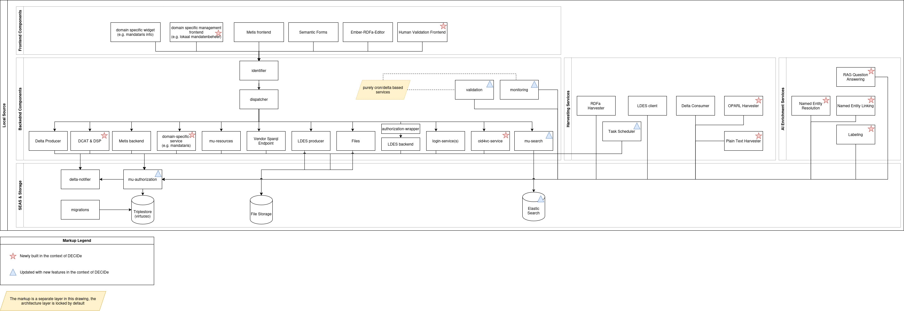

# Write-up UC0.0 Data space


This page is under construction!



UC0.0 covers multiple distinct technical components, each documented in its own write-up (see linked deliverables). This write-up is the umbrella document: it describes **the DECIDe data space as a whole**, provides the shared personas reference, and situates each component within the full architecture.


## Description UC/wanted deliverable

Local decisions and legislation (LD\&L) are the backbone of every action in local government, yet they remain among the hardest types of public data to work with at scale. Decisions are scattered across multiple repositories, managed by different actors, encoded in different formats, and rarely linked to the broader policy context they relate to. The result is a constant cycle of re-collection and duplication across government levels, friction for businesses and citizens trying to understand what applies to them, and limited capacity for governments themselves to track how their decisions connect to the goals they have committed to.

DECIDe's ambition is to show what becomes possible when LD\&L is treated as a core data space component: structured, machine-readable, and linked to thematic, geographic, and policy data from other sources. The proposal sets out three goals for this: raising the quality of policy decisions by connecting them to a broader context; enabling more efficient and proactive service delivery by allowing decisions to power downstream usecases; and supporting democratic transparency by making local legislative activity accessible and legible to citizens, businesses, and other stakeholders.

The wanted deliverable is a functioning LD\&L data space grounded in the DS4SSCC Reference Architecture, built across three pilot cities –Ghent (Belgium), Freiburg (Germany), and Bamberg (Germany). The data space provides a shared infrastructure layer covering data ingestion and normalisation, AI-assisted semantic enrichment, human oversight and validation, federated discovery, access policy enforcement, and identity and trust management.

### Link to other deliverables

As the umbrella document for UC0.0, this write-up is linked to all eight component write-ups that together make up the foundational data space layer: [UC0.0 Pipelines](write-up-uc0.0-pipelines.md), [UC0.0 Human Validation (HV)](write-up-uc0.0-human-validation-hv.md), [UC0.0 DCAT](write-up-dcat.md), [UC0.0 Authorization Policies Store (ODRL)](write-up-odrl.md), [UC0.0 Universal Trust Data Registry (VC)](write-up-verifiable-credentials.md), [UC0.0 Data Space Protocol (DSP)](write-up-dsp.md), [UC0.0 Data Quality Manager](write-up-data-quality-manager.md), and [UC0.0 Repeatable Data Plan](write-up-repeatable-data-plan.md).&#x20;

Each of the concrete usecases –[UC0.1 Policy Impact Report](../write-up-uc0.1-policy-impact-report.md), [UC1 Restrictive Mobility Zones](../write-up-uc1-restricted-mobility-zones.md), and [UC2 Smart Search](../write-up-uc2-smart-search.md)– also builds on the infrastructure documented here and in the component write-ups above.

## Glossary

The terms below are shared across all DECIDe write-ups. Each write-up also contains its own glossary covering terminology specific to that component or use case.

<table><thead><tr><th width="202.59375">Term</th><th>Explanation</th></tr></thead><tbody><tr><td>AP (Application Profile)</td><td>An application profile describes how standard(s) is to be applied in a particular domain or application</td></tr><tr><td>DCAT</td><td><a href="https://www.w3.org/TR/vocab-dcat-3/">Data Catalog Vocabulary</a>. W3C Recommendation (v3) for describing datasets, data services, their distributions, and data catalogs in RDF. The standard vocabulary for machine-readable dataset discovery. In DECIDe, ODRL policies and SHACL shapes are co-published alongside DCAT distributions to describe access conditions and expected data structure.</td></tr><tr><td>DECIDe</td><td><a href="https://www.ds4sscc.eu/decide">Data Driven Exploration in Contextual Information on Decisions</a>. The DS4SSCC pilot that builds an LD&#x26;L data space for local governments, bringing together three pilot cities: Ghent (Belgium), Freiburg (Germany), and Bamberg (Germany).</td></tr><tr><td>DS4SSCC</td><td><a href="https://www.ds4sscc.eu/">Data Space for Smart and Sustainable Cities and Communities.</a> European pilot programme under which DECIDe operates (Round 3).</td></tr><tr><td>DSSC</td><td><a href="https://dssc.eu/">Data Spaces Support Centre</a>. European body that provides guidance, blueprints, and building blocks for data spaces.</td></tr><tr><td>ELI</td><td><a href="https://eur-lex.europa.eu/eli-register/what_is_eli.html">European Legislation Identifier</a>. A standard from the <a href="http://op.europa.eu/en/home">Publications Office of the European Union</a> for identifying and describing legislation through linked data concepts (Work, Expression, Manifestation). Used in DECIDe as the common representation for all LD&#x26;L decisions regardless of source city or original format.</td></tr><tr><td>ELI-DL</td><td>European Legislation Identifier - Draft Legislation. A standard from the Publications Office of the European Union for identifying and describing activities related to legislation.</td></tr><tr><td>ELI-EP</td><td>European Legislation Identifier - European Parliament. An application profile adding constraints to using ELI and ELI-DL.</td></tr><tr><td>HV (Human Validation)</td><td>The set of lightweight per-use-case validation interfaces that allow domain experts to review and vote on AI-generated annotations using a thumbs-up/thumbs-down mechanism. Votes are stored as linked data and aggregated across interfaces. The HV votes don't modify the underlying source ELI data or AI-generated annotations.</td></tr><tr><td>Human-in-the-loop</td><td>An approach to AI systems in which machine-generated outputs are reviewed and assessed by human experts before being treated as authoritative. In DECIDe, the HV interfaces provide this capability for all AI enrichment pipelines.</td></tr><tr><td>LBLOD</td><td><a href="https://www.vlaanderen.be/lokaal-bestuur/digitale-transformatie/lokale-besluiten-als-gelinkte-open-data">Lokale Besluiten als geLinkte Open Data</a> (Local Decisions as Linked Open Data). Flemish program which includes infrastructure and standards for publishing municipal decisions as linked open data. The DECIDe data space extends the LBLOD stack.</td></tr><tr><td>LD&#x26;L</td><td>Local Decisions &#x26; Legislation. The corpus of formal local government decisions, that serve as the primary input to the DECIDe data space. In DECIDe, a decision is a formally adopted act by a local authority, published through the city's decision infrastructure and processable by the project's pipelines.</td></tr><tr><td><code>oa:Annotation</code></td><td><a href="https://www.w3.org/TR/annotation-model/">W3C Web Annotation class</a>. The annotation class of the W3C Web Annotation Ontology. Used in DECIDe both for AI-generated enrichments and for the human validation votes that assess them. Neither layer modifies the underlying source ELI data; annotations exist as a separate, independently queryable layer.</td></tr><tr><td>ODRL</td><td><a href="https://www.w3.org/TR/odrl-model/">Open Digital Rights Language</a>. W3C standard for expressing policies about the usage of content and services. In DECIDe, used for authorisation policies governing access to data space distributions.</td></tr><tr><td>RDF</td><td><a href="https://www.w3.org/RDF/">Resource Description Framework</a>. W3C standard for representing information as a graph of subject–predicate–object triples. ODRL is an RDF vocabulary; all policies and annotations in DECIDe are stored and exchanged as RDF data.</td></tr><tr><td>SHACL</td><td><a href="https://www.w3.org/TR/shacl/">Shapes Constraint Language</a>. W3C standard for describing and validating the structure of RDF graphs. SHACL shapes define what properties a resource must or should have; validation checks whether data in the triplestore conforms to those shapes. Used in DECIDe in both the ODRL component (to define Assets as NodeShapes) and the Data Quality Manager (to validate ELI entities).</td></tr><tr><td>SPARQL</td><td><a href="https://www.w3.org/TR/sparql11-query/">SPARQL Protocol and RDF Query Language</a>. The query language for RDF data. In DECIDe, access control is enforced at the SPARQL endpoint level, SPARQL queries define group membership in ODRL PartyCollections, and downstream applications query the triplestore via SPARQL.</td></tr><tr><td>Triplestore</td><td>A database for storing and querying RDF triples (subject–predicate–object). The DECIDe data space uses a Virtuoso triplestore as its central data store; all pipeline outputs, AI annotations, human validation votes, and validation reports are stored here as linked data.</td></tr></tbody></table>

## Business analysis

### Opportunity (problem, need, desire)

Decisions are taken at multiple government levels, across many domains, and are stored in data repositories managed by different actors with different semantics and formats. This fragmentation means that decision data is repeatedly re-collected and duplicated across processes, creating room for errors, gaps, and oversights. Businesses and citizens feel this complexity directly: rules and decisions that interact –or fail to interact– with each other make using public space, applying for services, or understanding what applies to them a genuine obstacle.

At the same time, governments themselves struggle to understand the policy footprint of their own decisions. The relationship between a formal council decision and the strategic goals a city has committed to –SDGs, climate targets, mobility policy– is rarely made explicit in a structured way. Policy assessment happens manually, retrospectively, and incompletely.

DECIDe sets out to demonstrate that making LD\&L machine-readable and structured changes this. When local decisions are expressed in a common linked data representation, linked to thematic, geographic, and legislative context, and made queryable through a shared data space, three things become possible: policy decisions can be connected to the broader context they are based on, raising their quality and traceability; services and tools can be triggered proactively from decision data, rather than requiring citizens to navigate the decision landscape themselves; and democratic transparency becomes achievable at scale, giving citizens, oversight bodies, and businesses structured access to how local governments exercise their mandates.

To deliver on this, DECIDe builds data space across three pilot cities that ingests, normalises, enriches, and governs access to decisions from all three. The data space is designed around the DS4SSCC Reference Architecture –a blueprint for interoperable, standards-based European data sharing– and provides the shared infrastructure on which concrete use case applications are built: a policy impact report, a mobility decision classifier, and a smart search interface. The three cities bring materially different data formats and national contexts to the pilot to demonstrate that the approach is format-agnostic and transferable.

The ambition of DECIDe is not only to show that this is technically feasible, but that it is achievable using open standards, open-source components, and a data plan that other cities and data spaces can reuse.

### Pilot partners

The three pilot cities are Ghent (Belgium), Bamberg (Germany), and Freiburg (Germany). Ghent contributes linked data published through the LBLOD infrastructure using the OSLO-Besluit standard. Freiburg contributes data through an OParl-based council information system. Bamberg contributes meeting minutes and decisions as PDF documents. The central data space infrastructure is operated by the DECIDe team at ABB; pilot cities are the source of the data the system processes and do not operate the infrastructure themselves.

### Target audience / Personas

DECIDe serves multiple distinct audiences across its components: the technical staff who operate the infrastructure, the domain experts who validate AI outputs, the non-technical users who consume the resulting applications, and the organisations that participate in the data space as data providers or consumers. The personas table below is the reference overview for all DECIDe write-ups.

<table><thead><tr><th width="283.736328125">Persona</th><th>Journey</th></tr></thead><tbody><tr><td><strong>P1</strong> Original decision data provider</td><td>A local authority –Ghent, Freiburg, or Bamberg– that publishes LD&#x26;L through its local infrastructure. Provides the primary data input to the data space without directly operating the DECIDe pipelines.</td></tr><tr><td><strong>P2</strong> Semantic framework owner</td><td>Defines decision models, concept schemes, and controlled vocabularies. Maintains the semantic standards –OSLO, codelist structures– that the data space builds on.</td></tr><tr><td><strong>P3</strong> Enrichment provider</td><td>Operates the AI annotation pipelines: triggers codelist mapping jobs, monitors NER pipeline runs, and verifies that annotation results are correctly written to the triplestore. Primarily ABB technical staff for the pilot.</td></tr><tr><td><strong>P4</strong> Domain validator</td><td>A human expert with subject-matter knowledge relevant to a specific annotation type: a sustainability officer validating SDG mappings (UC0.1), a mobility specialist validating RMZ classifications (UC1), or an IT/digiteam member validating entity links (UC0.0). Primary user of the HV interfaces.</td></tr><tr><td><strong>P5</strong> Non-technical application user</td><td>A policy officer, sustainability coordinator, civil servant, citizen, or any other person who consumes DECIDe's frontend applications without direct exposure to the underlying data infrastructure</td></tr><tr><td><strong>P6</strong> Data engineer (technical exploitation)</td><td>Configures and monitors the pipeline infrastructure: defines new jobs, updates cron schedules, diagnoses failed tasks, and manages data space component configuration. Primarily ABB technical staff for the pilot.</td></tr><tr><td><strong>P7</strong> Data space consumer (ecosystem participation)</td><td>An external organisation or individual that accesses data from the DECIDe data space as a consumer: discovers datasets through the DCAT catalogue, authenticates via the VC infrastructure, and queries data subject to the ODRL access policies.</td></tr></tbody></table>

## Datasources, datasets and datastandards

### Data sources

| Data source | Type/category | Brief description |
| ----------- | ------------- | ----------------- |
|             |               |                   |

### Datasets available in the data space

| Dataset | IdP/Authentication service | Country of origin | Domain | Shared within the project | Reused within the project |
| ------- | -------------------------- | ----------------- | ------ | ------------------------- | ------------------------- |
|         |                            |                   |        |                           |                           |

### Data standards

In DECIDe, two international data standards are reused to support the use cases: ELI-EP for describing all data related to LD\&L, and Web Annotations Model for enriching LD\&L and capturing human feedback. ELI-EP is an Application Profile defined for the European Parliament, which is an umbrella for reusing several other data standards: ELI for describing the content of LD\&L decisions, ELI-DL for activities related to LD\&L, FOAF for persons, ORG for organizations. Below, we give a more detailed explanation of ELI, ELI-DL and Web Annotation Model, because these are crucial to understand the data standards of the specific write-ups.

| Standard                                                       | Type                | Link                                                                                                                                                                                                                                                                       |
| -------------------------------------------------------------- | ------------------- | -------------------------------------------------------------------------------------------------------------------------------------------------------------------------------------------------------------------------------------------------------------------------- |
| European Legislation Identifier (ELI)                          | Ontology            | 
<a href="https://op.europa.eu/en/web/eu-vocabularies/dataset/-/resource?uri=http://publications.europa.eu/resource/dataset/eli">https://op.europa.eu/en/web/eu-vocabularies/dataset/- /resource?uri=http://publications.europa.eu/resource/dataset/eli</a>
       |
| European Legislation Identifier - Draft Legislation (ELI-DL)   | Ontology            | [https://joinup.ec.europa.eu/collection/eli-european-legislationidentifier/solution/eli-ontology-draft-legislation-eli-dl/release/v2](https://joinup.ec.europa.eu/collection/eli-european-legislationidentifier/solution/eli-ontology-draft-legislation-eli-dl/release/v2) |
| FOAF                                                           | Ontology            | [https://xmlns.com/foaf/spec/](https://xmlns.com/foaf/spec/)                                                                                                                                                                                                               |
| ORG                                                            | Ontology            | [https://www.w3.org/TR/vocab-org](https://www.w3.org/TR/vocab-org/)                                                                                                                                                                                                        |
| European Legislation Identifier - European Parliament (ELI-EP) | Application Profile | [https://europarl.github.io/eli-ep/](https://europarl.github.io/eli-ep/)                                                                                                                                                                                                   |
| Web Annotation Model                                           | Ontology            | [https://www.w3.org/TR/annotation-model/](https://www.w3.org/TR/annotation-model/)                                                                                                                                                                                         |

#### European Legislation Identifier (ELI)

ELI allows to describe any kind of document (Fig. 1). Documents can be LD\&L documents, but also legislation still in draft, or attachments of a decision. It is based on the librarian standard "[FRBR](https://en.wikipedia.org/wiki/Functional_Requirements_for_Bibliographic_Records)", which introduces 3 layers (actually 4, but the last two are combined in ELI):

1. [Work](http://data.europa.eu/eli/ontology#Work): identifies the content of a decision. On this level, versioning can be applied. For example, this decision "replaces" another decision.
2. [Expression](http://data.europa.eu/eli/ontology#Expression): contains the text of a decision. Multiple linguistic variants can be identified by linking `eli:Work` to an `eli:Expression` for each language using the `eli:is_realized_by` property. Expressions are used in DECIDe to identify the text in its original language, as well as the [AI translated text](write-up-uc0.0-pipelines.md#translation-task).
3. [Manifestation](http://data.europa.eu/eli/ontology#Manifestation): this is the concrete representation of the text in a machine-readable format. For example, HTML or PDF. In FRBR, there is an extra distiction between File and Format.

ELI also allows identifying subdivisions of a decision: article, paragraph etc, although subdivisions are not a focus of DECIDe.

ELI recommends using the FOAF vocabulary for describing persons and the ORG ontology for describing organizations (see Fig. 2).

<figure><figcaption>
Fig. 1: High-level overview of ELI. Documents are described with three layers. The lifecycle of legislation documents can be tracked using specialized ELI properties. Source: slides Thomas Francart (<a href="https://www.europarl.europa.eu/cmsdata/290451/CLOSEuP_Day1-am_ELI-ELI_DL.pdf">https://www.europarl.europa.eu/cmsdata/290451/CLOSEuP_Day1-am_ELI-ELI_DL.pdf</a>) 
</figcaption></figure>

<figure><figcaption>
Fig. 2: ELI reuses the FOAF vocabulary for describing Agents, and ORG for organizations.
</figcaption></figure>

#### European Legislation Identifier - Draft Legislation (ELI-DL)

ELI-DL allows to capture the documents that are created during the drafting of the legislation. It is an activity-based model where [activities](http://data.europa.eu/eli/eli-draft-legislation-ontology#Activity) can "consist of" sub-activities and can "[motivate](http://data.europa.eu/eli/eli-draft-legislation-ontology#was_motivated_by)" other activities. It provides relations to the ELI documents: a document can an input or output of an activity, activities can foresee a change in legislation, activities can be recorded in documents. More specific classes are introduced by ELI-DL, such as [Process](http://data.europa.eu/eli/eli-draft-legislation-ontology#Process), [Foreseen activities](http://data.europa.eu/eli/eli-draft-legislation-ontology#ForeseenActivity), [Participant](http://data.europa.eu/eli/eli-draft-legislation-ontology#Participation) and [Vote](http://data.europa.eu/eli/eli-draft-legislation-ontology#Vote). However, in DECIDe, we focus on the use of Activity for identifying meetings and consultations of agenda items, and tracking the participants.

<figure><figcaption>
Fig. 3: ELI-DL is an event-based model where activities are linked with eachother and with ELI documents ( are the 
</figcaption></figure>

#### Web Annotation Model

The Web Annotation Model (W3C recommendation since 2017) is a simple, but powerful model to link two distinct pieces of information. Instead of directly linking two resources, an "annotation" sits between resources: an "[annotation](https://www.w3.org/TR/annotation-vocab/#annotation)" describes that a "[body](https://www.w3.org/TR/annotation-vocab/#hasbody)" resource is about a "[target](https://www.w3.org/TR/annotation-vocab/#hastarget)" resource (Fig. 4). For example, a decision about greening a certain street can lead to an annotation with as body the decision and as target the street. This approach has several benefits:

* provenance: when was this annotation made and by who (AI or human)
* uncertainty: the producer of the annotation can indicate how confident it is of the relation between the body and the target
* motivation: what was the intent behind the annotation. For example, "linking" or "classifying"
* generalization: distinctive use cases can use the same annotation model

<figure><figcaption>
Fig. 4: The annotation model links two resources indirectly together. One resource is a "body" that is about a "target" resource.
</figcaption></figure>

Another feature of the Web Annotation Model is the ability to refer to a specific part of a resource, which is called a Specific Resource. A selector is used to express the specific dimensions, which depend on the type of resource. In DECIDe, we use the [text position selector](https://www.w3.org/TR/annotation-model/#text-position-selector) to reference a certain part (start, end) in the text of a decision. For example, if the content of an `eli:Expression` is "2026\_GR\_00480 - Construction and modification of a road - Rerum-Novarumplein, 9000 Ghent - Approval", then we could indicate its location `Rerum-Novarumplein, 9000 Ghent` using a text selector with start 58 and end 77. See [#named-entity-recognition-ner](write-up-uc0.0-pipelines.md#named-entity-recognition-ner "mention")for an example how an Named Entity Recognition service uses a selector for annotating an decision with entities.

## Final architecture (and why)

The DECIDe data space is organised around four layers that build on one another.

**Access and federation** is the outermost layer: it governs how the data space is discovered, how participants are identified, and what they are permitted to do. The DCAT catalogue makes datasets and distributions findable; the Data Space Protocol (DSP) governs how exchange requests are initiated and negotiated; the Authorization Policies Store (ODRL) defines access rules in machine-readable format; and the Universal Trust Data Registry (VC) manages participant identity. The Repeatable Data Plan sits alongside these components, covering data management and planning at the data space level.

**Data ingestion** is where raw LD\&L from the three pilot cities enters the system and is brought to a common representation. The Pipelines infrastructure harvests decisions from LBLOD/OSLO (Ghent), OParl (Freiburg), and PDF documents (Bamberg, and supplementarily the other cities), and normalises each to the European Legislation Identifier (ELI) standard. The result is a shared corpus of formal decisions in the triplestore.

**Data enrichment** operates on top of the normalised corpus to produce structured, queryable annotations. The AI enrichment pipelines generate `oa:Annotation` triples linking decisions to policy concepts, geographic entities, and temporal periods. The Human Validation (HV) layer provides domain experts with per-use-case interfaces to review and vote on these annotations, adding a human-endorsed signal layer without modifying the underlying data.

**Concrete applications** are built on top of the enriched decisions. UC0.1 delivers a Policy Impact Report visualising how local decisions across the three cities relate to the UN Sustainable Development Goals. UC1 uses the NER pipeline and codelist mapping to identify and classify decisions concerning restricted mobility zones. UC2 provides an AI-powered smart search interface over the full LD\&L corpus.

The end-to-end architecture of the DECIDe data space spans all four layers described above, from the raw LD\&L sources at the pilot cities through the ingestion and enrichment pipelines to the access and federation components and the use case applications. Each component write-up documents the architecture of its own layer in detail; this section provides the single end-to-end view that situates all components in relation to one another.

_<mark style="background-color:$warning;">Architecture drawing of all components</mark>_

_<mark style="background-color:$warning;">TODO update or remove depending on the decision in the comment:</mark>_

<figure><figcaption></figcaption></figure>

### Core semantic.works services

The DECIDe application is built as a [semantic.works application](https://semantic.works/). As such the application consists of a set of services that collaborate to achieve application's functionality. A "service" in a semantic.works application is a piece of software with clearly defined responsibilities. In other words, each service executes a (small) part the functionality provided by the application as a whole. A semantic.works application essentially consists out of two kinds of services:

1. core services that provide functionality that is required in every application; and
2. custom services that provide application-specific functionality.

The diagram below illustrates how these services interact with each other. The boxes represent services, with the core services in the middle and left-hand side. The greyed "custom-service" box illustrates how a custom service is typically wired into an application. Note, that applications typically will contain many different custom services. The arrows in the diagram represent how services communicate with each other using HTTP messages.

As such it uses the following core semantic.works services. The core services are shown in the diagram below. Boxes are services and arrows are HTTP messages being sent. The virtuoso triplestore is shown as a cylinder. The image also shows a `custom-service`, this is because any other service added in the context of a semantic.works project (like in DECIDe) works in the same way: it may receive HTTP calls dispatched from the dispatcher, performs SPARQL queries through mu-authorization and/or be informed of changes through delta notifications from the delta-notifier. Some services may have other capabilities and those will be noted specifically (e.g. AI services or services that need Elastic Search capabilities).&#x20;

<figure><figcaption></figcaption></figure>

In summary, the `identifier` is the service through which messages arrive at the application. The `dispatcher` is responsible to determine the appropriate service to which to forward each message. Each service in turn, the `mu-resources` and `custom-service` in the diagram, can retrieve data from the `triplestore` , which is subject to authorisation rules enforced by `mu-authorization` . The `delta-notifier` is responsible to notify services about data changes these services might be interested in. Finally, `migrations` provides an easy way for the developers or maintainers of an application to add or modify data in the `tripelstore`. The remainder of this section will zoom into each of the core services in more detail. The custom services that are part of the DECIDe application will be discussed in the appropriate write-ups.

#### Identifier

The **mu-identifier** is an HTTP proxy used to identify sessions for incoming messages so that other services can make use of this information. All external requests pass through this service, and its main responsibility is to identify which user is sending requests.\
The identifier itself is not connected to the database, but reasons about the data it receives and forwards it.

In theory, another service could be used that functions as a proxy, but in practice this is not done.

The mu-identifier is responsible for:

* composing the user agent
* cleaning up response headers
* simplifying caching
* caching user authorisation groups

GitHub: [https://github.com/mu-semtech/mu-identifier](https://github.com/mu-semtech/mu-identifier)

#### Dispatcher

This service is used to dispatch requests to appropriate services based on the path of incoming requests.

GitHub: [https://github.com/mu-semtech/mu-dispatcher](https://github.com/mu-semtech/mu-dispatcher)

#### Delta notifier

An update to the database may have consequences elsewhere in the application. For this, the delta notifier is used.

The delta notifier is informed by the mu-authorization service of changes in the database. The delta notifier can be configured to forward certain changes, called deltas, to specific services. Each delta essentially consists of a collection of inserts and delete statements representing which triples have been added or removed from the database. Based on its configuration the delta notifier determines for each delta which services should be informed and sends out the appropriate notifications containing the relevant changes.

The delta notifier is also a core component of semantic.works. There are essentially no real alternatives within this architecture.

Github: [https://github.com/mu-semtech/delta-notifier](https://github.com/mu-semtech/delta-notifier)

#### Resources

Resources provides frontend developers with a way to perform [JSON:API](https://jsonapi.org/) CRUD operations on a SPARQL endpoint. This allows them to work with a much more familiar model without needing deep knowledge of linked data. It's mainly used to interact with frontend services and not really meant as a way to exchange data with external partners (backend for frontend pattern).

GitHub: [https://github.com/mu-semtech/mu-cl-resources](https://github.com/mu-semtech/mu-cl-resources)

#### Mu-authorization

The Mu-authorization service, a.k.a. sparql-parser, a.k.a **SPARQL Endpoint Authorization Service (SEAS)** is an authorization layer that rewrites queries that are send to the database by taking the user’s permissions into account. Based on preconfigured rights, the service decides which graphs an update queries may write to, and from which graphs select queries may read.

The SEAS component recently underwent a revision that greatly increases efficiency. The way configuration is done has changed. It is strongly recommended to use only the new **“sparql-parser”** implementation.

Mu-authorization received additional features in the scope of the DECIDe project. This is because the component is receiving support for ODRL to define its authorization rules in the scope of DECIDe, the goal is to work towards more interoperability with other data spaces. While this goal is likely too lofty to be solved by simply adding ODRL as a configuration language, it will at least unlock a more common configuration language that will be understood outside of the LBLOD sphere as well, which is a nice first step.

GitHub old: [https://github.com/mu-semtech/mu-authorization](https://github.com/mu-semtech/mu-authorization)

GitHub new: [https://github.com/mu-semtech/sparql-parser](https://github.com/mu-semtech/sparql-parser)

#### Triplestore (Virtuoso)

The triplestore provides a SPARQL endpoint to manage the linked data of the source. It is _the_ core component of a local source; all other components will make use of this database.\
Note: the triplestore itself has no built-in security for reading or writing triples. For this, we have the SEAS layer (see above).

GitHub: [https://github.com/redpencilio/docker-virtuoso](https://github.com/redpencilio/docker-virtuoso)

In general, the open-source edition of virtuoso is the triplestore of choice for semantic.works projects and in DECIDe, this is also the triplestore chosen. In theory, there are several alternatives for the triplestore and its corresponding SPARQL endpoint, e.g., Apache Jena, GraphDB, … Only Virtuoso is truly “battle tested” in production environments. As long as the endpoint is SPARQL-compliant (spec: [https://www.w3.org/TR/sparql11-query/](https://www.w3.org/TR/sparql11-query/)) the environment _should_ work, but in practice every triplestore appears to have small “peculiarities” where they slightly deviate from the spec. So if you choose an alternative, make sure to thoroughly test it with a technical team that has sufficient know-how.

#### Migrations

The migrations component allows the definition of migration files to modify the contents of the triplestore. This can be done using either SPARQL queries or by directly inserting turtle files into specified graphs.

**GitHub:** [https://github.com/mu-semtech/mu-migrations-service](https://github.com/mu-semtech/mu-migrations-service)

