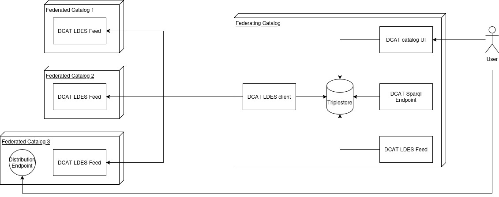
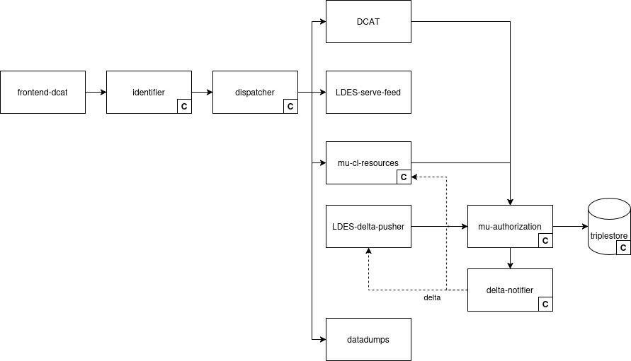
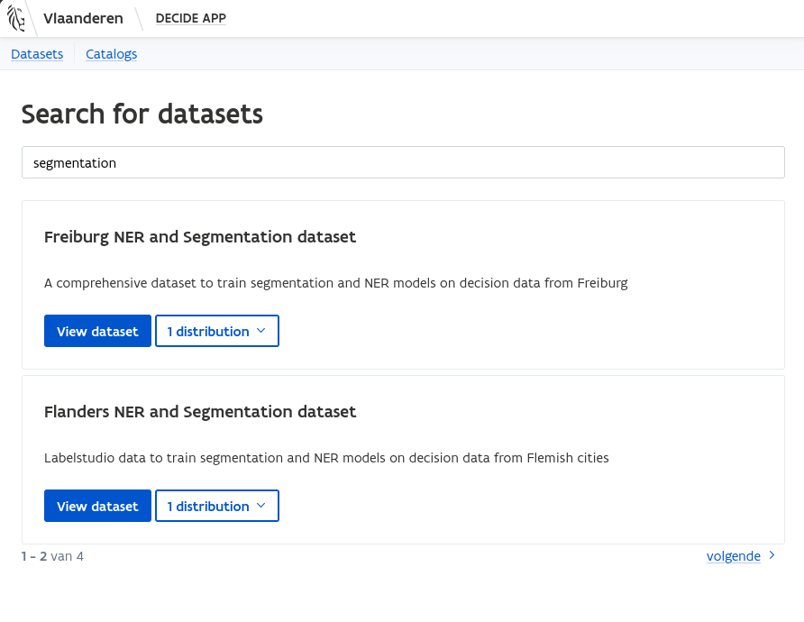
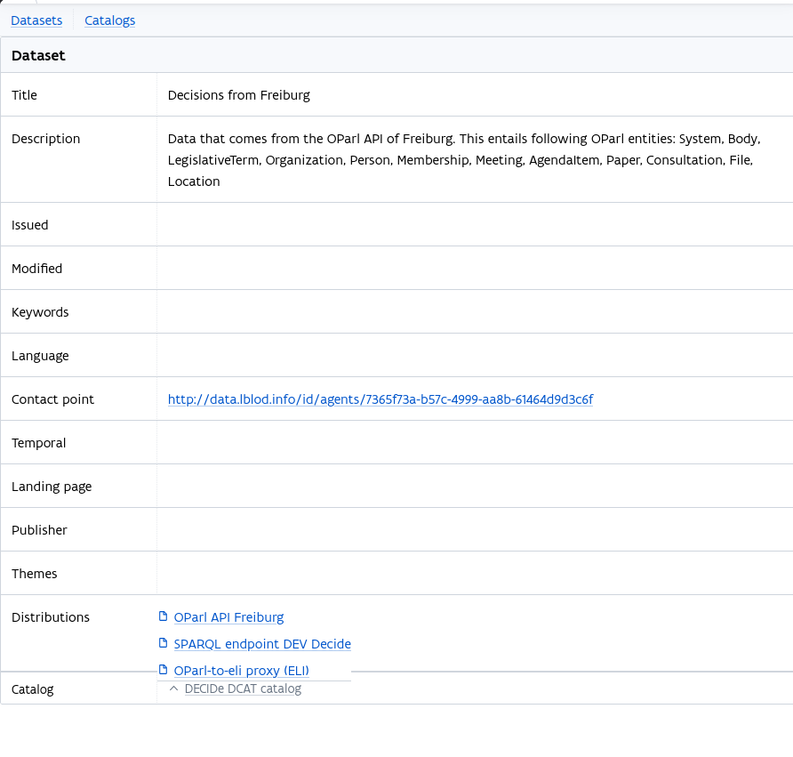
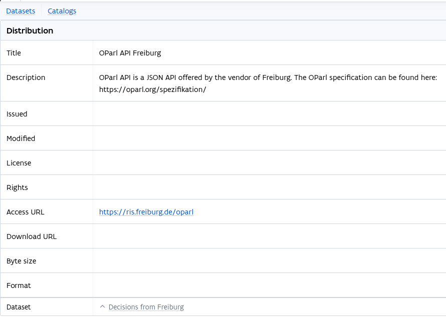

# Write-up DCAT


This page is under construction


## Description UC/wanted deliverable

Any data space needs a mechanism for discoverability: participating entities must have a reliable, standards-based way to publish what data they make available, so that both human users and automated agents can find and assess it. The goal is for a DCAT catalogue to sit at the highest-level entry point of the DECIDe data space, linking to the DCAT catalogues of all participating pilot partners. Each city hosts at least one catalogue describing its own datasets; an overarching Federating Catalogue then aggregates those local catalogues and signals which sources can be trusted within the data space.

The DCAT catalogue contains the essential information required for dataset discovery: access endpoints, licensing conditions, provenance, and metadata about content and structure. A human interface on top of the DCAT layer allows non-technical users to browse and understand what is available without needing to query a SPARQL endpoint or parse RDF directly.

Within the project proposal, this maps to the following deliverables and tasks:

| Deliverable                                                               | Activities                                                               |
| ------------------------------------------------------------------------- | ------------------------------------------------------------------------ |
| **D2.6.2** Federation Layer available                                     | **T2.4** Define, develop and test open source semantic Federation Layer. |
| **D2.7.2** Federation Layer integrated in local data space of pilot sites | **T2.5** Integrate Federation Layer in local DS of all pilots            |

### Link to other deliverables

#### Authorization Policies Store (ODRL)

Each DCAT distribution carries machine-readable access rights expressed as ODRL policies, co-published alongside the distribution metadata. The two components are tightly coupled: DCAT describes what datasets exist and how to reach them; ODRL describes the rules that apply.

[write-up-odrl.md](write-up-odrl.md "mention")

#### Universal Trust Data Registry (VC)

The Universal Trust Data Registry is conceived as an augmentation of the Federating Catalogue: initially, inclusion in the DCAT catalogue serves as the proxy for source trustworthiness; the VC-based registry strengthens this, by adding W3C DID and W3C Verifiable Credential-based identity verification on top of the DCAT discovery layer.

[write-up-verifiable-credentials.md](write-up-verifiable-credentials.md "mention")

#### Data Space Protocol (DSP)

The Data Space Protocol governs how data exchange requests between participants are initiated and negotiated; it complements DCAT as the discovery layer by providing the protocol through which a consumer acts on what they find in the catalogue.

[write-up-dsp.md](write-up-dsp.md "mention")

## Glossary


See the [UC0.0 Data space glossary](./#glossary) for definitions of DCAT, ELI, ODRL, and SHACL.


<table><thead><tr><th width="183.970703125">Term/Acronym</th><th>Explanation</th></tr></thead><tbody><tr><td><a href="https://semiceu.github.io/DCAT-AP/releases/3.0.0/">DCAT-AP (DCAT Application Profile)</a></td><td>A SEMIC recommendation that restricts and extends DCAT for use in European open data infrastructures. DECIDe's federation layer aligns with DCAT-AP v3.</td></tr><tr><td><a href="https://data.vlaanderen.be/doc/applicatieprofiel/DCAT-AP-VL/">DCAT-AP-VL</a></td><td>Flemish specialisation of DCAT-AP, based on DCAT v2. Used by Ghent and other Flemish open data publishers for local catalog publication.</td></tr><tr><td>DCAT feed</td><td>A downloadable RDF serialisation of a DCAT catalog (Turtle, RDF/XML, or N-Triples) published at a known URL, enabling automated consumption and federation.</td></tr><tr><td><code>dcat:Catalog</code></td><td>A curated collection of dataset and data service descriptions. Each pilot city hosts its own catalog; the Federating Catalogue aggregates these.</td></tr><tr><td><code>dcat:Dataset</code></td><td>A conceptual description of a collection of data published by a single agent. Described by title, description, publisher, contact point, access rights, and themes. Must have at least one distribution in DCAT-AP-VL.</td></tr><tr><td><code>dcat:DataService</code></td><td>A collection of operations accessible via an API, such as a SPARQL endpoint. Distinct from a distribution: a DataService is linked to a dataset via <code>dcat:servesDataset</code>.</td></tr><tr><td><code>dcat:Distribution</code></td><td>A specific physical representation of a dataset, available at an access URL. In DECIDe, distributions are typed as SPARQL endpoints, LDES feeds, or Resource APIs (JSON:API).</td></tr><tr><td>Federation</td><td>The mechanism by which a central catalog aggregates and replicates metadata from multiple member catalogs, enabling unified discovery without centralising the underlying data.</td></tr><tr><td><a href="https://w3id.org/ldes/specification">LDES (Linked Data Event Streams)</a></td><td>A specification for publishing RDF datasets as ordered, append-only event streams. DECIDe uses LDES to federate DCAT catalog metadata across pilot city catalogs to the Federating Catalogue.</td></tr></tbody></table>

## Business analysis + final feature passport (incl. functional analysis)

### Opportunity (problem, need, desire)

When a local source publishes data, it is important that interested third parties can actually find it. This is the core problem DCAT addresses: it provides a standardised way to describe datasets –their content, access endpoints, licensing conditions, and provenance– and to publish those descriptions somewhere they can be reliably discovered.

In DECIDe, each data source has a DCAT description for each of its datasets and distributions. An overarching Federating Catalogue aggregates those descriptions making all data space sources discoverable from a single entry point, and automatically picks up updates via LDES feeds. The DCAT catalogue itself is public; authentication is applied at the level of individual endpoints rather than at the catalogue level, keeping discovery open while access remains controlled. Being listed in the Federating Catalogue is an implicit trust signal: it means the source has been accepted as a trustworthy participant in the data space.

### Pilot partners

DCAT is relevant for all three pilot cities that participate in the data space: Ghent (Belgium), Freiburg and Bamberg (Germany). Each city has a DCAT catalog describing its sources within the data space, whether created locally or on the city's behalf as part of the DECIDe pipeline work.

#### Target audience / Personas

The DCAT Federating Catalogue serves two broad audiences: the data providers and technical maintainers who publish and manage catalog metadata, and the consumers who use the catalogue to discover and access data. Data engineers configure catalog entries and monitor federation; application developers and end users rely on the catalogue to find data and understand what they can do with it.

<table><thead><tr><th width="176.63671875">Persona</th><th>Journey</th></tr></thead><tbody><tr><td><strong>P1</strong> Original decision data provider</td><td>Publishes decision data from their local system; their datasets and distributions must be accurately described and registered in the DCAT catalogue so they are discoverable within the data space.</td></tr><tr><td><strong>P2</strong> Semantic framework owner</td><td>Defines the SHACL shapes and controlled vocabularies that describe dataset structure; ensures DCAT metadata accurately reflects these modelling choices and that dataset descriptions remain aligned with the semantic layer.</td></tr><tr><td><strong>P6</strong> Data engineer</td><td>Configures DCAT catalog entries for each dataset and distribution; monitors LDES feeds; ensures the Federating Catalogue stays in sync with member catalogs as data sources evolve.</td></tr><tr><td><strong>P7</strong> Data space consumer</td><td>Browses the Federating Catalogue to discover available datasets, inspect their distributions and access conditions, and retrieve data for use in an application or analysis.</td></tr></tbody></table>

### Functionality (requirements)

The DCAT service covers both the catalog publication standard and the federation mechanism. Each pilot city's data sources are described in a DCAT-AP v3 compliant catalog, capturing what endpoints are available, what they contain, who publishes them, and under what access conditions. The Federating Catalogue aggregates those local catalogs –replicating catalog metadata, not the underlying data– into a central triplestore, and exposes it through a human-readable interface, a SPARQL endpoint, and its own DCAT feed.

Three types of endpoints can be described in the catalog: SPARQL endpoints, LDES feeds, and Resource APIs (JSON:API). Alongside the endpoint descriptions, access conditions are co-published as ODRL policies and data structure expectations as SHACL shapes, keeping the full set of discovery metadata machine-readable and co-located in the catalog.

<table><thead><tr><th width="617.6279296875">Requirement</th><th>Priority</th></tr></thead><tbody><tr><td>DCAT-AP v3 compliant catalog per pilot city</td><td>Must-have</td></tr><tr><td>LDES feed per city catalog for federation</td><td>Must-have</td></tr><tr><td>Federating Catalogue aggregating all member catalogs via LDES</td><td>Must-have</td></tr><tr><td>SPARQL endpoint on the Federating Catalogue triplestore</td><td>Must-have</td></tr><tr><td>DCAT LDES feed exposed by the Federating Catalogue</td><td>Must-have</td></tr><tr><td>SPARQL endpoints modelled as <code>dcat:DataService</code> with <code>dcat:servesDataset</code></td><td>Must-have</td></tr><tr><td>LDES distributions modelled as <code>dcat:Distribution</code> + <code>ldes:EventSource</code> with <code>dct:conformsTo</code></td><td>Must-have</td></tr><tr><td>Resource API distributions modelled as <code>dcat:Distribution</code> with JSON:API media type</td><td>Must-have</td></tr><tr><td>ODRL policy co-published per dataset via <code>odrl:hasPolicy</code></td><td>Must-have</td></tr><tr><td>SHACL shapes co-published per dataset via <code>dct:conformsTo</code></td><td>Must-have</td></tr><tr><td>ODRL and SHACL metadata federated alongside DCAT catalog entries</td><td>Must-have</td></tr><tr><td>DCAT catalog publicly accessible without authentication</td><td>Must-have</td></tr><tr><td>Minimal human-readable DCAT catalog interface</td><td>Must-have</td></tr></tbody></table>

## Datasources, datasets and datastandards

### Data sources

| Data source | Type/category | Brief description |
| ----------- | ------------- | ----------------- |
|             |               |                   |

### Datasets available in the data space

| Dataset | IdP/Authentication service | Country of origin | Domain | Shared within the project | Reused within the project |
| ------- | -------------------------- | ----------------- | ------ | ------------------------- | ------------------------- |
|         |                            |                   |        |                           |                           |

### Data standards

The semantic foundation is DCAT-AP v3, the SEMIC European application profile of the W3C DCAT vocabulary. DCAT-AP v3 was chosen because it is a required standard in the DSSC Blueprint, it is structurally compatible with the existing Flemish DCAT-AP-VL publications (which are v2-based), and it adds useful features over v2 –versioning, dataset series, and inverse properties– without breaking backward compatibility.

Three distribution types are modelled:

* A SPARQL endpoint is modelled as a `dcat:DataService` with an `endpointURL`, linked to its dataset via `dcat:servesDataset`.
* An LDES feed is modelled as a `dcat:Distribution` simultaneously typed as `ldes:EventSource`, with `dct:conformsTo` pointing to the LDES specification and supported media types listed explicitly.
* A Resource API (JSON:API) is modelled as a `dcat:Distribution` with `dcat:mediaType` set to the JSON:API media type identifier. The Resource API option is the least interoperable of the three –the resources configuration that links its output to the semantic model is not public– and was included as a concession to project partners with limited linked data experience who prefer a JSON-based API over a SPARQL endpoint or LDES feed.

ODRL policies are co-published per dataset using `odrl:hasPolicy` on the `dcat:Dataset` description. SHACL shapes describing the expected content structure of datasets are co-published using `dct:conformsTo` at the dataset level. Both are surfaced by the LDES-based federation mechanism and replicated into the Federating Catalogue alongside the core DCAT metadata.

LDES was selected as the federation mechanism because it is event-driven: rather than periodically re-downloading entire catalog files, the Federating Catalogue receives incremental updates as dataset descriptions change. This is consistent with how LDES is used elsewhere in the LBLOD stack, and aligns with the [direction SEMIC is taking for DCAT-AP feeds](https://data.europa.eu/sites/default/files/report/Georges%20Lobo%20%26%20Pavlina%20Fragkou.pdf) at the European level –a prototype for LDES-based DCAT-AP exchange was set up in Belgium and Sweden in 2024.

For the Ghent pilot, DCAT-AP-VL (v2) is used for the local publication to Metadata Vlaanderen in addition to the DCAT-AP v3 description used within the DECIDe data space. The two profiles are structurally compatible; the versioning gap means some v3 features are not expressible in the Flemish local publication, but this does not affect the DECIDe data space operation.

## Final architecture

The DECIDe DCAT architecture follows a federated model: each participating city or organisation maintains its own DCAT catalog, and the Federating Catalogue aggregates those member catalogs by following their LDES feeds and replicating, then republishing its contents.

At the city level, each pilot city has a DCAT catalog describing its datasets and distributions. The catalog is public within DECIDe scope –authentication is applied at the level of individual endpoints, not at the catalog level.

The Federating Catalogue operates by following the DCAT LDES feeds published by each member catalog in their own system. This is shown in the image below. As member catalogs update, the Federating Catalogue replicates new or changed metadata entries into its own triplestore –not the underlying data, only the DCAT instances _describing_ the data: Catalog, Dataset, DataService and Distribution instances. The Federating Catalogue then exposes the aggregated metadata in three ways: a human-readable catalog UI for browsing by non-technical users, a SPARQL endpoint for querying the catalog metadata directly, and a DCAT LDES feed that allows other catalogs at regional, federal, or European level to follow and replicate the DECIDe catalog's contents.

ODRL policies and SHACL shapes are co-federated alongside DCAT catalog entries. When the Federating Catalogue follows a member catalog's LDES feed, it also picks up the ODRL policies and SHACL structural descriptions attached to those catalog instances, making the full discovery metadata (what the data is, how to access it, what rules govern access, and what structure to expect) available from the Federating Catalogue.

<figure><figcaption></figcaption></figure>

A typical client flow is shown below. The client queries the well-known location of the Federating Catalogue to find available dataset distributions and their endpoints (1). From the DCAT descriptions they learn which endpoints require authentication and which are public. This is described in the ODRL Policy instance that is attached to the DCAT datasets. As the distribution data/endpoints are not replicated, the user then accesses them in the environment of the data space participant that publishes the data and the user authenticates where required (2) and then access the endpoints relevant to them (3). The way authentication and authorization works for the distribution access is left to the data space participant. Each endpoint has a DCAT description that is put on the participant's LDES feed and thus replicated in the federating DCAT catalog.

<figure><figcaption></figcaption></figure>

### Final semantic components

The services used to realize the DCAT federation layer are shown in the image below.

<figure><figcaption></figcaption></figure>

In this drawing, services are depicted as rectangles, the Virtuoso triplestore is shown as a cylinder and HTTP requests are shown as arrows pointing from the origin of the request to the receiver of the request. Core services, marked with a **C**, are described in the core semantic.works components section of the [UC0.0 Data space write-up](https://github.com/lblod/gitbook-decide-write-up/blob/master/decide-project/write-up-uc0.0-data-space/write-up-uc0.0-data-space#core-semantic.works-components). Services specific to the DCAT federation layer are described below.

#### Frontend DCAT

This is the web application hosting the web interface through which users can search and view DCAT Catalogs, Datasets and Distributions in. The frontend is written in Ember and uses the endpoint provided by mu-resources to realize its functionality.

**GitHub:** [https://github.com/lblod/frontend-decide-dcat](https://github.com/lblod/frontend-decide-dcat)

#### DCAT

The DCAT service offers a one-stop way to fetch a full description of the DCAT catalogs in the triplestore including all of its datasets and distributions in multiple file formats, `application/ld+json` and `application/n-triples` among others.

**GitHub:** [https://github.com/lblod/dcat-service](https://github.com/lblod/dcat-service)

#### LDES-delta-pusher

The LDES-delta pusher is informed by the delta notifier about updates in the triplestore. When it detects an update to a DCAT related resource (Catalog, Dataset, DataService, Distribution, ODRL policy), it writes the current version of that resource to the set of LDES files on disk. It also has auto-healing functionality for the LDES stream in case it misses updates from the delta-notifier because either of the services was down for any reason. To accomplish this, it periodically reads out its own stream and compares it to its triplestore contents. If it discovers instances that are on the stream but no longer in the triplestore, it removes them from the stream by writing a Tombstone entity for them, informing clients that the instance is now gone. If it discovers an instance that is in the triplestore but not on the stream, it writes the latest version to the stream.

**GitHub:** [https://github.com/redpencilio/ldes-delta-pusher-service/](https://github.com/redpencilio/ldes-delta-pusher-service/)

#### LDES-serve-feed

The LDES-servce-feed service takes the files created by the LDES-delta-pusher service and exposes them in multiple triple formats as a web service. Supported formats are `application/ld+json` and `application/n-triples`, among others.

**GitHub:** [https://github.com/lblod/ldes-serve-feed-service](https://github.com/lblod/ldes-serve-feed-service)

#### datadumps

The datadumps service is a simple nginx web service that exposes distributions generated by data space participants. These distributions are generated together with their DCAT description using a dedicated `mu-cli` script called `publish_dataset`. The script is to be run manually by data space participants when they are ready to release a new version of their datasets. Every time the script runs, a new distribution is created for the new version of the datasets. The pre-configured datasets for each participant are:

* codelists: Codelist annotations for SDGs and impact
* rmz: Restricted Mobility Zone (RMZ) Concept annotations + locations for municipality
* expressions: ELI (meta)data for expression + work + manifestation
* human-validations: Human review annotations

As this is just a default [Nginx docker container](https://hub.docker.com/_/nginx), there is no specific GitHub link. However, the `mu-cli` script to generate the distributions has an extensive README published: [https://github.com/lblod/app-decide/tree/development/scripts/project/publish\_dataset](https://github.com/lblod/app-decide/tree/development/scripts/project/publish_dataset).

### Other explored semantic components

Two alternative federation approaches were assessed before settling on the LDES-based architecture.

The **Data space Interoperability Framework PoC** (using the CKAN DCAT extension format) was suggested by DS4SSCC coaches in the context of DECIDe. It is a minimal federation solution –intentionally excluding identity, contracting, and consent– that works by having independent catalogs register with a federating instance, which then fetches their catalog information and exposes a distributed search endpoint. The core problem for DECIDe is the format requirement: the PoC requires the format used by the CKAN DCAT extension, which does not support SHACL descriptions of dataset contents or ODRL policy extensions. Adding these within the CKAN format would require building a custom adapter, at which point the ready-made solution loses most of its value. The federated search mechanism was also assessed as unlikely to scale: distributing a search query across many registered independent catalogs, with no clear pagination strategy, does not generalise to a large data space. This approach was ruled out on both grounds.

The **Eclipse EDC Federated Catalog** was also assessed. It works by crawling the DSP catalog endpoint of the catalogs it federates, making it architecturally closer to what DECIDe ultimately built than the CKAN PoC. DECIDe chose not to implement the Data Space Protocol at this stage (though a minimal compatibility service was eventually trialed, see the DSP write-up) which already rules out the Eclipse approach as a dependency. In addition, the adopters documentation for the Eclipse Federated Catalog was still in a TBD state at the time of assessment, and it was unclear how the system handles federated catalogs using a different DCAT application profile than the federating catalog.

### Final AI components

No AI components are deployed to realize the DCAT Federating Catalogue.

## Final UI design

Only a very minimalistic UI was provided for the DCAT catalog. It allows users to search for datasets and then view their DCAT properties in a graphical interface.

Searching for content:

<figure><figcaption></figcaption></figure>

Viewing a dataset:

<figure><figcaption></figcaption></figure>

Viewing a distribution:

<figure><figcaption></figcaption></figure>

Currently no functionality is provided for administrators of the data space to create, delete or edit DCAT instances. This should be done by creating such descriptions as triplestore migrations in the application configuration or by running the [scripts included with the DECIDe project's GitHub repository](https://github.com/lblod/app-decide/tree/development/scripts/project/publish_dataset) that generate DCAT descriptions and downloads for the standard datasets in the data space.

## Possible future work

### Making the data space tamper-proof

When obtaining (meta) data from the data space, users want to be sure they obtain the correct, unmodified (meta) data. Similarly, data space members and data providers want assurances that unauthorised changes are prevented when possible and can be detected otherwise.

Currently, the DECIDe application relies on access control to prevent unauthorised changes to stored data and the use of secure protocols, e.g. https, to protect data in transit. But it does not provide users a way to explicitly verify the integrity of the (meta) data they receive. Note, due to the federated setup of a data space, it will finally be the responsibility of each data space member to ensure the integrity of the data they offer.

A logical initial step, would be to usie DCAT's [checksum](https://www.w3.org/TR/vocab-dcat-3/#Property:distribution_checksum) property for distributions. This property allows to link a DCAT `Distribution` resource to a `http://spdx.org/rdf/terms#Checksum` resource that specifies a checksum and algorithm used to compute it. For single file distributions, e.g. a Turtle file or archive of files, the recipient can calculate the the checksum of the received file and compare this to the original one. For this to be effective, this does require that the checksum can be [transmitted via a separate channel](https://www.w3.org/TR/vocab-dcat-3/#security_and_privacy) to ensure its integrity. Providing such a channel would require extending the DECIDe application. One possibility would be that data space members cryptographically sign the checksum resources for the distributions they produce. The data space member's public key required to verify such signatures could be published using the member's DID (see [write-up-verifiable-credentials.md](write-up-verifiable-credentials.md)). Alternatively, one could cryptographically sign a Distribution file as a whole, the signature would then be transmitted along with the actual distribution contents. This would allow to leverage existing technologies such as [openpgp](https://www.openpgp.org/about/) to publish public keys and verify signatures.

For distributions that provide more dynamic access the data, e.g. SPARQL endpoints, the above approaches are not feasible because the data in these distributions changes often as new decisions come in and new annotations are generated. For every such change, a new checksum would have to be generated and it would be almost impossible for users to know which checksum matches the current dataset. Providing users the means to verify the integrity the responses they receive for their queries will require an analysis of existing approaches in this field. One possibility would be to explore whether LDES can be leveraged to provide an auditable log of (parts of) the contents of the triplestore. This would allow users to verify received responses against the data in the LDES feed. This still poses significant challenges, such as how to guarantee the integrity of the feed itself.

Finally, ensuring the integrity of the DCAT data itself remains an open question. For instance, an attacker should not be able to add a malicious distribution, e.g. one pointing to an download URL under the attacker's control, to a dataset. One avenue to explore would be to cryptographically sign (parts of) DCAT resources. But this still poses some open challenges. For instance, any generated signature likely depends on the order of the signed triples, as different order will lead to different signatures, irrespective of any actual data changes. A investigation of existing approaches is needed, as well as a more detailed analysis of how to approaches described above could be re-applied here.

### Extending the DCAT UI with CRUD functionality

As stated before, currently no create, delete or update support exists in the DCAT catalog UI. This could be added, but only with great care not to modify DCAT information that was received from an LDES feed. The LDES client could put those in a separate, read only graph when storing them so even Admin users can't accidentally modify them. Another potential issue is the great extensibility of the DCAT contents. There is a risk when implementing this that a choice will have to be made between limiting the set of properties supported by the UI (similar to the path taken by the CKAN DCAT plugin), or making the editing UI very technical, almost resembling the creation of a SPARQL query as a migration and thereby making the UI itself rather pointless.

## Relevant links

Link to automatic DCAT content generation scripts: https://github.com/lblod/app-decide/tree/development/scripts/project/publish\_dataset

Link to federated DCAT catalog UI: https://ds.decide.lblod.info

Link to federated DCAT sparql endpoint: https://ds.decide.lblod.info/api/sparql

Link to federated DCAT LDES feed: https://ds.decide.lblod.info/ldes/public/1

Link to DCAT federated DCAT catalog as triples: https://ds.decide.lblod.info/dcat/catalog (use e.g. `text/turtle` as an accept header to not end up on the graphical interface)
