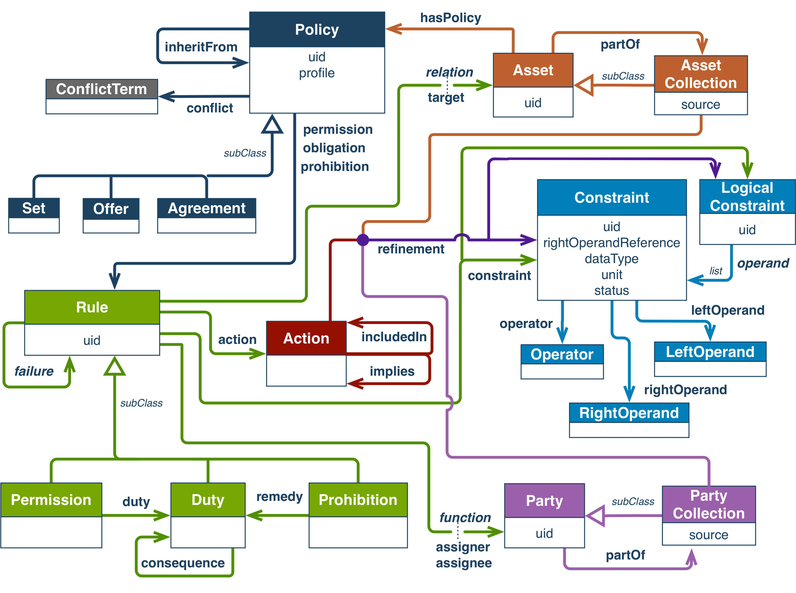

# Write-up ODRL


This page is under construction


## Description UC/wanted deliverable

The intention of the DECIDe project is to build a data space connecting multiple local authorities –with different systems, different roles, and different data, both publicly available datasets as well as non-public or sensitive information. It thus needs access policies that travel with the data: explicit, machine-readable, and understandable by anyone participating in the space, not just the team maintaining the configuration files.

We therefore set out to identify a standardized policy language suited to a linked-data context, evaluate the available options –with XACML 3.0 and ODRL as the main candidates– and implement the chosen language by mapping the existing access rules to it and extending sparql-parser to enforce it natively. The wanted deliverable is an **Authorization Policies Store**: a central registry of access rights, aligned with the DS4SSCC Reference Architecture, that all data space services can consume. We also scoped in describing the path towards supporting delegation of access rights –allowing one party to transfer a subset of their access to another– as a key capability for more complex multi-organization sharing scenarios.

The Authorization Policies Store is one of three inter-dependent Reference Architecture components that DECIDe must incorporate, alongside the Federating Catalogue and the Universal Trust Data Registry.

Within the project proposal, this maps to the following deliverables and tasks:

| Deliverable                                                                               | Activities                                                                                                                                                  |
| ----------------------------------------------------------------------------------------- | ----------------------------------------------------------------------------------------------------------------------------------------------------------- |
| **D2.1.1** In-depth technical analyzes of current architecture UC0.0                      | **T2.1** In-depth analysis of current technical architecture in use at pilot sites & gap analysis of possible solutions for the DECIDe 'to be' architecture |
| **D2.6.4** Authorization policies stores available                                        | **T2.10** Define, develop and test open source semantic Authorization Policies Store                                                                        |
| **D2.7.4** Authorization policies stores integrated in local dataspace of all pilot sites | **T2.11** Integrate Authorization Policies Store in local dataspace of all pilots                                                                           |

### Link to other deliverables

#### Universal Trust Data Registry (VC)

The Authorization Policies Store and the Universal Trust Data Registry form a single access control stack: the Trust Registry establishes who a participant is and what groups or roles they hold, while the Authorization Policies Store defines what those groups or roles are authorised to access. Neither component functions fully without the other.\
[write-up-verifiable-credentials.md](write-up-verifiable-credentials.md "mention")

#### Federation Layer (DCAT / DSP)

The proposal aims for DCAT distributions to be extended with machine-readable access rights information –specifically investigating `dcterms:accessRights` or a similar mechanism. ODRL policies governing access to a distribution are therefore linked to how that distribution is described and discoverable in the DCAT catalogue. The Data Space Protocol (DSP) governs how data exchange requests are initiated and negotiated; ODRL policies describe what access is ultimately permitted and what data consumers can or should do with their dataset. It should be noted that the ODRL policies that describe the broad access and use of distributions is only loosely and manually connected with the ODRL policies that govern deeper data access inside the triplestore.  \
[write-up-dcat.md](write-up-dcat.md "mention") [write-up-dsp.md](write-up-dsp.md "mention")

## Glossary


See the [UC0.0 Data space glossary](./#glossary) for definitions of DCAT, LBLOD, ODRL, RDF, SHACL, and SPARQL.

The glossary includes the most important concepts of the ODRL. See [#final-semantic-components-and-why-if-any](write-up-odrl.md#final-semantic-components-and-why-if-any "mention")for more information.


<table><thead><tr><th width="211.978515625">Term/Acronym</th><th>Explanation</th></tr></thead><tbody><tr><td><a href="https://en.wikipedia.org/wiki/Attribute-based_access_control">ABAC (Attribute-Based Access Control)</a></td><td>An access control model where rights are determined by attributes of the subject (e.g. group, role, department). The DECIDe authorisation model is ABAC in nature.</td></tr><tr><td>Access Control</td><td>The process of ensuring users only perform actions on a system in ways they are allowed to, such as ABAC and RBAC. Within this documentation, it's used as a synonym to Authorisation.</td></tr><tr><td><code>Action</code> (ODRL)</td><td>The operation a subject is permitted to perform on an <code>Asset</code>. In ODRL's common vocabulary, <code>read</code> and <code>modify</code> are the two pre-defined actions used in DECIDe.</td></tr><tr><td><code>Agreement</code> (ODRL)</td><td>A subclass of ODRL <code>Policy</code>: a set of <code>Rule</code>s explicitly agreed between two parties. This is very similar to a <code>Set</code>, with the difference that each rule in an <code>Agreement</code> must be explicitly assigned to some party by the assigning party.</td></tr><tr><td><code>Asset</code> (ODRL)</td><td>A resource to which a <code>Policy</code> applies. In DECIDe, an <code>Asset</code> corresponds to triples for a specific resource type within a graph, modelled as a SHACL NodeShape.</td></tr><tr><td><code>AssetCollection</code> (ODRL)</td><td>A subclass of <code>Asset</code> that identifies a collection of resources. In DECIDe, an <code>AssetCollection</code> corresponds to a named graph in the triplestore.</td></tr><tr><td>Authorisation</td><td>The process of ensuring users only perform actions on a system in ways they are allowed to. Within this documentation, it's used as a synonym to Access Control</td></tr><tr><td>Authorisation Policies Store</td><td>The DS4SSCC Reference Architecture component that serves as the central registry from which access rights can be consumed. In DECIDe, implemented as ODRL policies stored as linked data in the triplestore.</td></tr><tr><td><code>Constraint</code> (ODRL)</td><td>An ODRL mechanism for adding conditional refinements to Rules, Actions, Assets, or Parties. Not used in DECIDe; SHACL shapes and SPARQL queries are used instead.</td></tr><tr><td><code>Duty</code> (ODRL)</td><td>An ODRL <code>Rule</code> type granting a subject the obligation to exercise an action on an <code>Asset</code>. Not used in DECIDe.</td></tr><tr><td>Grant</td><td>The sparql-parser concept corresponding to an ODRL Permission: it assigns a right (read or write) on a graph to an allowed group.</td></tr><tr><td><a href="https://github.com/mu-semtech/sparql-parser">mu-auth / SEAS / sparql-parser</a></td><td>The authorisation enforcement technology in the semantic.works stack. mu-authorization was the original implementation; it was replaced by sparql-parser (also called SEAS). Access control is enforced by rewriting SPARQL queries at the endpoint level.</td></tr><tr><td><code>Offer</code> (ODRL)</td><td>A subclass of ODRL <code>Policy</code>: a policy that can be offered from one entity to another, but in itself does not grant any rights to the receiving entity.</td></tr><tr><td>PAP (Policy Administration Point)</td><td>The component through which authorisation policies are specified and managed. In DECIDe, currently a manual process of writing ODRL policies as TTL.</td></tr><tr><td><code>Party</code> (ODRL)</td><td>An entity with an active role in a policy (assigner or assignee). In DECIDe, individual users are <code>Parties</code>.</td></tr><tr><td><code>PartyCollection</code> (ODRL)</td><td>A subclass of <code>Party</code> that identifies a collection of entities. In DECIDe, a <code>PartyCollection</code> corresponds to a group of users as defined in semantic.works, with membership determined by a SPARQL query.</td></tr><tr><td>PDP (Policy Decision Point)</td><td>The component that evaluates a request against the applicable policy and decides whether it is permitted. In DECIDe, embedded in sparql-parser.</td></tr><tr><td>PEP (Policy Enforcement Point)</td><td>The component that intercepts requests and enforces the policy decision. In DECIDe, sparql-parser rewriting SPARQL queries at the endpoint level.</td></tr><tr><td><code>Permission</code> (ODRL)</td><td>An ODRL <code>Rule</code> type granting a subject the ability to exercise an action on an <code>Asset</code>. The only Rule type used in DECIDe.</td></tr><tr><td><code>Policy</code> (ODRL)</td><td>A collection of one or more <code>Rule</code>s, with 3 subclasses: <code>Set</code>, <code>Offer</code> and <code>Agreement</code>. DECIDe only uses <code>Set</code> policies.</td></tr><tr><td><code>Prohibition</code> (ODRL)</td><td>An ODRL <code>Rule</code> type granting a subject the inability to exercise an action on an <code>Asset</code>. Not used in DECIDe: everything not explicitly permitted is prohibited by default.</td></tr><tr><td><code>Rule</code> (ODRL)</td><td>An abstract concept with 3 subclasses: <code>Permission</code>, <code>Prohibition</code>, and <code>Duty</code>.</td></tr><tr><td><code>Set</code> (ODRL)</td><td>The most general subclass of ODRL <code>Policy</code>: any collection of Rules without additional restrictions (such as bilateral agreement structure or offer semantics).</td></tr><tr><td><a href="https://docs.oasis-open.org/xacml/3.0/xacml-3.0-core-spec-os-en.html">XACML (eXtensible Access Control Markup Language)</a></td><td>An OASIS standard for expressing and enforcing fine-grained access control policies. Cited in the proposal as a candidate for comparison with ODRL; not adopted in DECIDe.</td></tr></tbody></table>

Prefixes that are used in this section:

```turtle
@prefix sh: <http://www.w3.org/ns/shacl#> .
@prefix eli: <http://data.europa.eu/eli/ontology#> .
@prefix odrl: <http://www.w3.org/ns/odrl/2/> .  
@prefix dcat: <http://www.w3.org/ns/dcat#> .  
@prefix dct: <http://purl.org/dc/terms/> .  
@prefix xsd: <http://www.w3.org/2001/XMLSchema#> .  
@prefix foaf: <http://xmlns.com/foaf/0.1/> .  
@prefix schema: <https://schema.org/> .  
@prefix rdf: <http://www.w3.org/1999/02/22-rdf-syntax-ns#> .
@prefix private-ds-ex: <http://decide.data.gift/datasets/example/60e19fdf-b549-41b9-9adf-420379285127/> .
@prefix public-ds-ex: <http://decide.data.gift/datasets/example/1ae2da8e-9889-426b-a7e8-9360c15ba2cd/> .
@prefix mu: <http://mu.semte.ch/vocabularies/core/> .
@prefix ext: <http://mu.semte.ch/vocabularies/ext/> .
@prefix : <http://example.org/> .
```

## Business analysis + final feature passport (incl. functional analysis)

### Opportunity (problem, need, desire)

The DECIDe data space connects local governments from different countries and jurisdictions, and as it moves beyond publicly available datasets towards non-public or sensitive information, it needs a mechanism for expressing and enforcing access policies that is explicit and machine-readable, interoperable across organizational boundaries, linked-data native, and practically enforceable at the data layer.

The existing mu-authorization/sparql-parser stack (in use in the LBLOD ecosystem) already enforces access control at the SPARQL endpoint level, meaning all data-accessing services automatically respect the same rules, but its policies are expressed in a bespoke Lisp-like configuration language with no standardized representation. This makes access rules explicit but application-specific: they cannot be understood by other systems, verified by external tooling, or reused across organizational boundaries.

ODRL –the Open Digital Rights Language, a W3C standard already mandated by the DS4SSCC Blueprint– addresses this directly. As an RDF vocabulary, ODRL fits naturally into the linked-data architecture of DECIDe: policies can be stored in the same triplestore as the data they govern, consumed by standards-aware tooling, and shared across data space participants. **By extending sparql-parser to read and enforce ODRL policies directly from the triplestore, DECIDe gains interoperable, machine-readable access control without replacing its existing enforcement infrastructure**.

### Target audience / Personas

The primary users of the Authorization Policies Store are data engineers and policy administrators who define and manage access rules for the data space.

<table><thead><tr><th width="290.0693359375">Persona</th><th>Journey</th></tr></thead><tbody><tr><td><strong>P6</strong> Data engineer</td><td>Writes ODRL policies as TTL, loads them into the Authorization Policies Store, and verifies that sparql-parser correctly enforces the resulting access rules across the relevant graphs and resource types.</td></tr><tr><td>Other Personas</td><td>All other roles –enrichment providers, application users, validators– are indirectly affected: the ODRL policies govern what they can access, but they do not interact with the Authorization Policies Store directly.</td></tr></tbody></table>

### Functionality & Scope

The Authorization Policies Store is a set of ODRL policies –expressed as TTL and stored as linked data in the triplestore– specifying which groups of users are permitted to read or write which graphs and resource types. The sparql-parser component acts as both Policy Enforcement Point and Policy Decision Point: it intercepts every incoming SPARQL request, evaluates the applicable ODRL policies, and rewrites the query to enforce the access rules. No separate enforcement layer is needed; all data-accessing services are automatically subject to the same policy by virtue of passing through the sparql-parser endpoint.

The deliberate scope of the ODRL implementation covers only the subset of the ODRL information model that fits the usecase of authorisation policies and maps to sparql-parser's capabilities.

## Datasets and datastandards

### Datasets available in the data space

| Dataset                                                 | IdP/Authentication service                                           | Country of origin                         | Domain                      | Shared within the project         | Reused within the project      |
| ------------------------------------------------------- | -------------------------------------------------------------------- | ----------------------------------------- | --------------------------- | --------------------------------- | ------------------------------ |
| Authorization policies (ODRL TTL in triplestore)        | oid4vc-login service / session-based authentication (semantic.works) | Belgium / Germany                         | Access control / governance | Yes –used by all pilot sites–     | Yes – enforced across use cases |
| Dataset-specific usage policy (ODRL TTL in triplestore) | Not enforced                                                         | Per partner, defaults provided by project | Governance                  | Yes                               | Yes –policies available to all datasets published |
### Data standards

| Standard                           | Link                                                                           |
| ---------------------------------- | ------------------------------------------------------------------------------ |
| ODRL Information Model 2.2         | [https://www.w3.org/TR/odrl-model/](https://www.w3.org/TR/odrl-model/)         |
| ODRL Common Vocabulary             | [https://www.w3.org/TR/odrl-vocab/](https://www.w3.org/TR/odrl-vocab/)         |
| SHACL (Shapes Constraint Language) | [https://www.w3.org/TR/shacl/](https://www.w3.org/TR/shacl/)                   |
| SPARQL 1.1                         | [https://www.w3.org/TR/sparql11-query/](https://www.w3.org/TR/sparql11-query/) |
| vCard ontology (`vcard:fn`)        | [https://www.w3.org/TR/vcard-rdf/](https://www.w3.org/TR/vcard-rdf/)           |

#### The ODRL information model

<figure><figcaption><p>ODRL Information Model (<a href="https://www.w3.org/TR/odrl-model/">source</a>)</p></figcaption></figure>

[ODRL](https://www.w3.org/TR/odrl-model/) defines a standardized information model for expressing policies about the usage of content and services. Understanding the ODRL model is important to understand the implementation choices.

A **`Policy`** is a collection of one or more `Rules`. ODRL supports three kinds

* a `Set` is the most general form, representing any collection of `Rules` without additional restrictions (such as bilateral agreement structure or offer semantics)
* an `Offer` can be presented from one entity to another but does not by itself grant any rights to the receiving entity
* an `Agreement` is a set of `Rules` that have been explicitly agreed on between two parties.

A **`Rule`** defines what can, cannot, or must be done. ODRL supports three kinds:

* a `Permission` grants the ability to exercise an `Action` on an `Asset`
* a `Prohibition` forbids the ability to exercise an `Action` on an `Asset`
* a `Duty` grants the obligation to exercise an `Action` on an `Asset`.

An **`Action`** is the operation a `Party` is permitted or prohibited to perform on an `Asset`. ODRL pre-defines a range of actions, but policy writers can also define custom ones if needed.

An **`Asset`** represents a resource to which a policy applies. It can represent a single resource or all resources of a given type. An **`AssetCollection`** groups `Assets` together, where a single `Asset` can belong to multiple `AssetCollection`.

A **`Party`** is an entity with an active role in a policy –typically the assigner (who sets the policy) and the assignee (who must follow it). A **`PartyCollection`** groups `Parties`, where a single `Party` can belong to multiple `PartyCollection`.

**`Constraint`** allows any of the above concepts to be refined to apply only under certain conditions. `Constraint` is an expression that compare two operands using some operator. For example, `n < 10` is a constraint in which `n` and `10` are operands and `<` is the operator.

#### SHACL

Shapes Constraint Language (SHACL) is a specification to specify a set of conditions on data. In DECIDe, we use SHACL in two ways. First, to validate the quality of the data in the triple store (see [#data-standards](write-up-data-quality-manager.md#data-standards "mention")). Second, which will be further detailed in this write up, to express the structure of an **`Asset`**. For example, an asset can be all resources of type `eli:Expression` that have a title property. This section will briefly explain how data conditions are expressed using two types of SHACL shapes: node and property shapes.

Node shapes allow to target certain nodes in the graph. Nodes that have a certain class as type can be targetted using the `sh:targetClass` property. For example, the shape below targets nodes of type `eli:Expression`:

```turtle
:ExpressionShape
	a sh:NodeShape ;
	sh:targetClass eli:Expression .
```

When we have data in the triple store as shown below, the shape targets `:decisionInEnglish`:

```turtle
:decisionInEnglish a eli:Expression ;
    eli:title "This is the expression of a decision in English"@en .
```

Property shapes allow to specify constraints on properties. The `sh:propertyPath` predicate is used to specify which property is targetted. Cardinalities can be specified using `sh:minCount` and `sh:maxCount`. Typically, property shapes are linked with a node shape using `sh:property` to constrain properties of the targetted nodes. For example, to express that a `eli:Expression` must have at least one `title` property:

```turtle
:ExpressionShape
	a sh:NodeShape ;
	sh:targetClass eli:Expression ;
	sh:property :mustHaveTitleShape .
	
:mustHaveTitleShape
	a sh:PropertyShape ;
	sh:propertyPath eli:title ;
	sh:minCount 1 .
```

Further details of SHACL can be found in the specification: [https://www.w3.org/TR/shacl/#shacl-sparql](https://www.w3.org/TR/shacl/#shacl-sparql)

## Final architecture (and why)

The Authorization Policies Store architecture follows the standard three-component pattern for access control systems: a Policy Administration Point (PAP), a Policy Enforcement Point (PEP), and a Policy Decision Point (PDP).

In DECIDe, the PAP is currently manual: a data engineer writes ODRL policies as TTL and loads them into the triplestore. The triplestore itself –with its dedicated authorization policies graph– functions as the Authorization Policies Store from which access rights are consumed at request time. The sparql-parser service acts as both PEP and PDP simultaneously: it intercepts every incoming SPARQL request, resolves the applicable ODRL policies from the triplestore, evaluates whether the requesting user's session matches any PartyCollection (via the embedded SPARQL membership query), and if so rewrites the query to limit its scope to the permitted graphs and resource types. Requests for which no matching Permission exists are rejected by default.

This means all data-accessing services –SPARQL query results, LDES feeds, file hosting, AI labelling pipelines– are automatically subject to the same access control, as they all route through the sparql-parser endpoint. No additional enforcement layer is needed.

### Final semantic components (and why) (if any)

DECIDe uses three semantic components together to express authorisation policies: ODRL for policy structure, SHACL for asset scoping, and SPARQL for group membership. ODRL was chosen because it is mandated by the DS4SSCC Blueprint and because, as an RDF vocabulary, it fits directly into the linked-data stack: policies are stored in the triplestore alongside the data they govern and can be shared across data space participants and evaluated by external tools. SHACL and SPARQL replace ODRL's own Constraint mechanism where it does not map well to the capabilities of sparql-parser; the rationale for the deviation is detailed below.

In the following sections, we examine which ODRL concepts are most relevant to specify authorisation policies, and, how those concepts map to DECIDe's specific technology stack, namely [semantic.works](https://semantic.works/) and sparql-parser.

#### Using ODRL for authorisation policies

Authorisation is the process of ensuring that users only perform actions on a system in ways they are allowed to. ODRL was designed to express policies about content and services broadly –covering rights management, usage obligations, and access control across many domains. The reason it maps cleanly onto authorisation policies lies in how its core concepts align with the structure of an authorisation rule.

A rule in an authorisation policy has the form "_subject_ can perform _action_ on _object_". In ODRL, a `Permission` is defined as "the ability to exercise an Action on an Asset", making it the direct, natural mapping for an authorisation _rule_. The `Action` concept maps to the _action_ the subject may perform, and the `Asset` maps to the _object_. For the _subject_, ODRL offers both `Party` (a single entity) and `PartyCollection` (a group). Since authorisation rules typically apply to groups of users rather than named individuals, `PartyCollection` is the appropriate choice. At the policy level, a `Set` is the right type because an authorisation policy is simply a collection of rules specifying who can access what.

This defines the ODRL subset appropriate for defining authorisation policies. The table below summarises this mapping, using a movie renting service as a reference example.

<table><thead><tr><th width="233.619140625">Authorisation policy</th><th width="167.1708984375">ODRL</th><th>Movie renting example</th></tr></thead><tbody><tr><td>Policy</td><td>Set</td><td>The set of all authorisation rules</td></tr><tr><td>Rule</td><td>Permission</td><td>A customer can play a rented movie</td></tr><tr><td>Subject</td><td>PartyCollection</td><td>All customers with a premium subscription</td></tr><tr><td>Object</td><td>Asset</td><td>A movie</td></tr><tr><td>Object</td><td>AssetCollection</td><td>All movies available to rent in Belgium</td></tr><tr><td>Action</td><td>Action</td><td>Rent, Play</td></tr></tbody></table>

#### Mapping ODRL to semantic.works

Now that we have identified the subset of ODRL concepts relevant for authorisation policies, we have to examine what's needed to use it in DECIDe's linked data context. Therefore, the next sections describe how we map the identified ODRL subset broadly to semantic.works and specifically to its authorisation component, [sparql-parser](https://github.com/mirdono/sparql-parser).

In a linked-data context, the objects an authorisation rule applies to are not high-level entities like movies, but the RDF triples that constitute those entities. The mapping from generic ODRL to semantic.works therefore works as follows.

An `Asset` corresponds to all triples for a specific resource type. An `AssetCollection` then logically corresponds to a named graph in the triplestore –the set of all such typed triples that live in that graph.

A `PartyCollection` maps neatly to the `group` concept in semantic.works: a named set of users to which access rights can be assigned.

The only relevant `Action`s in a linked-data context are reading and writing triples, which map directly with ODRL's pre-defined `read` and `modify` actions. For backwards compatibility, the deprecated ODRL `write` action is also allowed instead of `modify`. Specifying any other action will result in an invalid policy.

Expanding our table above, and applying it to an example within the context of DECIDe, we get:

<table><thead><tr><th width="147.5810546875">Authorisation policy</th><th width="160.80078125">ODRL</th><th width="207.4033203125">Semantic.works</th><th>DECIDe example</th></tr></thead><tbody><tr><td>Policy</td><td>Set</td><td><mark style="background-color:$warning;">to do</mark></td><td><mark style="background-color:$warning;">to do</mark></td></tr><tr><td>Rule</td><td>Permission</td><td>Grant</td><td><mark style="background-color:$warning;">to do</mark></td></tr><tr><td>Subject</td><td>PartyCollection</td><td>Group</td><td>All public servants of a local government</td></tr><tr><td>Object</td><td>Asset</td><td>Triples for a specific resource type</td><td>Triples for a <code>besluit:Besluit</code> resource</td></tr><tr><td>Object</td><td>AssetCollection</td><td>Graph</td><td>Graph containing all data for a local government</td></tr><tr><td>Action</td><td>Action: read or modify</td><td><mark style="background-color:$warning;">Right:</mark> Read or Write</td><td>Read the decision data<br>Annotate the decision data</td></tr></tbody></table>

#### Detailed mapping: ODRL to sparql-parser's Lisp-style configuration


This section requires technical knowledge of how to write authorisation policies for sparql-parser using its Lisp-style configuration interface. If you are looking for an explanation to simply configure sparql-parser using ODRL instead please consult its [README](https://github.com/mirdono/sparql-parser/blob/upstream/feature/odrl-configuration/README.md#L400).


This section documents the precise mapping between sparql-parser's Lisp-style configuration macros and the corresponding resource types and predicates used in an ODRL configuration. The following table summarises this mapping:

| sparql-parser macro    | argument                   | ODRL resource type           | triple predicate      |
| ---------------------- | -------------------------- | ---------------------------- | --------------------- |
| `supply-allowed-group` |                            | `odrl:PartyCollection`       |                       |
|                        | group                      |                              | `vcard:fn`            |
|                        | `:parameters`              |                              | `ext:queryParameters` |
|                        | `:query`                   |                              | `ext:definedBy`       |
| `define-graph`         |                            | `odrl:AssetCollection`       |                       |
|                        | `name`                     |                              | `vcard:fn`            |
|                        | `graph`                    |                              | `ext:graphPrefix`     |
|                        | type-specifications (body) | `odrl:Asset`, `sh:NodeShape` | `odrl:partOf`         |
| `grant`                |                            | `odrl:Permission`            |                       |
|                        | `right`                    |                              | `odrl:action`         |
|                        | `:to-graph`                |                              | `odrl:target`         |
|                        | `:for-allowed-group`       |                              | `odrl:assignee`       |

**Group as PartyCollection**

Groups in sparql-parser are mapped to `PartyCollection` in ODRL. The membership of a group is defined by a SPARQL query linked via the `ext:definedBy` predicate; the query parameters are listed via `ext:queryParameters`. The group name is stored as `vcard:fn`.

For example, to define a `PartyCollection` containing users with administrator rights the following resources could be defined.

```turtle
<somePartyCollection> a odrl:PartyCollection ;
  vcard:fn "users-with-admin-roles" ;
  ext:definedBy """PREFIX ext: <http://mu.semte.ch/vocabularies/ext/>
  PREFIX mu: <http://mu.semte.ch/vocabularies/core/>
  SELECT DISTINCT ?session_group ?session_role WHERE {
    <SESSION_ID> ext:sessionGroup/mu:uuid ?session_group ;
                  ext:sessionRole ?session_role .
    FILTER( ?session_role = \"admin\" )
  }""" ;
  ext:queryParameters ("session_group", "session_role") ;
  dct:description "An optional description of this party collection" .
```

The above ODRL `PartyCollection` maps rather straightforwardly to the following `supply-allowed-group` for sparql-parser. Note that the query is mapped without changes.

```common-lisp
(supply-allowed-group "users-with-admin-roles"
  :parameters ("session_group" "session_role")
  :query "PREFIX ext: <http://mu.semte.ch/vocabularies/ext/>
  PREFIX mu: <http://mu.semte.ch/vocabularies/core/>
  SELECT DISTINCT ?session_group ?session_role WHERE {
    <SESSION_ID> ext:sessionGroup/mu:uuid ?session_group ;
                  ext:sessionRole ?session_role .
    FILTER( ?session_role = \"admin\" )
  }")
```

**Graph as AssetCollection**

Named graphs are mapped to ODRL's `AssetCollection`. The triples in the graph are the members of the collection, not the instances (subjects) themselves. This reflects the fact that sparql-parser enforces access at the triple level. For example, you can grant access to all instances of `skos:Concept` but restrict which predicates are accessible –such as `skos:prefLabel` and `skos:inScheme` only.

So we can define the Assets in an AssetCollection to be triples constrained by SHACL shapes. Each asset will be modelled using an `sh:NodeShape` with a resource type as `sh:targetClass` . Each `sh:NodeShape` can contain zero or more `sh:PropertyShapes` to restrict the the triples that can(not) be accessed for the target resources type.

More concretely, the following `odrl:AssetCollection` s and `sh:NodeShape` s

```turtle
<someAssetCollection> a odrl:AssetCollection ;
  ext:graphPrefix <http://mu.semte.ch/graphs/name> ;
  vcard:fn "some-name" .

<anotherAssetCollection> a odrl:AssetCollection ;
  ext:graphPrefix <http://mu.semte.ch/graphs/another-name> ;
  vcard:fn "another-name"
  
<someAssetNodeShape> a odrl:Asset , sh:NodeShape ;
  odrl:partOf <someAssetCollection> ;
  sh:targetClass <typeOne> .

<anotherAssetNodeShape> a odrl:Asset , sh:Node shape ;
  odrl:partOf <someAssetCollection> , <anotherAssetCollection> ;
  sh:targetClass <typeTwo> .
```

would correspond to the following `define-graph` s in sparql-parser's Lisp-style configuration:

```lisp
(define-graph some-name ("http://mu.semte.ch/graphs/name")
  ("typeOne" -> _)
  ("typeTwo" -> _))

(define-graph another-name ("http://mu.semte.ch/graphs/another-name")
  ("typeTwo" -> _))
```

Note that `sh:targetSubjectsOf` or `sh:targetObjectsOf` could also be used instead of `sh:targetClass` but would require more logic (and SPARQL queries) to determine the exact type(s) to be used.

We use property shapes with property paths to further specify which predicates of a resource type are accessible. Each property shape corresponds to a predicate specification in sparql-parser. So the following shape would specify that for resources of type `typeOne` only triples with predicates the `predOne` and `predTwo` are part of the node shape"

```turtle
<someShape> a odrl:Asset , sh:NodeShape ;
  odrl:partOf <someCollection> ;
  sh:targetClass <typeOne> ;
  sh:property [
    sh:path <predOne>
  ], [
    sh:path <predTwo>
  ] .
```

This is equivalent to the following type specification for sparql-parser:

<pre class="language-common-lisp"><code class="lang-common-lisp"><strong>("typeOne" -> "predOne"
</strong>           -> "predTwo")
</code></pre>

For inverse predicate specifications for type specifications, the `sh:inversePath` can be used in the `sh:path` of the property. This is rather straightforward for inverse predicate specifications that explicitly list the predicates. The following shape

```turtle
<someShape> a odrl:Asset , sh:NodeShape ;
  odrl:partOf <someCollection> ;
  sh:targetClass <typeOne> ;
  sh:property [
    sh:path [ sh:inversePath <predOne> ]
  ] , [
    sh:path [ sh:inversePath <predTwo> ]
  ] .
```

would become the following type specification (note the direction of the arrows):

```lisp
("typeOne" <- "predOne"
           <- "predTwo")
```

A disadvantage here is that the general inverse case, `(type <- _)`, also requires that some predicate is explicitly stated. For this we can define some custom property, for example

```turtle
<someShape> a odrl:Asset , sh:NodeShape ;
  odrl:partOf <someCollection> ;
  sh:targetClass <typeOne> ;
  sh:property [
    sh:path [ sh:inversePath ext:all ]
  ] .
```

would be equivalent to the `(typeOne <- _)` type specification.

To express disallowing type specifications property shapes can be surrounded with a `sh:not` constraint component. So a shape like the following

```turtle
<someShape> a odrl:Asset , sh:NodeShape ;
  odrl:partOf <someCollection> ;
  sh:targetClass <typeOne> ;
  sh:not [
    sh:property [
      sh:path <predOne>
    ] , [
      sh:path <predTwo>
    ]
  ] .
```

would become

```lisp
("typeOne" x> "predOne"
           x> "predTwo")
```

Same as before, the `sh:inversePath` property path can be used to express the inverse direction in the property shapes.

Note, explicitly specifying something like `("type" x> _)` does not make much as sense as that should be equivalent to not adding such a type specification.

**Grant as Permission**

The ODRL `Rule` allows exactly one `Action` per rule. Consequently, if a Party has both read and write access to an AssetCollection, two separate permissions are required. The transformation from ODRL to sparql-parser merges such permissions together into a single `grant` with multiple `rights`.

For example, the following ODRL permissions provided a member of `somePartyCollection` , as defined above, read and write access to `someAssetCollection`

```turtle
<peopleReadPermission> a odrl:Permission ;
  odrl:action odrl:read ;
  odrl:target <someAssetCollection> ;
  odrl:assignee <somePartyCollection> .

<peopleWritePermission> a odrl:Permission ;
  odrl:action odrl:modify ;
  odrl:target <someAssetCollection> ;
  odrl:assignee <somePartyCollection> .
```

These correspond to a single `grant` macro in Lisp:

```lisp
(grant (read write)
  :to-graph some-name
  :for-allowed-group "users-with-admin-roles")
```

Note that ODRL Permissions are only required to have an action and a target, whereas an assignee is optional. However, in the context of sparql-parser authorisation policies, an assignee is mandatory. Without it, the right cannot be granted to any entity. Additional optional properties such as the assigner can be specified but will have no effect.

#### ODRL concepts that are not supported

DECIDe focuses on ODRL to express authorisation policies in the context of a semantic.works application, with sparql-parser as its authorisation component. Therefore, certain concepts of the ODRL information model aren't suitable.

Of the ODRL `Policy` types, `Offer` is unsuitable because it does not grant rules to the receiving entity. `Agreement` is also unsuitable because it requires exactly one assigner and one assignee, whereas authorisation policies typically apply to multiple groups simultaneously.

The remaining ODRL `Rule` types –`Prohibition` and `Duty`– are also not needed in the context of authorisation policies. `Prohibition` rules are redundant because everything that is not explicitly permitted is prohibited, and `Duty` rules are irrelevant because the access model does not impose obligations on users as part of granting access rights.

As sparql-parser does not support granting any other rights, we only support the `read` and `modify` (and the depecrated `write`) `Actions`.

Finally, we do not support `Constraint` as its semantics don't properly fit our needs. ODRL supports a `Constraint` on `AssetCollection`, `PartyCollection`, `Action`, and `Rule`. We evaluated the use for each case:

* For **`AssetCollection`**, ODRL `Constraint` allows specifying conditions specifying which Assets belong to a collection (for example, a movie is part of a collection only if it is shorter than 60 minutes). In DECIDe, `AssetCollection`s are graphs and `Asset`s are sets of triples defined by resource type and predicate. Describing which triples belong to a graph is precisely where _SHACL_ excels.
* For **`PartyCollection`**, ODRL `Constraint` allows specifying conditions for membership (for example, a customer is a member of the adult collection only if they are at least 18 years old). For group mempership, sparql-parser leverages _SPARQL queries_, which can express any condition derivable from session attributes and the underlying data model –an expressiveness that ODRL `Constraint` semantics cannot match.
* For **`Action`**, ODRL `Constraint` allows granting the ability to exercise an action only under certain conditions (for example: a movie may be played only for non-commercial purposes). Sparql-parser currently has no support to further refine a granted right. The two supported actions in DECIDe –read and modify– are granted unconditionally to the assignee.
* For **`Rule`**, ODRL `Constraint` allows a Rule to apply only under temporal or other conditions (for example, playing a rental movie is only allowed during the two week rental period). Sparql-parser does not currently support adding such constraints to granted rights.

Should sparql-parser gain support for constraint refinement of Actions or Rules in a future version, revisiting a more complete ODRL mapping could be worthwhile.

#### ODRL use to describe dataset usage restrictions

In DECIDe ODRL is also used to describe the *usage restrictions* of datasets. Note that this is going much further than 'dataset access restrictions', i.e. whether users can just read or write to the dataset. It also can define what users can or can't do with the dataset. For instance, should they attribute the original owner? Can they resell or republish the dataset? This is done by adding an ODRL Offer and linking it to a dataset. The offer is then published on the LDES and in the DCAT catalog together with the DCAT description of the dataset. 

As all the datasets in the DECIDe project are public, the publication of such policies was not a strong concern for the participants at this time and therefore, the standard offers in the DECIDe project are fairly minimal. Here is an example of an Offer that describes a dataset as public:

```turtle
public-ds-ex:policy a odrl:Offer, ext:PublicPolicy ;  
    mu:uuid "ab4509a9-4676-4966-bc07-8c20a3eb1d80" ;
    dct:description "Anyone may use this dataset" ;
    odrl:permission [  
        odrl:action odrl:read ;  
        odrl:target public-ds-ex:dataset ;  
        odrl:assigner <http://ds.decide.lblod.info> ;  
    ] ;
    odrl:prohibition [
      odrl:action odrl:modify ;
      odrl:target public-ds-ex:dataset ;  
      odrl:assigner <http://ds.decide.lblod.info> ;  
    ] .
```

As there is no `odrl:assignee` for the permission and prohibition above, this Policy grants anyone the permission to view the dataset, but prohibits writing to the dataset. 

An example of an Offer that describes a private dataset is:

```turtle
private-ds-ex:policy a odrl:Offer, ext:RestrictedPolicy ;  
    mu:uuid "1d8e1e34-ac8c-4fb8-845a-a9e8ca0e9f6b" ;
    dct: "Only licensed users may access this content" ;
    odrl:conflict odrl:perm ;
    odrl:permission [  
        odrl:assigner <http://ds.decide.lblod.info> ;  
        odrl:target private-ds-ex:dataset ;  
        odrl:action odrl:read ;  
        odrl:assignee private-ds-ex:licensedUserCollection ;  
    ] ;
    odrl:prohibition [  
        odrl:assigner <http://ds.decide.lblod.info> ;  
        odrl:target private-ds-ex:dataset ;  
        odrl:action odrl:read, odrl:modify ;  
    ] .

```

In this case, the permission to read is only granted to an `odrl:PartyCollection` called `private-ds-ex:licensedUserCollection`. Reading and writing is prohibited by default. This means that only users who have bought a license can read the private dataset.

These policies are only there for users to read (and possibly also automated systems that understand ODRL), they are not parsed, let alone enforced in the DECIDe data space. The only rules applied by the DECIDe dataspace are the ODRL authorisation policies above. This is because they work on a different level.

### Other explored semantic components (and why not)

### Final AI components (and why) (if any)

n/a

### Other explored AI components (and why not)

n/a

## Final UI design (and why) (if any)

n/a

### Other explored UI design (and why not)

n/a

## Testing approach

### Risks & mitigations

## Possible future work

### Possible future work DECIDe data space related

#### Feature parity between ODRL and Lisp configuration

Configuring sparql-parser using ODRL does not yet support all features available in the Lisp-style configuration. More specifically, the ODRL configuration does not support some more fine-grained settings which the Lisp-style configuration allows. Sparql-parser allows to configure some things at the level of individual graphs. For example, [generating delta messages](https://github.com/mu-semtech/sparql-parser/blob/feature/odrl-configuration/README.md#generating-delta-messages-for-data-changes-in-odrl) when triples in a graph change. Currently ODRL configurations only allow this for all graphs or none of them.

#### Policy rule composition

ODRL's optional feature of [policy rule composition](https://www.w3.org/TR/odrl-model/#composition) allows to combine common properties in a single rule. Supporting this for ODRL policies for sparql-parser would allow to make policies slightly more concise. For example, it would allow to specify read and write access in a single permission instead of having to specify two very similar rules.

#### ODRL Constraints for Permission scope

Currently scopes for permission in a policy are defined using an external `ext:scope` predicate. This predicate should be considered a shorthand notation for ODRL `Constraint`s. Ideally we also support users to explicitly specify the scopes as ODRL Constraints. To specify a single scope for some permission, a policy writer would specify a constraint with

* `odrl:systemDevice` as left operand;
* `odrl:eq` as operator; and
* a string specifying the scope URI as right operand.

Note that only the right operand can vary across instances of constraints defining permission scopes. The left operand and operator would always have as value the one listed above.

To give a concrete example, a permission with a single scope would look something like the snippet below. Note that the value for the right operand is the same as we would currently use for the `ext:scope` predicate.

```turtle
<scopeWritePermission> a odrl:Permission ;
  odrl:action odrl:modify ;
  odrl:target example:publicGraph ;
  odrl:assignee example:publicParty ;
  odrl:constraint [
    odrl:leftOperand odrl:systemDevice ;
    odrl:operator odrl:eq ;
    odrl:rightOperand "http://services.semantic.works/some-service"
  ] .
```

If one wants to specify multiple scopes for a single permission, these could be combined using an ODRL logical constraint. This logical constraint would have `odrl:or` as operator indicating at least one scope must be satisfied for the permission to be granted. For example, extending the above snippet with a second scope could look as follows:

```turtle
<scopeWritePermission> a odrl:Permission ;
  odrl:action odrl:modify ;
  odrl:target <publicGraph> ;
  odrl:assignee <publicParty> ;
  odrl:constraint <logicalConstraint> .

<logicalConstraint> a odrl:LogicalConstraint ;
  odrl:or <firstScope> , <secondScope> .

<firstScope> a odrl:Constraint ;
  odrl:leftOperand odrl:systemDevice ;
  odrl:operator odrl:eq ;
  odrl:rightOperand "http://services.semantic.works/some-service" .

<secondScope> a odrl:Constraint ;
  odrl:leftOperand odrl:systemDevice ;
  odrl:operator odrl:eq ;
  odrl:rightOperand "http://services.semantic.works/another-service" .
```

#### ODRL Constraints for PartyCollections

Currently, group membership for ODRL PartyCollections is currently defined via embedded SPARQL queries that describe which users are members of that collection. The advantage of using SPARQL here is that we are highly flexible in how PartyCollection membership is defined. A disadvantage is, it requires policy writers to know sufficient SPARQL to understand and/or write such queries; and to have sufficient understanding of the underlying data model.

Supporting ODRL Constraints for PartyCollection –transforming them to their corresponding SPARQL queries for sparql-parser– would make policies more readable and writable by a broader audience, though with some reduction in expressiveness as compared to arbitrary SPARQL. The trade-off warrants further evaluation.

#### Unifying dataset ODRL policies and mu-authorization ODRL policies

The authorization policies for mu-authorization expressed in ODRL are currently not connected automatically to the datasets published in the data space. This is not straight-forward to enforce for all types of distributions either. The policies defined in mu-authorization make sense on the level of a SPARQL endpoint, but are much too fine grained for describing access to simple download distributions as they restrict reading and writing on specific graphs and even types and predicates in those graphs. On the other hand, the ODRL policies related to a dataset may specify information on what can or can't be done with a dataset's content, like republication or even reselling the dataset. These things fall more into the legal domain than in the software system authorization domain.

It isn't even easy to set out some general guidelines on what would be required of a mu-authorization ODRL policy for a dataset that is marked as 'public' in the ODRL policy attached to its DCAT description. One can expect there to be only `odrl:read` actions in its policy, and no `odrl:modify` policies, but mu-authorization will be *much* more precise in which specific types and predicates to expose in its data slices and this will be quite custom to *which parts exactly* of the dataset will be exposed. The [#final-semantic-components-and-why-if-any](write-up-odrl.md#final-semantic-components-and-why-if-any "mention") has some examples of just how specific these rules can be. Needless to say Mapping a 'private' dataset to a mu-authorization policy allows for even more degrees of freedom.

Authorization ODRL policies are enforced by the mu-authorization component. This cannot be expected from the ODRL policies describing what can or should be done with the DCAT dataset because of the federated nature of the data space. Some distributions may not be under control of the system but rather reside in the system of a participant, fully outside the scope of the system that holds a DCAT description of the dataset.

### Possible future work LBLOD related

## Relevant links

* [ODRL information model](https://www.w3.org/TR/odrl-model/)
* [sparql-parser README](https://github.com/mu-semtech/sparql-parser/tree/feature/odrl-configuration)
