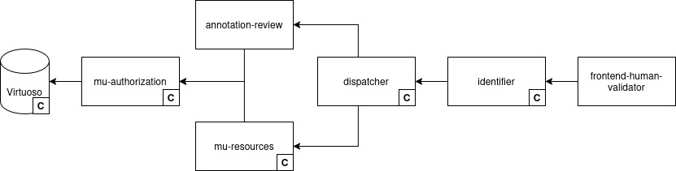

# Write-up UC0.0 Human Validation (HV)


This page is under construction


## Description UC/wanted deliverable


**Note:** Human Validation (HV) is a horizontal component shared across all DECIDe use cases. It is documented at UC0.0 level because its shared logic, data model, and governing design decisions apply equally to UC0.0, UC0.1, UC1, and UC2. Each use case write-up documents the UC-specific validation interface; this write-up covers the general pattern, the data model, and the decisions that govern all interfaces as well as the interface for UC0.0.


The DECIDe project builds an AI enrichment layer that generates structured semantic annotations on local decisions and legislation (LD\&L) –recognizing named entities, linking them to authoritative concept URIs, mapping decisions to policy frameworks, and extracting dates and temporal scope. The quality of these AI-generated enrichments directly affects their downstream utility: annotations that are incorrect or unreliable erode the value of the data space for the cities and organizations that consume it.

The wanted deliverable is a human-in-the-loop validation layer: a set of lightweight interfaces through which domain experts and local government staff can work through AI annotation outputs, recording their judgments and enabling downstream consumers to filter or weight results based on a certain level of human endorsement

Within the project proposal, this maps to the following deliverables and tasks:

| Deliverable                                                                     | Activities                                                                                                                                                                                                        |
| ------------------------------------------------------------------------------- | ----------------------------------------------------------------------------------------------------------------------------------------------------------------------------------------------------------------- |
| **D2.9** AI tool for labelling LD\&L ready                                      | **T2.13** Define, develop, train and test open source semantic AI tool for labelling LD\&L, including _interface for human review_ UC1                                                                            |
| **D2.10** AI tool for labelling implemented at relevant pilot sites             | **T2.14** Implement AI tool for labelling LD\&L at lead pilot and at least one following pilot site                                                                                                               |
| **D2.11** AI tool for matching LD\&L to relevant policies and legislation ready | **T2.15** Define, develop, train and test open source semantic AI tool for matching LD\&L to relevant policies and legislation, including _interface for human review_                                            |
| **D2.12** AI tool for matching LD\&L implemented at relevant pilot sites        | <p><strong>T2.16</strong> Implement AI tool for matching LD&#x26;L to relevant policies and legislation, including <em>interface for human review</em> at lead<br>pilot and at least one following pilot site</p> |

### Link to other deliverables

#### UC0.0 Pipelines

The pipelines write-up documents the AI enrichment pipelines whose outputs the HV validates: the Named Entity Recognition and Linking pipeline (UC0.0) and the Codelist Mapping Tool (UC0.1, UC1). The `oa:Annotation` objects produced by these pipelines are the primary input to every HVT interface.

[write-up-uc0.0-pipelines.md](write-up-uc0.0-pipelines.md "mention")

#### UC0.1 Policy Impact Report

UC0.1 includes a dedicated HV interface for validating AI-generated SDG codelist mappings. The general validation logic and data model are documented in this write-up; the specific interface design and user journey for UC0.1 are in the UC0.1 write-up.

[write-up-uc0.1-policy-impact-report.md](../write-up-uc0.1-policy-impact-report.md "mention")

#### UC1 Restrictive Mobility Zones

UC1 reuses two of the HV interface components documented here: the codelist mapping interface (for validating whether a decision concerns a restricted mobility zone) and the entity linking interface (for validating the location entities recognized in the decision text). UC1-specific interface details are in the UC1 write-up.

[write-up-uc1-restricted-mobility-zones.md](../write-up-uc1-restricted-mobility-zones.md "mention")

#### UC2 Smart Search

The HV for UC2 is embedded in the interface for the use case itself: validating AI-generated answers to user queries as well as the source decisions used to construct those answers. The UC2 write-up covers the specifics of this interface.

[write-up-uc2-smart-search.md](../write-up-uc2-smart-search.md "mention")

## Glossary


See the [UC0.0 Data space glossary](./#glossary) for definitions of Human-in-the-loop, HV (Human Validation), and `oa:Annotation`, and Triplestore


<table><thead><tr><th width="153.2138671875">Term/Acronym</th><th>Explanation</th></tr></thead><tbody><tr><td>Domain validator</td><td>A human expert with domain knowledge relevant to a specific annotation type, for example a sustainability officer validating SDG mappings (UC0.1) or a mobility expert validating RMZ classifications (UC1). Corresponds to persona P4.</td></tr><tr><td>NEL</td><td>Named Entity Linking. The AI step that links a recognized named entity (e.g. a bestuursorgaan mentioned in a decision text) to an authoritative concept URI in a reference registry. The output of NEL is one of the annotation types validated via the UC0.0 HV interface.</td></tr><tr><td>Session</td><td>The browser session in which a user interacts with the HVT. Votes are persisted per session; there is no user login, so cross-session vote history is not tracked per individual user.</td></tr><tr><td>Vote</td><td>The binary validation action available to a user in any HV interface. A thumbs-up indicates the annotation is correct; a thumbs-down indicates it is incorrect. Votes are stored as linked data and aggregated across interfaces.</td></tr></tbody></table>

## Business analysis + final feature passport (incl. functional analysis)

#### Opportunity (problem, need, desire)

Across DECIDe use cases, AI generates several types of structured annotations on local decisions and legislation: named entity recognition and linking (extracting and matching organizations, dates and locations) and codelist mapping (linking a decision to SDG goals or RMZ classifications and assigning an impact score where relevant). These annotations are valuable –they make LD\&L machine-queryable in ways not possible with unstructured text– but they are not fully reliable. Model errors, ambiguous decision language, and domain-specific edge cases mean that any given annotation may be incorrect. Without a structured mechanism for human feedback, two problems follow: there is no way for domain experts to flag errors or endorse correct outputs in a form that persists in the data space, and there is no feedback loop for improving the AI pipelines over time through observed expert assessments.

The Human Validation Tooling (HVT) addresses both problems. It provides a low-friction mechanism for domain experts to work through AI annotation outputs, record assessments as linked data, and thereby create a growing layer of human-endorsed signal that downstream consumers can query directly, subject to their own quality thresholds. Crucially, this signal doesn't modify the AI-generated annotations or the source LD\&L data –it exists as a separate, independently queryable layer.

#### Pilot partners

All three pilot cities participate in Human Validation, though the nature of participation differs across use cases. Pilot partners representatives work through validation during development and testing. Domain expert validation by city staff is the intended target use during the pilot phase.

#### Target audience / Personas

The HV interfaces are designed primarily for domain experts who can bring subject-matter knowledge to bear on annotation quality, and for internal and external validation testers who help the team assess performance. The primary persona is P4, the domain validator. Because no login is required and the interfaces are accessible to any user, non-technical users (P5) are a secondary audience — they encounter the validation interface embedded within a UC application and participate in validation without a dedicated expert role.

<table><thead><tr><th width="283.3603515625">Persona</th><th>Journey</th></tr></thead><tbody><tr><td><strong>P4</strong> Domain validator</td><td>Works through a paginated table of AI-generated annotations for a given use case; votes thumbs-up or thumbs-down per annotation; accesses the source decision document when more context is needed to assess a row. May be a sustainability officer (UC0.1), a mobility specialist (UC1), or an IT/digiteam member (UC0.0).</td></tr><tr><td><strong>P5</strong> Non-technical application user</td><td>Encounters the HV interface embedded within a UC application; can vote on annotations without expert knowledge of the underlying data model.</td></tr><tr><td><strong>P6</strong> Data engineer</td><td>Monitors aggregated vote counts to assess annotation quality; configures downstream queries to filter annotations by vote ratio or minimum vote count threshold.</td></tr></tbody></table>

#### Functionality (requirements)

Rather than building a single universal interface for all annotation types, DECIDe implements a shared validation pattern and a tailored interface per use case. Each use case handles different annotation types, focuses on different domains, and is used by validators with different expertise; a sustainability officer validating SDG mappings does not necessarily have the knowledge to validate named entity links or restricted mobility zones. Per-use-case interfaces allow them to be embedded within the relevant UC application (e.g. the SDG validation interface within the Policy Impact Report), making the validation task contextually situated rather than detached from the data it concerns.

The shared logic applies to all four interfaces: annotations are stored as `oa:Annotation` linked data objects; validation results are stored as additional `oa:Annotation` objects in the triplestore without modifying the AI-generated annotations or the underlying ELI source data; users vote thumbs-up or thumbs-down per annotation; votes are aggregated across all interfaces that reference the same annotation; and users can access the original source decision from any row.

The four UC-specific validation scopes are:

* UC0.0: validating named entity type assignments and entity URIs
* UC0.1: validating SDG goal–impact pairs
* UC1: validating location entities and RMZ classifications
* UC2: validating AI-generated answers and their source decisions

In this write-up, we are focusing on the shared logic, data model, and governing design decisions that apply to all interfaces, as well as the specific UC0.0 validation.

<table><thead><tr><th width="617.1787109375">Feature</th><th>Priority</th></tr></thead><tbody><tr><td>Human validation results stored as additional <code>oa:Annotation</code> linked data, separate from AI annotations and source ELI data</td><td>Must-have</td></tr><tr><td>User can vote thumbs-up or thumbs-down per annotation</td><td>Must-have</td></tr><tr><td>Votes aggregated across interfaces that reference the same annotation</td><td>Must-have</td></tr><tr><td>User can see total number of existing votes per annotation</td><td>Must-have</td></tr><tr><td>User can access or download the original source decision for context</td><td>Must-have</td></tr><tr><td>Paginated annotation table, one <code>oa:Annotation</code> per row</td><td>Must-have</td></tr><tr><td>One validation interface per use case (not one universal interface)</td><td>Must-have</td></tr><tr><td>Landing page, with overview of available interfaces</td><td>Nice-to-have</td></tr><tr><td>Interface available in English</td><td>Must-have</td></tr></tbody></table>

## Datasources, datasets and datastandards

> The foundational data sources and datasets for DECIDe (LD\&L decisions, core data standards) are documented in the UC0.0 Pipelines write-ups. The HVT uses the AI-generated `oa:Annotation` objects from all use cases, and writes human validation votes back as additional linked data.

### Data sources

| Name of data source                             | Type/category          | Brief description                                                                               |
| ----------------------------------------------- | ---------------------- | ----------------------------------------------------------------------------------------------- |
| Named Entity Recognition enrichments (`oa:Annotation`) | Internal (triplestore) | The enrichment outputs produced by the NER service. |
| Named Entity Linking enrichments (`oa:Annotation`) | Internal (triplestore) | The enrichment outputs produced by the NEL service. |
| Codelist mapping enrichments (`oa:Annotation`) | Internal (triplestore) | The enrichment outputs produced by the codelist mapping service. |
| Smart search response (`schema:Answer` and `schema:Quotation`) | Internal (triplestore) | The answer produced by the question answering service. |


### Datasets available in the data space

| Dataset                                  | IdP/Authentication service | Country of origin                                                        | Domain     | Shared within the project | Reused within the project      |
| ---------------------------------------- | -------------------------- | ------------------------------------------------------------------------ | ---------- | ------------------------- | ------------------------------ |
| Human validation feedback (`oa:Annotation`) | Data space authentication                        | Belgium / Germany | Government | Yes                       | Yes - shown as aggregate number in Human Validation Tool, Codelist mapping votes are reused by the codelist mapping service for training. |

### Data standards

<table><thead><tr><th width="371.2509765625">Standard</th><th>Link</th></tr></thead><tbody><tr><td>Web Annotation Vocabulary (<code>oa:Annotation</code>)</td><td><a href="https://www.w3.org/TR/annotation-vocab/">https://www.w3.org/TR/annotation-vocab/</a></td></tr><tr><td>Simple Knowledge Organization System (SKOS)</td><td><a href="https://www.w3.org/TR/skos-reference/">https://www.w3.org/TR/skos-reference/</a></td></tr></tbody></table>

The way AI annotations are expressed using the Web Annotation Vocabulary has already been described earlier in the [UC0.0 data space write-up](./#web-annotation-model). Through the human review process, these AI annotations are either voted as correct, or incorrect. These votes themselves are ALSO represented by annotations according to the Web Annotation Vocabulary. This is illustrated by the following drawing:

<figure><figcaption></figcaption></figure>

In this drawing, rdf classes are represented by rounded rectangles. Predicates are shown as arrows connecting their origin as the predicate subject to their target as a predicate object. The bottom classes represent a high level view of the AI annotations and are shaded slightly darker to make the distinction with the annotations created by the human validation process, which are shaded lighter.

Human validation votes are themselves also of the type `oa:Annotation`, their target is the AI annotation that it validates. The body is a `skos:Concept` that is either `http://mu.semte.ch/vocabularies/ext/annotation-review#approve` to signify a thumbs up or `http://mu.semte.ch/vocabularies/ext/annotation-review#reject` for a thumbs down vote of the user. The creator of the human review annotation is the session of the user that created the annotation. Like other annotations created in our pipeline, they also have a `mu:uuid` identifier and a `dct:created` creation timestamp, which are not shown in the drawing. For further distinction from AI annotations, they are also of the type `ext:ReviewAnnotation` and are marked using `oa:motivatedBy` with the value `oa:assessing`.

The prefixes used in this section are:

```
PREFIX oa: <http://www.w3.org/ns/oa#>
PREFIX mu: <http://mu.semte.ch/vocabularies/core/>
PREFIX ext: <http://mu.semte.ch/vocabularies/ext/>
PREFIX dct: <http://purl.org/dc/terms/>
PREFIX skos: <http://www.w3.org/2004/02/skos/core#>
```

Tracking human reviews like this gives us a lot of provenance information on the human validations. We know who approved or rejected the annotation, though only with the session information, see future work for how this can be extended to great effect. We also know when the review took place. If a malicious agent would somehow automatically create millions of fake annotations, we would be able to tell from the unrealistic timestamps and filter out annotations from such a period. As discussed in the future work section, we currently don't allow corrections, but with this data model, the human review annotations could be extended to also contain a correction as an additional `oa:hasBody` without breaking the data model.

## Final architecture (and why)

### Final semantic components

The semantic components related to the human validation are depicted in the drawing below.

<figure><figcaption></figcaption></figure>

In this drawing, services are depicted as rectangles, the Virtuoso triplestore is shown as a cylinder and HTTP requests are shown as arrows pointing from the origin of the request to the receiver of the request. Core components, marked with a **C**, are described in the core semantic.works components section of the [UC0.0 Data space write-up](./#core-semantic.works-components).

#### Annotation-review

The triplestore contains the annotations created by the various AI services. This data is stored according the the Web Annotation Vocabulary. How this is done is described in the different use case chapters. These annotations needs to be presented to the user through the frontend-human-validator component so the user can interact with them to validate them.

Usually, mu-resources is used to provide a JSON-based API on top of the linked-data representation of such concepts. However, since the model for annotations is more complex than what resources is best suited for, the annotation-review service was created. It has the same role as mu-resources, but is created specifically for the Web Annotation Vocabulary model and tackles the more complex parts of the model. The main issue it resolves is dealing with the different formats an annotation can have: the target can be an expression, or it can be an `oa:SpecificResource` that points to a specific section of an expression. The body can be a direct `skos:Concept` or it can be an `rdf:Statement` that expresses any sort of knowledge through a triple. It offers pagination and filtering over annotation targets (expressions in our case) and over the annotations of such a target. It also allows browsing and filtering the annotations of a certain type, regardless of the target, which is used in UC0.1 and UC1 for showing codelist annotations. The simple parts of annotations are still published through mu-resources, expressions and their contents for instance.

The annotation-review service also handles the approval and rejection of AI annotations by the user, making sure that the same session can only have one vote on the correctness of an AI annotation. If it sends another vote, it updates the existing one instead of adding an additional

This service is made to be reusable and can be configured to render annotations of any type on any kind of target as long as the annotations are expressed using the Web Annotation Vocabulary. For more information on this service, see its [GitHub repo](https://github.com/lblod/annotation-review-service/).

#### Frontend-human-validator

Like any user facing interface in the [semantic.works](https://semantic.works/) architecture, the interface of the human validation tool is created as a frontend component. This is an [Emberjs](https://emberjs.com/)-based web interface that uses the APIs provided by mu-resources and the annotation-review service to build a view that the user can interact with through a web-browser.

To allow for easy reuse, the frontend-human-validator interface is split out from the other interfaces in DECIDe, allowing users to pick and choose which functionality they want to install or build upon.

More information can be found in the service's [GitHub repo](https://github.com/lblod/frontend-decide-human-validator/).

### Final AI components (and why) (if any)

n/a

The HV is not itself an AI component –it provides the interface through which human validators assess AI-generated outputs. The AI components whose outputs the HV interfaces validate are documented in the [UC0.0 Pipelines write-up](write-up-uc0.0-pipelines.md#ai-pipeline).

### Other explored AI components (and why not)

n/a

## Final UI design (and why) (if any)

There are multiple types of Human Validation needed throughout the DECIDe project:

1. Validation of discovered entities _within_ a decision: i.e. an annotated piece of text in the decision (like a person, government body, or a location)
2. Validation of AI annotations _about_ a decision: i.e. What is this decision about? e.g. SDG (UC0.1) and Restricted Mobility Zones (UC1)
3. Validation of AI generated responses to a user question, based on a number of source decisions (UC2)

The HVT delivers different validation interfaces, each tailored to the annotation type being validated. In this section, we explain the interfaces for UC0.0 -covering the first type of validation. For the other types of validation, please refer to the design section of the use case write-ups.

#### Validation of AI annotations _within_ a decision



The first screen the user sees, is a list of all available decisions with discovered entities. A user can filter the decisions by local authority (within DECIDe: Bamberg, Freiburg, and Ghent). Once the user selects a decision by clicking on the decision title, the user is sent to the next screen: a list of discovered entities.


**Implementation difference**

In the mock-up, you will find a table with, among other things:

1. The decision title being with an external link to consult the decision
2. A Validate button to get to the discovered entities list.

The implementation is different on purpose. With the time constraints on this project, we had very limited user testing for the interfaces, however the design team did get feedback from the developers implementing this feature: They always tried to navigate to the list of discovered entities by clicking on the decision title, rather than the validate-button.

We took this on board and decided to swap these two actions.


In the list of discovered entities, which is represented by a table in the interface, creating a more structured view of the data, the user can:

1. See and navigate to the AI model (for more technical users)
2. See the type of entity discovered (e.g. a person, a governing body, an address)
3. See and navigate to the discovered entity within the decision
4. Validate the type and the discovered entity.

In the implementation, the type is shown in a more technical way due to time constraints, as well as a new column being added: the link. This is done for more data accuracy (the discovered entity is part of a triple) .

#### See and navigate to the discovered entity in the decision

If the user needs more context to decide whether the discovered entity is correct, which we assume they will, the user can click on the discovered entity in the table. This will open the decision in a split-screen and highlight the discovered entity. The user can click on this highlighted entity to:

1. Find out more information about the entity (e.g. if the discovered entity is an address, the user will see a map showing the location)
2. Navigate to the relevant URI

#### Validate the link, type, and the discovered entity

To confirm whether the discovered entity detected by the AI models is correct, we could enforce different depths of validation. For this project, we chose the route of least effort (and time) required from the user (and the developers). More information about what the other validation features could involve will be in the next section.

In this interface, the user can only validate the link, type, and discovered entity together. This means that if one of those three is incorrect, the whole annotation is incorrect.

To let us know whether the combination is correct, the user simply needs to select a thumbs up or down in that row of the table. We chose to introduce a thumbs up/down icon for the validation as we deemed it to be the easiest way for a user to tell us whether they agree with the combined annotation generated by the AI model. The interface uses a lot of jargon, so we have decided to introduce the thumbs up/down system to simplify an otherwise already very complex interface.

Once a user has selected a thumbs up or down, the chosen icon will fill up, showing the user what they selected. This supports the 1st UX heuristic (Visibility of System Status). If the user selected the wrong icon they can, within the same session, select the other icon to change their validation, or click on the selected icon again to undo any type of selection (3rd UX heuristic: User Control and Freedom).

### Other explored UI design (and why not)

#### Separate interface



When first looking for the correct place for human validation, we explored the idea of incorporating it into an existing interface: Lokaal Beslist. This is an interface designed and created by ABB, which allows people to view and read published decisions made by Flemish local authorities.

We explored the idea of adding a new section in this interface, with a table with discovered entities, as well as highlighting parts of the text to show different annotated entities. Mock-up ideas can be found on figma.

Because Lokaal Beslist only shows decisions made by Flemish local authorities, this solution would only work for Ghent and we would need to find a workaround for Bamberg and Freiburg:

1. Create a copy of Lokaal Beslist for this project to be able to include the German cities
2. Leave Ghent’s decisions to be validated within Lokaal Beslist and find another way to validate Bamberg and Freiburg’s decisions
3. Create a new interface that will be the same for all three cities in this project.

We chose option 3, because it was the least time consuming and made the experience consistent for all three pilot partners.

#### Table structure



When designing the interface, we went through several stages of exploration to figure out what to show in the table, how/if/when to show the context in which the discovered entity sits.

We discovered that the following elements can be quite long, not fitting inside a table adequately:

* Decision title
* Some discovered entities (e.g. a decision’s description)
* Relevant context to help validation

We could either leave it as is, and create a table with very little structure, which would harm the user experience, use ellipses to shorten the longer text elements, or move these longer elements out of the table.

We also toyed with the idea of not showing the context in which the discovered entity sits within the decision, as the decision is linked on the page and can be viewed in an external tab. This solution is not ideal however, as a discovered entity (e.g. a person’s name) can refer to multiple places in the decision and not having a way to highlight which exact place the discovered entity refers to, hinders the validation.

We opted for a combination of ellipsis and table restructure, taking the decision title out of the table, using ellipsis for longer discovered entities, and creating a split-screen to show the decision context. This last change also allowed us to show the user the full discovered entity when viewing the decision.

#### Levels of validation

As mentioned earlier, there are levels and depths of validation we could’ve explored within the interface.

* Creating a login, so the user has bigger control over which annotations they already validated.
* A feedback or correction feature, where the user could tell us what the correct validation would be if they let us know the validation is wrong.
* A feature to validate the three elements (link, type, and discovered entity) separately

Neither of these has been designed or implemented due to time constraints.

## Testing approach

### Risks & mitigations

## Possible future work

### Possible future work DECIDe data space related

#### Annotation correction

The HVT interfaces support binary validation only: a validator can agree or disagree with an AI annotation, but cannot modify it (e.g. reassign the SDG target or change the impact score). Tracking all possible corrections a user might make, while maintaining a usable interface and coherent data model, was considered too complex to deliver within DECIDe scope. Extending the interface to support correction would allow validators to actively improve the annotation dataset rather than merely endorse or reject it.

#### Vote retraction

Once a vote is cast in the HVT, it is permanent. The reason is structural: because votes are not associated with individual user accounts, cross-session retraction would require user identity and authentication, which is out of scope for the pilot. Within-session retraction was considered limited in value for the effort it would require. Vote retraction, including appropriate audit trail handling, could be considered for a future iteration of the HVT that introduces user accounts.

#### Feedback on absent annotations

The HV interfaces only surface annotations that the AI models have produced. The user has no way to flag an annotation the model missed entirely. For example, a sustainability officer who knows that a particular decision has environmental impact but finds no SDG mapping for it, currently has no mechanism to record that observation. A future iteration could introduce a reporting option per decision, allowing validators to indicate that an annotation of a given type should exist and optionally suggest the correct value; thereby providing a qualitatively different and richer signal for AI pipeline improvement.

#### Threshold-based validation

Neither the HV interfaces nor any downstream use case application currently apply a threshold for treating an annotation as validated or invalidated: votes are collected indefinitely, and what constitutes sufficient endorsement is left open. This is appropriate for the pilot. A future iteration could introduce a configurable threshold layer: e.g. surfacing a visual confidence indicator when an annotation has reached a defined vote count, or automatically filtering low-confidence annotations from certain views and downstream applications.

#### Automatic handling of new agent version

The current implementation of the human validation tool does not take into account that there may be old versions of the AI model. A straight-forward extension would be to define a filter in the annotation-review service config and the human validation interface frontend that allows filtering the annotations by the agent that created them. If users never want to see the annotations of old versions, the filter can even be added to the config in the annotation-review service so only the latest model annotations are returned. In that case, no change is needed in the frontend.

#### Restricting access and expert annotations

Currently, the human validation tool is open to anyone. This means that in theory, a malicious actor could write a script to automatically generate a lot of incorrect validations. It is fairly easy to restrict access to the annotation interface to only logged in users with a certain role. To do this, the following steps would need to be taken:

* a role would have to be defined and the corresponding restrictions would need to be defined in mu-authorization using ODRL
* the annotation-review service would need to be extended to check for this role, as it user mu-authorization scopes, instead of using the user's session for writing annotations
* a login component would need to be added to the human-validation frontend (e.g. https://github.com/mu-semtech/ember-mu-login)
* an appropriate login service would need to be selected to be included in the application, to be used by this frontend login component (e.g. https://github.com/mu-semtech/login-service)

This change would allow us to restrict access to annotations to domain experts or even allow both open review by volunteers AND experts, but give more weight to an expert review. Such extensions are easy because of our model where we store the human validation as yet another annotation that is linked to the user creating the annotation.

#### Improve Annotation Clarity

For named entity extraction and linking, the annotations are fairly bare bones in the current interface:

<figure><figcaption></figcaption></figure>

For every annotation, a row is rendered in the table with:

* the model that generated the annotation
* the predicate in the annotation's statement
* the object in the annotation's statement
* the type of the annotation
* the review controls

The object sometimes has a nicer rendering, e.g. if the type is period, the start and end times of the period are shown. Still, this can be improved quite a bit further. For instance, in the screenshot above, some annotations are of type `https://data.vlaanderen.be/ns/omgevingsvergunning#NormatieveBepaling` which represent a restriction on the decision, specifically in this case, a restriction in terms of applicability regarding the timeframe. Those dates are shown as separate annotations. The interface is kept simplistic to keep the scope manageable, but this does mean it expects users to realize that these annotations actually form a single coherent unit and should be treated as such. This is too much to expect even from expert validators. In a further iteration, the interface should bundle these annotations as a single item and they should be reviewed using a more complex control in one go.

The attentive reader will also notice that the _subject_ of the annotation's body isn't shown in the table. This is to keep the interface somewhat understandable for the user. However, it sometimes hides critical information about the validations. A path forward we see is to split the current table into many tables, one for each statement subject and predicate, so we don't need to repeat this information in every row and also so we can add more information about both subject and predicate, giving more contextual information to the human reviewer.

### Possible future work LBLOD related

#### In-text annotation display in Lokaal Beslist

Embedding annotation validation directly within the local decision-publishing platforms used by city staff would make the validation task more natural and more accessible to the domain experts best placed to assess annotation quality. These are the environments where decision text is already read and worked with; displaying AI annotations inline within familiar interfaces would lower the barrier to validation considerably.

## Relevant links

GitHub for human validation frontend: [https://github.com/lblod/frontend-decide-human-validator](https://github.com/lblod/frontend-decide-human-validator)

GitHub for annotation-review service: [http://github.com/lblod/annotation-review-service](http://github.com/lblod/annotation-review-service)

Test environment for human validation tool: [https://human-validator.decide.lblod.info](https://human-validator.decide.lblod.info)
