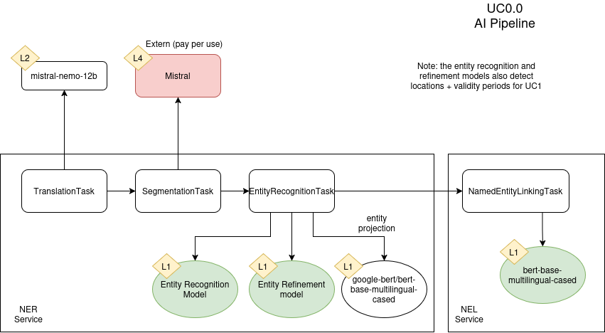
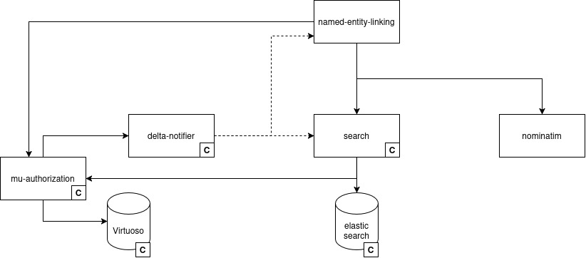
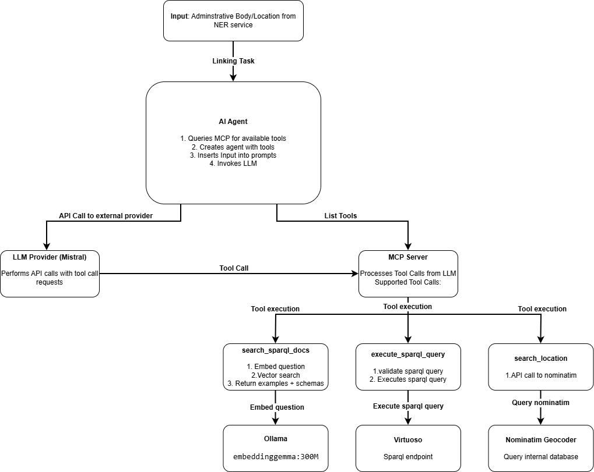

# Write-up UC0.0 Pipelines


This page is under construction


## Description UC/wanted deliverable

The DECIDe data space connects local governments from three pilot cities across two countries — Ghent (Belgium), Bamberg (Germany), and Freiburg (Germany) — each of which publishes its local decisions and legislation (LD\&L) through different digital infrastructures and in different formats. Before any cross-city analysis, AI-based enrichment, or downstream application can be built, this heterogeneous input must be harvested, converted to a common representation, and made available in the data space.

This is what UC0.0 addresses: creating and adapting semantic data standards and building the conversion and integration infrastructure needed to bring LD\&L from all pilot city contexts into a common, machine-readable form.

The wanted deliverable is a pipeline infrastructure as the foundational layer of the DECIDe data space: a set of configurable, reusable tools that ingests LD\&L from all pilot city sources, normalises it to a common standard –the European Legislation Identifier (ELI)– and enriches it with AI-generated annotations that make the resulting data structured and queryable for downstream use cases.

Within the project proposal, this maps to the following deliverables and tasks:

| Deliverable                                                                              | Activities                                                                                              |
| ---------------------------------------------------------------------------------------- | ------------------------------------------------------------------------------------------------------- |
| **D1.1** Datasets from every pilot available "as is"                                     | **T1.1** Get input datasets 'as is' from every pilot usable, at least for research                      |
| **D1.2** Data ready for decentralised ingestion into data space – scope of data plan UC0 | **T1.2-T1.7** Analyse available data sets and standards, develop and execute data plan for the use case |
| **D2.1.1** In-depth technical analyses of current architecture UC0.0                     | **T2.1** In-depth analysis of current technical architecture at pilot sites & gap analysis              |
| **D2.2** Conversion and integration tools available                                      | **T2.2** Build and test conversion (and extraction) and integration tools                               |
| **D2.3** Conversion and integration of data deployed and executed at relevant pilot site | **T2.3** Deployment and/or integrate tools for decentralised ingestion into data space                  |

### Link to other deliverables

#### UC0.0 Human Validation (HV)

The HV is the human-in-the-loop counterpart to the AI pipelines. Once the pipelines produce AI-generated annotations those annotations are surfaced in the HV interfaces for domain expert review and voting.

[write-up-uc0.0-human-validation-hv.md](write-up-uc0.0-human-validation-hv.md "mention")

#### Downstream use cases (UC0.1, UC1, UC2)

The pipeline infrastructure is the foundational prerequisite for all downstream use cases in DECIDe. Without the ingestion and normalisation layer, there is no common corpus of LD\&L decisions to work with; without the AI enrichment pipelines, there are no structured annotations for downstream applications to consume. UC0.1 Policy Impact Report, UC1 Restrictive Mobility Zones, and UC2 Smart Search all operate on ELI-normalised decisions and annotation outputs produced by these pipelines; none of them function without a working pipeline layer beneath them.

[write-up-uc0.1-policy-impact-report.md](../write-up-uc0.1-policy-impact-report.md "mention")\
[write-up-uc1-restricted-mobility-zones.md](../write-up-uc1-restricted-mobility-zones.md "mention")\
[write-up-uc2-smart-search.md](../write-up-uc2-smart-search.md "mention")

## Glossary


See the [UC0.0 Data space glossary](./#glossary) for definitions of ELI, LBLOD, `oa:Annotation`, and Triplestore. For Codelist Mapping Tool, see the [UC0.1 glossary](../write-up-uc0.1-policy-impact-report.md#glossary).


See the[ UC0.0 Dataspace glossary](./#glossary) for definitions of ELI, LBLOD, `oa:Annotation`, and Triplestore. For Codelist Mapping Tool, see the [UC0.1 glossary.](../write-up-uc0.1-policy-impact-report.md#glossary)

<table><thead><tr><th width="189.3759765625">Term/Acronym</th><th>Explanation</th></tr></thead><tbody><tr><td>Agent / Agentic LLM</td><td>An LLM given a set of tools (e.g. search, query, lookup) that it can call itself. Instead of producing one answer in one go, the agent decides which tool to use, looks at the result, and decides what to do next –possibly calling more tools– until it has an answer. Used in DECIDe for instance for Named Entity Linking, where the agent constructs SPARQL queries iteratively against a knowledge graph.</td></tr><tr><td><a href="https://tika.apache.org/">(Apache) Tika</a></td><td>An open-source framework that allows to detect and extract metadata and text from PDFs (and over a thousand other file types). Used in DECIDe as a separate service running in a Docker container to extract text from PDF decision documents.</td></tr><tr><td><a href="https://en.wikipedia.org/wiki/BERT_(language_model)">BERT / Transformer encoder</a></td><td>Bidirectional Encoder Representations from Transformers. A type of neural network that converts text into rich numerical representations. "Encoder" means it reads text and produces a representation; it does not generate text. BERT and its variants (DistilBERT, RoBERTa, XLM-RoBERTa, Longformer) are the workhorses behind modern NER and classification.</td></tr><tr><td>Context window</td><td>The maximum amount of text (measured in tokens) a model can read at once. Standard BERT sees 512 tokens (~400 words); Longformer extends this to 4,096 tokens (~3,000 words), enough to fit a whole decision document.</td></tr><tr><td>Cosine similarity</td><td>A standard way to measure how similar two embeddings are. Values close to 1 mean "very similar in meaning"; values close to 0 mean "unrelated". Used in DECIDe to find the most relevant SPARQL examples in the NEL knowledge base for a given entity.</td></tr><tr><td>Crawler / Crawling</td><td>Automatically browsing a website by following links from page to page. The DECIDe PDF scraper does not crawl — it stays on the single page provided and does not follow links to other pages.</td></tr><tr><td><a href="https://en.wikipedia.org/wiki/Cron">Cron expression</a></td><td>A notation for defining recurring time schedules (e.g. "every day at 03:00"). Used in DECIDe's scheduled job controller to trigger recurring pipeline runs automatically.</td></tr><tr><td>Cross-lingual span alignment</td><td>A technique to map a piece of text identified in one language (e.g. an entity span detected in the English translation) back to its position in the original-language text (e.g. Dutch or German).</td></tr><tr><td><a href="https://github.com/mu-semtech/delta-notifier">Delta notifier</a></td><td>A service that intercepts all insert and delete queries on the triplestore and forwards relevant changes to registered service endpoints. Used in DECIDe to notify pipeline services of state changes without constant polling.</td></tr><tr><td>Dual-head NER model</td><td>A NER model with one shared text encoder feeding into two parallel classifiers ("heads"), each predicting a different kind of label. In DECIDe's Location Formatter, one head identifies fine-grained components (street, house number, postcode), the other identifies which components belong to the same address.</td></tr><tr><td>Embedding / Embedding model</td><td>A numerical vector representation of a piece of text, produced by an embedding model. Texts with similar meaning produce vectors that are close together in vector space, enabling semantic similarity search. Used in DECIDe to power semantic search over SPARQL examples (NEL) and over decision documents (UC2).</td></tr><tr><td>embeddinggemma</td><td>A small open-source embedding model from Google, used in DECIDe to embed SPARQL example queries and schema definitions for the NEL knowledge base. Run locally via Ollama.</td></tr><tr><td>Fine-tuning</td><td>Taking an already-trained AI model and training it further on a smaller, task-specific dataset to specialise it for that task. Cheaper and faster than training from scratch. In DECIDe, used for example to specialise XLM-RoBERTa for legal/administrative entity recognition.</td></tr><tr><td>Hallucination</td><td>When an LLM produces a fluent but factually wrong or fabricated answer. The main mitigation in DECIDe is RAG: the LLM is constrained to answer only from retrieved documents, and outputs are reviewed via the HV.</td></tr><tr><td>Job controller</td><td>The sequencing service for DECIDe pipelines. Reads a configuration file describing pipelines as ordered jobs and tasks, and advances through each step as the previous one completes.</td></tr><tr><td><a href="https://www.langchain.com/">LangChain</a></td><td>An open-source framework for building LLM-powered applications, particularly agentic pipelines in which a model calls external tools in sequence. Allows switching between Ollama, Mistral AI, OpenAI, and others by changing environment variables rather than code.</td></tr><tr><td><a href="https://en.wikipedia.org/wiki/Large_language_model">LLM (Large Language Model)</a></td><td>A neural network model trained on very large text corpora, capable of generating, translating, summarising, and reasoning over natural-language input.</td></tr><tr><td><a href="https://huggingface.co/docs/transformers/en/model_doc/longformer">Longformer</a></td><td>A transformer encoder model designed for long documents. Standard BERT processes up to 512 tokens at once; Longformer extends this to 4,096 tokens using a combination of local windowed attention and global attention. Used in DECIDe for Named Entity Refinement, where understanding the context of an entity requires seeing whole paragraphs.</td></tr><tr><td><a href="https://modelcontextprotocol.io/">MCP (Model Context Protocol)</a></td><td>A standard way of exposing tools to an LLM agent. The agent sees a list of tools with names, inputs, and outputs, and can call them when useful. Used in DECIDe to give the NEL agent access to schema lookup, query execution, and location resolution.</td></tr><tr><td><a href="https://en.wikipedia.org/wiki/Named-entity_recognition">NER (Named Entity Recognition)</a></td><td>An AI technique for identifying and classifying named entities within unstructured text. In DECIDe, used to extract entities (e.g. persons, organisations, locations, dates) from decision text as part of the NER pipeline.</td></tr><tr><td>NEL (Named Entity Linking)</td><td>An AI technique for linking identified named entities to specific linked data resources with known URIs. In DECIDe, NEL is performed by an agentic LLM service that constructs SPARQL queries against the triplestore.</td></tr><tr><td><a href="https://ollama.com/">Ollama</a></td><td>A tool for running open-source LLMs on a local server, without depending on external paid APIs. Used in DECIDe development to host models like Mistral Nemo and embeddinggemma.</td></tr><tr><td><a href="https://oparl.org/">OParl</a></td><td>OParl is an initiative to standardise open access to parliamentary information systems in Germany. The goal of OParl is to create a standard API for accessing public content in municipal council information systems, so that this content can be used for as many different purposes as possible, in line with the principles of open data. In DECIDe, Freiburg pilot data is harvested from an OParl-based system.</td></tr><tr><td><a href="https://www.vlaanderen.be/digitaal-vlaanderen/onze-diensten-en-platformen/oslo">OSLO (Open Standards for Linked Organisations)</a></td><td>The Flemish government's framework for linked data standards. The <a href="https://data.vlaanderen.be/ns/besluit/">OSLO-Besluit</a> (Decision) model is used by Belgian municipalities publishing LD&#x26;L through LBLOD.</td></tr><tr><td><a href="https://qdrant.tech/">Qdrant</a></td><td>An open-source vector database that stores embeddings and supports fast similarity search over them. Used in DECIDe as the production knowledge base for the NEL service.</td></tr><tr><td>RAG (Retrieval Augmented Generation)</td><td>A technique in which an LLM is provided with retrieved context documents before generating an answer, reducing hallucination by grounding model output in sourced material rather than relying on parametric memory alone. This limits hallucination and keeps answers traceable to source documents.</td></tr><tr><td>Regex (Regular expression)</td><td>A pattern used to match specific text formats.</td></tr><tr><td>Scraper / scraping</td><td>A tool or program that automatically collects information from websites. In DECIDe, used to collect PDF download URLs from local government web pages.</td></tr><tr><td>Span / span format</td><td>A representation of a detected text region as a tuple of (<code>start offset</code>, <code>end offset</code>, <code>label</code>), where offsets are character positions in the source text. Used in DECIDe by the segmentation and NER tasks to record entity and structural boundaries within decision text.</td></tr><tr><td>Text segmentation</td><td>Splitting a piece of text into smaller parts. In DECIDe, identifying title boundaries in meeting minutes to split the document into individual decisions.</td></tr><tr><td>Token</td><td>The smallest unit of text a model processes. Tokens are usually short pieces of words rather than whole words: for example "subsidies" might be split into "subsid" + "ies". A typical English document of 1,000 words is roughly 1,300 tokens; languages like Dutch and German tend to produce more tokens per word.</td></tr><tr><td><a href="https://en.wikipedia.org/wiki/Transformer_(deep_learning)">Transformer</a></td><td>The neural-network architecture underlying virtually all modern NLP models –both encoders (BERT-family) and generative LLMs. The defining feature is the "attention" mechanism, which lets the model weigh how relevant each word is to every other word when interpreting text.</td></tr><tr><td><a href="https://en.wikipedia.org/wiki/Universally_unique_identifier">UUID (Universally Unique IDentifier)</a></td><td>A 128-bit number used to identify information in computer systems.</td></tr><tr><td>Vector / Vector index / Vector database</td><td>A vector is the numerical embedding of a piece of text. A vector index (or vector database) stores many such vectors and supports fast searches for "the most similar vectors to this one", which is how semantic search works.</td></tr><tr><td><a href="https://www.w3.org/TR/void/">VOID (Vocabulary of Interlinked Datasets)</a></td><td>An RDF vocabulary for describing metadata about datasets and SPARQL endpoints, including their structure, properties, and example queries. Used in DECIDe to populate the knowledge base that the NEL agent consults when constructing SPARQL queries.</td></tr></tbody></table>

## Business analysis + final feature passport (incl. functional analysis)

### Opportunity (problem, need, desire)

A data space revolves around data — and before any analysis, AI enrichment, or downstream application becomes possible, that data must be brought to a common representation. For DECIDe, the input is LD\&L –local decisions and legislation– published by three pilot cities across two countries through materially different digital infrastructures. Flemish municipalities publish formal council decisions (_besluiten_) as linked open data through LBLOD using the OSLO-Besluit standard. German municipalities work with a different administrative vocabulary –council papers (_Vorlagen_) discussed in meetings, from which decisions emerge– accessed via OParl-based council information systems. Both contexts also produce full meeting minutes as PDFs, from which individual decisions must be extracted.

The opportunity is not just about getting the data in, but doing so in a way that is transparent, inspectable, and extensible: individual pipeline steps are small and replaceable, every task records its inputs and outputs, and failures are traceable. The same backbone that ingests raw decisions today can be extended with new enrichment models or new data sources without redesigning the whole system.

The pipeline infrastructure is the answer to these prerequisites: a set of configurable, reusable tools that harvest LD\&L from all sources and normalise it to a single common representation. The European Legislation Identifier (ELI) was chosen as that representation because it provides a vocabulary specifically designed for describing legislation –structuring each decision as a Work, Expression, and Manifestation– that is source-agnostic and already adopted within European public administrations. Normalising all input to ELI at ingestion means every downstream step operates on identical data structures, regardless of which city the decision came from or in what format it was originally published.

On top of this normalised base, a set of AI pipelines produce the structured annotations that https://github.com/lblod/app-decide/tree/development/config/migrations/bestuurseenheden-and-organizations-flandersthe downstream use cases depend on, and that can be validated through Human Validation interfaces.

### Pilot partners

All three pilot cities contribute data to the pipelines: Ghent (Belgium), Freiburg and Bamberg (Germany). <mark style="background-color:$warning;">The pipeline infrastructure is deployed centrally by the DECIDe team at ABB; pilot cities do not operate the pipelines directly.</mark>

### Target audience / Personas

The pipelines are operated by technical staff; non-technical end users are not exposed to them directly. The primary audiences are data engineers who configure and monitor pipeline runs and AI enrichment providers who operate the annotation steps.

<table><thead><tr><th width="284.6591796875">Persona</th><th>Journey</th></tr></thead><tbody><tr><td><strong>P1</strong> Original decision data provider</td><td>Publishes LD&#x26;L online. <mark style="background-color:$warning;">The pipeline harvests their data automatically; they are not active pipeline users but they are the source.</mark></td></tr><tr><td><strong>P3</strong> Enrichment provider</td><td>Operates and monitors the AI annotation pipelines, and verifies that annotation results are correctly written to the triplestore.</td></tr><tr><td><strong>P6</strong> Data engineer</td><td>Configures the pipeline system: defines new jobs, updates cron schedules, connects new data sources, diagnoses failed tasks via the job dashboard, and manages delta notifier configuration</td></tr></tbody></table>

### Functionality (requirements)

The pipeline system covers two stages. The first is ingestion and normalisation: harvesting LD\&L from OSLO, OParl, and PDF sources, converting each to ELI, and writing the result to the triplestore. The second is AI enrichment: running AI pipelines over normalised decisions and storing results as `oa:Annotation` triples.

<table><thead><tr><th width="624.25390625">Requirement</th><th>Priority</th></tr></thead><tbody><tr><td>Harvest LD&#x26;L from OSLO/LBLOD (Ghent) and convert to ELI</td><td>Must-have</td></tr><tr><td>Harvest LD&#x26;L from OParl (Freiburg) and convert to ELI</td><td>Must-have</td></tr><tr><td>Extract decision content from PDF sources and convert to ELI</td><td>Must-have</td></tr><tr><td>Deduplicate: skip documents already present in the triplestore</td><td>Must-have</td></tr><tr><td>Run NER pipeline (Named Entity Recognition, Refinement, Formatting, Linking) over LD&#x26;L</td><td>Must-have</td></tr><tr><td>Store all AI annotation results as <code>oa:Annotation</code> triples without modifying source ELI data</td><td>Must-have</td></tr><tr><td>Schedule recurring jobs/tasks</td><td>Must-have</td></tr><tr><td>Record AI model version at time of annotation</td><td>Must-have</td></tr><tr><td>Job dashboard interface for manually triggering pipeline runs and monitoring its status</td><td>Must-have</td></tr><tr><td>Prevent concurrent duplicate runs of the same pipeline (singleton job guard)</td><td>Nice-to-have</td></tr><tr><td>Investigate the reason why jobs/tasks fail</td><td>Nice-to-have</td></tr><tr><td>Interface available in English</td><td>Must-have</td></tr></tbody></table>

## Datasources, datasets and datastandards

### Data sources

<table><thead><tr><th width="174.810546875">Data source</th><th width="215.951171875">Type/category</th><th>Brief description</th></tr></thead><tbody><tr><td>LBLOD / OSLO-Besluit (Ghent)</td><td>LD&#x26;L as structured linked data</td><td>Belgian municipal decisions published through the LBLOD infrastructure using the OSLO-Besluit model. Primary data source for Ghent.<br><br><a href="https://vlaamseoverheid.sharepoint.com/:x:/r/sites/ABB_TG_CPDS/Gedeelde%20documenten/Ghent/gent-source.csv?d=wee7f82f5db224cf4b04ece420f41bd59&#x26;csf=1&#x26;web=1&#x26;e=P0nkEi">Decisions from the municipality of Ghent were queried up to the date of 2026-03-09</a></td></tr><tr><td>OParl API (Freiburg)</td><td>Structured JSON API</td><td>German council information system data accessed via the OParl standard. Primary data source for Freiburg.<br><a href="https://vlaamseoverheid.sharepoint.com/:x:/r/sites/ABB_TG_CPDS/Gedeelde%20documenten/Freiburg/freiburg-source.csv?d=w6b2fa4a4364848948175363551a60779&#x26;csf=1&#x26;web=1&#x26;e=OEfRve"><br>Decisions from Stadt Freiburg were queried up to the date of 2025-11-26</a></td></tr><tr><td>PDF documents (Bamberg)</td><td>Unstructured documents</td><td>Decision documents in PDF form. Sole data source for Bamberg, supplementary source for Ghent and Freiburg.<br><br><a href="https://vlaamseoverheid.sharepoint.com/:x:/r/sites/ABB_TG_CPDS/Gedeelde%20documenten/Bamberg/bamberg-sources.csv?d=wd0cb9c109fcd45b3b4e9be663fe4ba81&#x26;csf=1&#x26;web=1&#x26;e=3pMZM0">URLs pointing to the PDFs containing Bamberg decision documents were provided as a single excel file.</a></td></tr><tr><td>PDF documents (Flanders)</td><td>Unstructured documents</td><td>Decision documents in PDF form. Added to test the validation part of the pipeline on other Flemish sources so we are prepared to transform historical data into linked data.<br><br>Urls pointing to the PDFs containing Flemish decision documents from different municipalities were provided as a single excel file.</td></tr></tbody></table>

### Datasets available in the data space

<table><thead><tr><th width="128">Dataset</th><th width="132.375">IdP/Authentication service</th><th>Country of origin</th><th>Domain</th><th>Shared within the project</th><th>Reused within the project</th></tr></thead><tbody><tr><td>ELI-normalised LD&#x26;L decisions</td><td>Data space authentication</td><td>Belgium / Germany</td><td>Government</td><td>Yes</td><td>Yes, base input for all AI pipelines</td></tr><tr><td>AI enrichments (<code>oa:Annotation</code>)</td><td>Data space authentication</td><td>Belgium / Germany</td><td>Government</td><td>Yes</td><td>Yes, base for all use cases</td></tr><tr><td>Organizations</td><td>Data space authentication</td><td>Belgium / Germany</td><td>Government</td><td>Yes</td><td>Yes - used by Entity Linking, Policy Impact Report, Human Validation Tool, Smart Search</td></tr></tbody></table>

The Organizations dataset is used as registry for identifying municipalities and its governing bodies. The data originates from several data sources, depending of the municipality:
* Freiburg: organizations are retrieved through the OParl to ELI pipeline automatically
* Bamberg: a [migration](https://github.com/lblod/app-decide/tree/development/config/migrations/add-governing-bodies-bamberg) is added to generate URIs for Bamberg and its governing bodies
* Ghent: a [migration](https://github.com/lblod/app-decide/tree/development/config/migrations/bestuurseenheden-and-organizations-flanders) is added to reuse the existing URIs of municipalities and governing bodies in Flanders and transform them to align with the [ORG-EP](https://europarl.github.io/org-ep) data model

### Data standards

<table><thead><tr><th width="384.5908203125">Standard</th><th>Link</th></tr></thead><tbody><tr><td>ELI (European Legislation Identifier)</td><td><a href="https://eur-lex.europa.eu/eli-register/about.html">https://eur-lex.europa.eu/eli-register/about.html</a></td></tr><tr><td>OSLO-Besluit (vocabulary)</td><td><a href="https://data.vlaanderen.be/ns/besluit">https://data.vlaanderen.be/ns/besluit</a></td></tr><tr><td>OSLO Besluit Publicatie (AP)</td><td><a href="https://data.vlaanderen.be/doc/applicatieprofiel/besluit-publicatie/">https://data.vlaanderen.be/doc/applicatieprofiel/besluit-publicatie/</a></td></tr><tr><td>OParl JSON schema</td><td><a href="https://oparl.org/">https://schema.oparl.org/</a></td></tr><tr><td>SKOS (Simple Knowledge Organization System)</td><td><a href="https://www.w3.org/TR/skos-reference/">https://www.w3.org/TR/skos-reference/</a></td></tr><tr><td>Web Annotation Vocabulary (<code>oa:Annotation</code>)</td><td><a href="https://www.w3.org/TR/annotation-vocab/">https://www.w3.org/TR/annotation-vocab/</a></td></tr><tr><td>COGS (job/task vocabulary)</td><td><a href="http://vocab.deri.ie/cogs">http://vocab.deri.ie/cogs</a></td></tr><tr><td>redpencil tasks vocabulary</td><td><a href="http://redpencil.data.gift/vocabularies/tasks/">http://redpencil.data.gift/vocabularies/tasks/</a></td></tr></tbody></table>

#### PDF to ELI

The PDF to ELI pipeline extracts content from PDFs and initializes the [three levels of ELI](./#european-legislation-identifier-eli) in the triple store:

* [eli:Work](http://data.europa.eu/eli/ontology#Work): is still an empty class with only a UUID provided, but it is important for compliancy with ELI, and for later steps in the pipeline that the work level is initialized
* [eli:Expression](http://data.europa.eu/eli/ontology#Expression): is set with the content of the PDF in its original language
* [eli:Manifestation](http://data.europa.eu/eli/ontology#Manifestation): contains metadata of the PDF: media type, URL, and bytesize

<figure><figcaption><p>Fig. 1: PDF to ELI pipeline sets the three ELI levels</p></figcaption></figure>

#### OSLO to ELI

The raw data of the city of Ghent uses the application profile "[OSLO Besluit publicatie](https://data.vlaanderen.be/doc/applicatieprofiel/besluit-publicatie/)" as data model. Although this is an extension of ELI, in practice, only the extension for `eli:Expression` ("Besluit") is implemented. This means we need to provide a sibling \`eli:Work\` for every Besluit.

Instead of mapping to a new `eli:Expression` resource, we could reuse the URI of oslo:Besluit, and add an extra type of Expression. The property `epvoc:expressionContent` is filled with a waterfall system: if there is a `prov:value` with the content of the decision, we use that. Else if there are articles with content, we use the aggregation of the content. Otherwise, the title and description of the decision is used (Fig. 2).

Agents, such as governing bodies and mandatees, are also mapped with `dct:creator` and `dct:contributor` to align with ELI-EP.

<figure><figcaption><p>Fig. 2: OSLO Besluit is an extension of ELI Expression</p></figcaption></figure>

#### OParl to ELI

OParl uses Paper and File entities to describe LD\&L (see [OParl specification](https://oparl.org/spezifikation/online-ansicht/#schema)). Paper matches with `eli:Work` , while File is split into `eli:Expression` , and `eli:Manifestation` (Fig. 3). The expression focuses on the content in a certain language, while the manifestation holds the URL of the document online. For the city of Freiburg, the expression is the German text of the LD\&L, and the manifestation links to its PDF. In OParl, next to main files, there are also auxiliary files. These are mapped to `foaf:Documents` and linked with the work using `eli:related_to`.

<figure><figcaption><p>Fig. 3: Mapping of Oparl to ELI</p></figcaption></figure>

The other OParl entity types (Body, System, Location, Organization...) are also mapped aligned with ELI-EP. The mappings can be found in the Github repository: [https://github.com/lblod/oparl-to-eli-service/blob/main/constants.ts](https://github.com/lblod/oparl-to-eli-service/blob/main/constants.ts)

#### Named Entity Recognition (NER)

Entity extraction

NER uses the [Web Annotation Model](./#web-annotation-model) for describing entities discovered in the text of an `eli:Expression` . Fig. 4 depicts how a `rdf:Resource` is about a `oa:SpecificResource`. This specific resource represents a part (start and end position) in the text of a `eli:Expression`. The `rdf:Resource` can be further specified using `rdf:type` : `locn:Address` for an address, `org:Organization` for an organization etc. Optionally, a geometry can be linked containing coordinates when the NER service has geocoding capabilities.

<figure><figcaption><p>Fig. 4: Annotation of an entity extracted by NER</p></figcaption></figure>

Relation extraction

NER also goes a step further by expressing how the discovered entity relate to the LD\&L data. This is called "relation extraction" and makes use of RDF statements as body of an annotation. A statement refers to a subject, predicate, and object resource, which resembles a triple statement.

<figure><figcaption><p>Fig. 5: Annotation of a relation extracted by NER</p></figcaption></figure>

The object of the statement can a resource or a literal. For example, when an administrative body is detected in the text, a statement can be made where:

* subject = URI of the eli:Work
* predicate = eli:passed\_by
* object = (temporary) URI of the administrative body

Another example, when a title is detected in the text, a statement can be made where:

* subject = URI of the eli:Work
* predicate = eli:title
* object = text of the title

A full list of mappings can be found on Gitbook here:



#### NEL

Entities that are linked by the NER service get a stable URI, but are not known within the Linked Data ecosystem. For certain types of entities (addresses, governing bodies...), authoritative registries exist. Therefore, the NEL service will try to link the NER entities with existing known entities. The result of a link is expressed with an annotation that has an "exact match" statement as body:

* subject = URI of the discovered NER entity
* predicate = skos:exactMatch
* object = URI in the authoritative registry

For example, the location entity with label "Theatergassen 8, 96047 Bamberg" can be linked with following statement:

* subject = URI of the location entity given by NER
* predicate = skos:exactMatch
* object = <[https://www.openstreetmap.org/way/38114254](https://www.openstreetmap.org/way/38114254)>

## Final architecture (and why)

The pipeline infrastructure is the foundational backbone for the ingestion and enrichment of LD\&L within the DECIDe data space.

* Three **ingestion pipelines** bring LD\&L from each pilot city's source format into the data space and standardise it to a common linked-data representation (ELI): one for OSLO-Besluit data from Ghent, one for Freiburg's OParl-based council information system, and one for PDF documents –the only format available for decisions from Bamberg.
* Working on top of this normalised input, the enrichment tasks of the **AI pipeline** generate the annotations that downstream use cases depend on.
* Underpinning all of this is a **job and task management infrastructure** that controls when and how each pipeline runs, sequences its individual steps, tracks status in the triplestore, and surfaces failures for inspection.

### Pipeline infrastructure: Job controller

The DECIDe data space is built entirely on linked data, so its pipelines must be too. Individual steps in a pipeline should also stay small, focused, and replaceable. Both requirements are already met by the job/task pipeline infrastructure developed by ABB, and adopted here as the DECIDe pipeline backbone. Reusing this existing system avoided building a new orchestration layer from scratch and ensured full compatibility with the semantic.works stack underpinning both the DECIDe data space and Lokaal Beslist. Originally built for linked-data harvesting, the system maps naturally to AI enrichment tasks: it makes no assumption about what a pipeline step does, only about how it signals its status and passes data to the next step.

The [job controller](https://github.com/lblod/job-controller-service) is the sequencer of a pipeline. It works from a configurable JSON file in which each pipeline is defined as a job, and each job contains an ordered array of task definitions representing the steps of that pipeline. The job controller is fully data-driven: it monitors the triplestore for task status changes and, when a task reaches a terminal state, creates the next task in the sequence.

#### Jobs and tasks

In the triplestore, a _job_ is represented as a resource of type `<http://vocab.deri.ie/cogs#Job>`. Its two most important predicates are `<http://redpencil.data.gift/vocabularies/tasks/operation>` and `<http://www.w3.org/ns/adms#status>`. The former points to a URI identifying the type of job; this URI is used in the job controller configuration so it knows which pipeline is being run. The latter indicates the job's current status: preparing, scheduled, busy, success, or failed.

_Tasks_ are represented as resources of type `<http://redpencil.data.gift/vocabularies/tasks/Task>`. They have the same operation and status predicates as jobs. Each task operation URI appears in the config as a list item under its parent job, which is how the job controller knows what to create next. Tasks also carry `<http://purl.org/dc/terms/#isPartOf>` to link back to their parent job.

Here is a simplified example of such a job-controller config showing the tasks of two jobs:


```json
{
  "http://lblod.data.gift/id/jobs/concept/JobOperation/harvesting/pdf-to-eli": {
    "tasksConfiguration": [
      {
        "currentOperation": null,
        "nextOperation": "http://lblod.data.gift/id/jobs/concept/TaskOperation/singleton-job",
        "nextIndex": "0"
      },
      {
        "currentOperation": "http://lblod.data.gift/id/jobs/concept/TaskOperation/singleton-job",
        "nextOperation": "http://lblod.data.gift/id/jobs/concept/TaskOperation/pdf-scraping",
        "nextIndex": "1"
      },
      {
        "currentOperation": "http://lblod.data.gift/id/jobs/concept/TaskOperation/pdf-scraping",
        "nextOperation": "http://lblod.data.gift/id/jobs/concept/TaskOperation/pdf-to-eli",
        "nextIndex": "2"
      }
    ]
  },
  "http://lblod.data.gift/id/jobs/concept/JobOperation/eli-entity-linking-test": {
    "tasksConfiguration": [
      {
        "currentOperation": null,
        "nextOperation": "http://lblod.data.gift/id/jobs/concept/TaskOperation/singleton-job",
        "nextIndex": "0"
      },
      {
        "currentOperation": "http://lblod.data.gift/id/jobs/concept/TaskOperation/singleton-job",
        "nextOperation": "http://lblod.data.gift/id/jobs/concept/TaskOperation/entity-linking",
        "nextIndex": "1"
      }
    ]
  }
}

```


**Statuses**

A job or task status can take five values:

* **Preparing**. The creator of the job or task has already created the instance, but is still gathering the data before it can be scheduled.
* **Scheduled**. For a job: its first task still needs to run. For a task: it is ready to be picked up by the corresponding custom service.
* **Busy**. For a job: not all tasks have finished yet. For a task: it is currently being processed.
* **Success**. For a job: all tasks completed successfully. For a task: it completed successfully, which signals the job controller to schedule the next task, or mark the whole job as succeeded if this was the last one.
* **Failed**. For a job: one of its tasks failed. For a task: it failed, which signals the job controller to skip remaining tasks and mark the whole job as failed.

#### <mark style="background-color:$warning;">Delta notifier</mark>

The job controller and custom services need to be notified when jobs and tasks change status in the triplestore. To avoid constant polling, the DECIDe data space uses the [delta notifier](https://github.com/mu-semtech/delta-notifier), a service that intercepts all insert and delete queries on the triplestore and, based on its configuration, forwards relevant changes, called delta messages, to the right service endpoints.

For pipelines, jobs and tasks that reach success or failed generate delta messages that are forwarded to the job controller, which consults its config to determine next steps. Tasks that reach scheduled are forwarded to the registered custom services, each of which checks the operation URI to decide whether the task is theirs to handle.

<figure><figcaption></figcaption></figure>

#### Task handling

**Custom services**

Where the job controller handles sequencing of tasks in jobs, custom microservices do the actual work to perform the tasks. Each service exposes one or more `/delta` endpoints that receive POST requests containing delta messages with changes to a task resource. Each endpoint follows the same pattern: check the operation URI of the task and ignore if it doesn't match, mark the task as busy if it does, then execute the actual logic, and finally mark the task as succeeded or failed.

**Inputs and outputs**

Tasks typically consume input data and produce output data. To keep that data linked to the task, each task carries an optional `http://redpencil.data.gift/vocabularies/tasks/inputContainer` and `http://redpencil.data.gift/vocabularies/tasks/resultsContainer`, both pointing to a `http://www.semanticdesktop.org/ontologies/2007/03/22/nfo#DataContainer` resource. A data container can hold:

* `http://redpencil.data.gift/vocabularies/tasks/hasGraph`: a named graph of triples
* `http://redpencil.data.gift/vocabularies/tasks/hasHarvestingCollection`: a collection from a harvesting task
* `http://redpencil.data.gift/vocabularies/tasks/hasFile`: a file on disk
* `http://redpencil.data.gift/vocabularies/tasks/hasResource`: any RDF resource. This option was added in the context of the DECIDe project, it gives the most freedom but it does require the service handling the task to have a good understanding of which data to fetch for the resource.

When the job controller creates a new task, it copies the previous task's results container and sets it as the new task's input container. The original results container remains untouched, making it possible to inspect the full history of a pipeline run after the fact.

#### Starting jobs

**Singleton job task**

To prevent multiple instances of the same pipeline from running simultaneously, every pipeline starts with a singleton job task. This triggers a [dedicated service](https://github.com/lblod/harvesting-singleton-job-service) that checks whether another job is already active for the same input, determined by the `http://www.semanticdesktop.org/ontologies/2007/01/19/nie#url` property on the harvesting collection in the task's input container. If a match is found, the new job is immediately marked as failed and the pipeline goes no further.

**Scheduled jobs**

Pipelines often need to run repeatedly on a fixed schedule. This is handled by scheduled jobs and the scheduled job controller. A `http://vocab.deri.ie/cogs#ScheduledJob` looks exactly like a regular job, with one addition: a `http://redpencil.data.gift/vocabularies/tasks/schedule` property pointing to a cron expression. The scheduled job controller monitors these resources and, at the right moments, creates corresponding regular jobs in the triplestore, which are then picked up by the job controller as usual.

#### Harvester frontend

A simple [frontend](https://github.com/lblod/frontend-harvesting-self-service/tree/feature/oparl-harvesting), aimed primarily at developers and data space administrators, provides an overview of all running and completed jobs. Clicking into a job shows its individual tasks, and each task's input and results containers can be inspected. Users can also start a new job by selecting a job type and filling in the corresponding input fields.

<figure><figcaption></figcaption></figure>

<figure><figcaption></figcaption></figure>

### Ingestion pipelines

LD\&L arrives from three structurally different sources: OSLO-Besluit (Belgian linked data), OParl (German JSON API), and PDF. To allow every downstream processing step to work identically regardless of source city, all three are normalised to a single common representation before entering the enrichment pipeline. The ELI (European Legislation Identifier) ontology was chosen as that representation. ELI provides a linked-data-native vocabulary for describing legislation through Work, Expression, and Manifestation entities. Normalising to ELI at the ingestion stage means that the enrichment pipelines all operate on identical data structures regardless of which city the decision came from.

For each source format, a dedicated pipeline is responsible for collecting the original data, converting it to ELI, and storing it in the data space.

#### OSLO to ELI pipeline

Ghent's decision data is published through _Lokaal Beslist_, the central Flanders endpoint for local council decisions. The pipeline consumes from this endpoint, filters the high-volume stream for Ghent specifically, and transforms the resulting OSLO-Besluit records into ELI. Three services carry out these steps in sequence, after the singleton job task that every pipeline starts with (see above):

[**Consumer service**](https://github.com/lblod/decide-harvester-consumer-service)

In essence, a consumer service makes its own copy of the data provided by a producer. It follows a custom delta-based format used in applications built on top of the semantic.works architecture, which both _Lokaal Beslist_ and DECIDe are. In this case, the consumer is configured to take in all data from the _Lokaal Beslist_ producer. This producer holds all decision data from local governments in Flanders.

All consumed data is stored in a configurable graph (`LANDING_GRAPH`). The next tasks in the pipeline rely on it.

The consumer service can be triggered in one or two ways, by firing an initial sync or a delta sync:

* Initial sync\
  An initial sync operation takes in all data that the producer has available at that moment in time. Depending on the size of the dataset, this might take some time. Usually, the initial sync needs to be run only once. When finished, the consumer stores the current datetime in order for a future delta sync operation to know which moment in time to proceed from.
* Delta sync\
  A delta sync operation brings the dataset up to date (inserts/deletes), starting from the last registered timestamp. When finished, the consumer stores a new timestamp, ready for the next delta sync operation. This means the data in DECIDe is kept continuously in sync with the original _Lokaal Beslist_ dataset.

In order to keep the dataset up to date throughout time, a delta sync operation should be triggered at regular intervals. It is therefore suitable to configure this pipeline as a scheduled job.

To make sure the next tasks in the pipeline can focus specifically on the new data inserted by a delta sync (and not the entire landing graph), that same data is also inserted in a temporary graph. This temporary graph is provided to the next service in line.


Since decisions should never receive partial updates, we don't expect _Lokaal Beslist_ to deliver any of those. The temporary graph created during delta sync therefore only holds inserted data, and the final transformation service will always create resources/properties (not update or delete).


[**Filter service**](https://github.com/lblod/decide-harvester-filter-service)

The filter service allows to configure which resources should effectively be transformed in the next step. It does this by running a SPARQL select query on the consumer's landing graph, and writes the resulting resource URIs to a new temporary graph.

In case the service detects an input graph from the previous step (cfr. delta sync), it will restrict the query run on the landing graph to only inspect the resources listed in that input graph.

The filter service's [default SPARQL select query](https://github.com/lblod/decide-harvester-filter-service/blob/development/config/query-definitions.js) looks for `besluit:Besluit` instances that belong to Ghent administrative bodies.

[**Transformation service**](https://github.com/lblod/decide-harvester-transformation-service)

The transformation service allows to configure several SPARQL insert-where queries. Each of these looks for resources/properties in the consumer's landing graph and inserts them (usually in a new _format_) in a configured output graph.


While it would in theory be possible to provide a single large insert-where query, it is advised to work with multiple smaller ones, as the triplestore might struggle with large queries on large input graphs.


The SPARQL insert-where queries are further **restricted** to take into account only those resources that appear in the temporary graph provided by the filter service.

The transformation service's [default SPARQL insert-where queries](https://github.com/lblod/decide-harvester-transformation-service/blob/development/config/besluit.js) map specific `besluit:Besluit` properties to `eli:Expression` and/or `eli:Work` properties. In fact, the service doesn't create completely new resources, but instead _expands_ the existing `besluit:Besluit` resources with ELI properties (type definitions included). Still, the fact that the transformation service writes to a different output graph than the consumer's landing graph, divides the original OSLO data from the newly created ELI data.

#### OParl to ELI pipeline

Freiburg's decision data is published through a standardised API called OParl. The OParl to ELI pipeline fetches all available data from that API, converts it to ELI, and keeps the triplestore in sync using a diff mechanism that compares each harvest against the previous one –inserting only new triples and removing obsolete ones. Four services implement this, after the singleton job task that every pipeline starts with (see above):

[**OParl harvesting service**](https://github.com/lblod/oparl-to-eli-service)

This is a new service created specifically for DECIDe. The goal of this service is to ingest the data from the OParl API into a triplestore following the ELI standard. To achieve this, two mechanisms have been implemented:

Mechanism 1: semantic uplifting of OParl API to ELI

The OParl API exposes a collection of resources (system, body, paper...) using a JSON API. The OParl harvesting service provides a proxy API (and library) where OParl responses are converted to ELI on the fly. For example:

1. Send request to proxy API: [https://ds.decide.lblod.info/eli/oparl/Body/FR](https://ds.decide.lblod.info/eli/oparl/Body/FR)
2. Internally, the service fetches data from Freiburg's OParl API using the same URL parameters: [https://ris.freiburg.de/oparl/Body/FR](https://ris.freiburg.de/oparl/Body/FR)
3. A JSON-LD context is added to provide a basic linked data representation of the OParl data. An important aspect is that links to other resources are mapped with the URI [http://lblod.data.gift/vocabularies/besluit/linkToPublication](http://lblod.data.gift/vocabularies/besluit/linkToPublication). This enables the service in the second mechanism to discover more data to harvest. These links are mapped in such way that a Direct-Acyclic-Graph (DAG) is created: [https://github.com/lblod/oparl-to-eli-service/blob/main/docs/oparlspec-linktopublication.png](https://github.com/lblod/oparl-to-eli-service/blob/main/docs/oparlspec-linktopublication.png)
4. A SPARQL Construct transformation is performed to convert the basic representation to ELI

Mechanism 2: harvesting of all data

Next to proxying an OParl API into ELI, a harvesting mechanism is provided by the service that crawls over all ELI responses and writes it to files for further processing by the harvesting helper service. In other words, the OParl API is made compatible for further processing within the existing Flemish LBLOD harvesting system. This mechanism follows the task-handling approach where each discovered URL is added to the harvesting collection in the task's input container. When all URLs in the harvesting collection are processed, the task status is set to "success".

[**Harvesting helper service - adding UUIDs**](https://github.com/lblod/import-with-sameas-service)

This service adds UUIDs to the harvested OParl resources. This is a best practice in the semantic.works stack. This is required to expose resources with a JSON API using the mu-resources service. When a resource is already available in the triplestore, the UUID must be reused to prevent multiple UUIDs for the same thing. If there is no UUID found, a new UUID is minted for the resource using standard libraries.

[**Diff service**](https://github.com/lblod/harvesting-diff-service)

This service compares the triples that have been retrieved from a URL with the triples retrieved in a previous harvesting job. For example, [https://ris.freiburg.de/oparl/paper/5742503100005](https://ris.freiburg.de/oparl/paper/5742503100005) is the URL of one specific decision in Freiburg. The first time this URL is retrieved, the diff service will put all triples in a "new" file. The second time this URL is retrieved (by running a new job) and the decision has changed, the triples will be divided into a "new-insert-triples.ttl" file for new triples, a "intersect-triples.ttl" file for already processed triples, and a "to-remove-triples.ttl" file for triples that need to be removed from the triplestore.

[**Harvesting helper service - publishing triples**](https://github.com/lblod/import-with-sameas-service)

This service inserts the data from the "new-insert-triples.ttl" files in the triplestore as part of the publishing step, and deletes the data from the "to-remove-triples.ttl" as a separate step.

#### PDF to ELI pipeline

All three pilot cities produce decision data as PDFs –Bamberg as its sole source, Ghent and Freiburg as a supplementary one alongside their structured feeds. The pipeline takes a URL or list of PDF links as input, extracts text from each PDF, and produces ELI Work/Expression/Manifestation entities that are processed identically to decisions from any other source. Two services carry out these steps, after the singleton job task (see above):

[**Scraping service**](https://github.com/semantic-ai/decide-pdf-scraper)

Currently, upon the creation of the pipeline, the PDF source can be provided in two different ways:

* A URL to a web page
* A list of PDF URLs, referring directly to the PDFs to be downloaded

When given a web page URL, the scraping service collects all PDF links found on that page. For each URL gathered this way, or provided directly, it checks whether the PDF has already been processed by looking for an existing ELI Manifestation referencing that URL. Only URLs not yet linked to an ELI Manifestation are passed to the content extraction service.

Three limitations are worth noting. First, there is no filtering on content: any PDF URL found on the provided webpage is gathered regardless of whether it relates to a decision, so the input to the content extraction service may include non-decision PDFs. Second, the scraping service does not crawl: it inspects only the single page provided and does not follow links to other pages. Third, deduplication is URL-based: the same PDF hosted at two different URLs will be processed twice, while a PDF whose URL has not changed will be correctly skipped.

[**Content extraction service**](https://github.com/semantic-ai/decide-pdf-content-extraction)

For each PDF URL that the content extraction service receives, it will first download the PDF. Next, each saved PDF is then sent to a local Apache Tika server (running in a separate Docker container) for text extraction. Then, titles are identified in the extracted text. This allows to split up the text into separate decisions. This is done as follows:

1. The text from a single decision ranges from (and including) a title, up until the next title or the end of the text.
2. The text before the very first title is copied at the top of each decision, as this contains the date of the meeting and the participants.

Finally, an ELI Manifestation is created, referring to the processed PDF URL, together with an ELI Work and ELI Expression for each decision.

### Other explored semantic components (and why not)

n/a

### AI pipeline

The AI pipeline operates on the normalised ELI data produced by the previously mentioned ingestion pipelines. Its purpose is to extract structured, machine-readable information from the unstructured text of decisions and connect it to existing resources as linked data. The pipeline consists of four sequential tasks, orchestrated by the job controller in the same way as the ingestion steps.

A general overview of the AI pipeline is given in the <mark style="background-color:$warning;">following figure</mark>. The tasks are organised in 2 services: the Named Entity Recognition (NER) service which houses three tasks, and the Named Entity Linking (NEL) which has one.

<figure><figcaption></figcaption></figure>

All outputs of the AI pipeline are stored as `oa:Annotation` triples in the triplestore, following the W3C Web Annotation data model. Source ELI data is never modified; enrichment results are always additive.

#### Translation Task

The first step translates the decision text into English to allow all subsequent AI processing to operate in a single language to address many of the multilinguality requirements of the project, regardless of whether the original document was in Dutch or German. This avoids the need for retraining models on different datasets every time the DECIDe system would be used on LD\&L in another language in the future.

The major downside of this approach is that position-based annotations which label a subsequence of the text will have position offsets on the English version. This is a significant downside, mitigated by the entity projection step described below. Multilingual models such as XLM-RoBERTa were briefly considered as an alternative. However, even models pre-trained on multilingual data can suffer significant performance degradation when fine-tuned on a dataset that does not cover all target languages, a real constraint given the only Dutch and German data available for the pilot.

Another downside is translation error, which is why two translation backends are available via configuration: either the open-source variant of Mistral Nemo 12B running locally via Ollama, or the [European Commission's eTranslation API service](https://translation.ec.europa.eu/tools-and-resources/ai-translation-and-language-tools_en). The latter is used by the European Commission itself and is therefore considered very high quality. Its downside is unfortunately an asynchronous execution model and strict rate limiting, making it impractical for application on larger volumes of decisions.

Finally, the translated text is stored in the annotation format, as a suggested eli:Expression

<figure><figcaption></figcaption></figure>

#### Segmentation Task

The segmentation task follows the translation task and operates on the English translation of the decision. The table below lists the output of the text segmentation model, which partitions the text in basic blocks. Each entry in the table is a type of entity which can be detected in a text, and is emitted in a span format: (`start_position`, `end_position`, `label`). E.g.: (35, 72, TITLE) means the text substring between character 35 and 72 was recognised as a TITLE.

The discovered entities from the segmentation task are saved in the triplestore as annotations. The segmentation step relies on Mistral Large 3, a proprietary LLM hosted externally within the European Union.

<table><thead><tr><th width="212.326171875">Entity</th><th>Description</th></tr></thead><tbody><tr><td>TITLE</td><td>The official title of the municipal decision or document.</td></tr><tr><td>PARTICIPANTS</td><td>A metadata block listing the individuals involved in the meeting or decision. This often includes lists of who was present (nl: <em>Aanwezig</em>), excused/absent (nl: <em>Verontschuldigd</em>), the responsible official (nl: <em>Verantwoordelijk</em>), the secretary (nl: <em>Secretaris</em>), etc.</td></tr><tr><td>MOTIVATION</td><td>The contextual background, reasoning, and justification for the decision. This includes the direct cause or trigger (nl: <em>aanleiding</em>)</td></tr><tr><td>PREVIOUS_DECISIONS</td><td>Specific references, citations, or summaries of prior decisions that are directly linked to the current document and provide legal or historical context for the resolution being passed.</td></tr><tr><td>LEGAL_FRAMEWORK</td><td>Citations of the specific laws, regulations, or legal precedents. This includes both the general regulations that give the municipality the authority to act (nl: <em>regelgeving waaruit blijkt dat het orgaan bevoegd is/Regelgeving bevoegdheid</em>) and the specific legal grounds on which this particular decision is based (nl: <em>op basis van welke regels (rechtsgronden) wordt deze beslissing genomen/Wetgeving</em>).</td></tr><tr><td>DECISION</td><td>The core, binding content of the decision; the text that outlines what is being formally enacted, ruled, or established.</td></tr><tr><td>VOTING</td><td>The specific record of votes. This can range from a simple statement (e.g., "unanimously adopted", "20 votes for, 5 against") to a detailed breakdown including the names of proponents (nl: <em>voorstanders</em>), opponents (nl: <em>tegenstanders</em>), and abstentions (nl: <em>onthouding(en)</em>).</td></tr><tr><td>ARTICLE</td><td>The specific, numbered provisions, rules, or regulations that make up the operative part of the decision (e.g., "Article 1," "Article 2").</td></tr></tbody></table>

#### Entity Recognition Task

The Entity Recognition task takes the English translation of a decision and produces structured, language-linked annotations for named entities found within it. It works in four steps: an initial detection pass identifies entity spans and their coarse type; a refinement pass classifies those into specific sub-types; a formatting pass converts the raw text spans into structured linked-data representations; and finally, an entity projection step maps all annotations back from the English translation to the original source-language text. The output is a set of `oa:Annotation` triples in the triplestore, linked to both the English and source-language expressions of the decision.

**Initial entity detection**

An initial detection pass is performed using [PedroDKE/multilingual-ner-abb](https://huggingface.co/PedroDKE/multilingual-ner-abb) (based on [XLM-RoBERTa](https://huggingface.co/FacebookAI/xlm-roberta-base)) to detect entities of the following types:

| Entity               | Description                                                                                                                                  | Example                                                                                                                                                 |
| -------------------- | -------------------------------------------------------------------------------------------------------------------------------------------- | ------------------------------------------------------------------------------------------------------------------------------------------------------- |
| DATE                 | A specific date or time range in different formats.                                                                                          | <ul><li>"24/02/2026"</li><li>"24 Februari 2026"</li><li>"Fiscal period of 2022/2023"</li></ul>                                                          |
| LOCATION             | A geographical place, address, street, or area.                                                                                              | <ul><li>"Mengener Str. 32"</li><li>"Gent"</li><li>"Freiburg i.Br.-Lehen, Breisgauer Str., Flst. 68/1 and 68/3"</li></ul>                                |
| LEGAL\_GROUND        | A citation to a specific law, decree, statute, or legal article that serves as the foundation for the decision.                              | <p>"Application according to <em><mark style="color:yellow;">§ 34 GemO</mark></em> by the faction Bündnis 90/Die Grünen from<br>October 9, 2019..."</p> |
| ADMINISTRATIVE\_BODY | The specific municipal body, council, or committee (e.g., city council, welfare council) that is responsible for making the decision.        | "The <mark style="color:yellow;">Town Council</mark>, in accordance with item 2 of Document G-24/034, reappoints..."                                    |
| MANDATARY            | An individual person involved in the decision-making process, often listed with their name and function (e.g., mayor, councilor, secretary). | <ul><li>"Hafsa El-Bazioui, schepen-voorzitter"</li><li>"Lien Van Tornhout, voorzitter"</li><li>"Pieter De Crem, burgemeester"</li></ul>                 |

**Entity refinement**

A second pass refines coarser entity types into specific sub-types using [svercoutere/longformer-classifier-refinement-abb](https://huggingface.co/svercoutere/longformer-classifier-refinement-abb) (based on [Longformer](https://huggingface.co/allenai/longformer-base-4096)): DATE, for instance, is mapped into either context\_date, entry\_date, expiry\_date, legal\_basis\_date, publication\_date, or session\_date. Longformer is used for this refinement step because sub-type classification often requires reading beyond the immediate sentence –whether a date is an entry date or a session date can depend on context several paragraphs away. Longformer's 4,096-token context window (versus standard BERT's 512 tokens) makes this document-level contextual reading feasible.

The output remains a span, meaning the refinement model might modify for example (35, 48, LOCATION) into (35, 48, context\_location).

<table><thead><tr><th width="151.1533203125">Entity</th><th width="231.8193359375">Description</th><th>Example</th></tr></thead><tbody><tr><td>context_date</td><td>Any other date mentioned in the text that provides context, background, or a temporal anchor</td><td>"due to the events of <mark style="color:yellow;">10 May 2023</mark>..."</td></tr><tr><td>context_location</td><td>Other locations mentioned for context that are not directly affected by the decisions made in this article/decision.</td><td>"Similar roadworks happened on the <mark style="color:yellow;">veldstraat"</mark></td></tr><tr><td>context_period</td><td>Any time period mentioned in the text that provides background, context, or a temporal anchor</td><td>"during the festival <mark style="color:yellow;">between 30/11/2024 and 05/12/2024"</mark></td></tr><tr><td>entry_date</td><td>The date the decision becomes effective.</td><td>"This regulation enters into force on <mark style="color:yellow;">January 25, 2026"</mark></td></tr><tr><td>expiry_date</td><td>The date the decision or its effects are no longer valid.</td><td>"Duration of road works: 25 Januari 2026 - <mark style="color:yellow;">2nd of February 2026"</mark></td></tr><tr><td>impact_location</td><td>A location <em>directly</em> affected by the decision</td><td>"the street being closed, the address receiving a permit, a new <em>speelstraat</em>"</td></tr><tr><td>legal_basis_date</td><td>A date that is part of the name/title of a cited law</td><td>"the law of <mark style="color:yellow;">12 July 1998"</mark></td></tr><tr><td>publication_date</td><td>The date the decision was formally published.</td><td></td></tr><tr><td>session_date</td><td>The date the meeting/session was held.</td><td></td></tr><tr><td>validity_period</td><td>The specific time range during which the <em>impact</em> or <em>subject</em> of the decision takes place.</td><td>"in the reference period <mark style="color:yellow;">from 30/10/2025 until 01/01/2026"</mark></td></tr></tbody></table>

**Entity Formatting**

After extraction, the raw text spans must be parsed into structured, machine-readable representations before they can be stored as linked data. Date and period entities are routed to a rule-based parser ([DatePeriodParser](https://github.com/semantic-ai/decide-dateperiod-parser)) that produces `xsd:Date` literals or `time:ProperInterval` resources.

Date and date period entities are routed to a rule-based parser ([dateperiodparser](https://github.com/semantic-ai/decide-dateperiod-parser)) that produces `xsd:Date` literals or `time:ProperInterval` resources.

Location entities are routed to a dual-head NER model implemented in the [decide-location-formatter](https://github.com/semantic-ai/decide-location-formatter) (based on [xlm-roberta-base](https://huggingface.co/FacebookAI/xlm-roberta-base)) that decomposes the free text span into structured address components (street, house number, postcode, city, etc.) and produces Nominatim-compatible address strings for later geocoding as part of the Named Entity Linking service.

At the end of this step, the span-based detections are translated into linked data, where possible based on the ELI and LOCN ontologies. They are then saved as `oa:Annotation`, linked to the English Expression in the triplestore.

**Entity Projection**

As described, the linked data annotations of the detected entities are stored linked to the English Expression of the decision. As a last step, the Entity Extraction Task projects these annotations back to the original source language. This is implemented by copying these annotations, updating the reference to the source language, and adjusting start/end indications which are part of the annotation using a cross-lingual span alignment approach based on transformer embeddings (`xlm-roberta-base`, `bert-base-multilingual-cased`). This step is referred to as the entity projection step.

This process acts like a smart bridge between languages. It uses advanced AI models to understand that "Ghent" in English corresponds exactly to "Gent" in Dutch, even if the surrounding sentence structure is completely different. It ensures that when a user sees a highlighted entity in the system, it is accurately marked in the original document they are reading.

The implementation uses a custom-made Python utility called [span-aligner](https://pypi.org/project/span-aligner/), specifically the `SpanProjector` class. This tool handles cross-lingual span mapping using semantic alignment based on transformer embeddings.

The process works as follows:

1. Tokenisation & embedding: Both the source (Dutch) and target (English) texts are tokenised and passed through a multilingual transformer model (like `xlm-roberta-base`) to generate context-aware embeddings for each token.
2. Similarity matrix: similarity is computed to find the correspondence between tokens in both languages.
3. Alignment algorithms: Matching algorithms identify the optimal path to map the specific start/end character offsets of an entity in English back to the corresponding offsets in the original Dutch text.

#### Named Entity Linking (NEL)

The extraction tasks described above identify entities as text spans, strings like "City Council" or "Gent", but do not resolve them to specific linked data resources with a fixed known URI. Two documents from different cities might both mention "City Council", yet refer to entirely different organisations. The Named Entity Linking (NEL) service closes this gap: it takes the extracted entities and attempts to find their corresponding URI in the target LOD endpoints. Currently, the service links administrative bodies and locations; support for additional entity types (e.g. mandataries, legal documents) has been investigated but is not yet implemented.

The NEL service is built as a FastAPI application that integrates a [LangChain](https://www.langchain.com/)-based agent with a Model Context Protocol (MCP) server. The architecture is designed around one central insight: writing correct SPARQL queries against an unfamiliar schema requires both knowledge of the SPARQL language and understanding of the target database's class hierarchy, property names, and naming conventions. Rather than hard-coding queries for each entity type –which would be brittle and difficult to extend– the service delegates query construction to an LLM, augmented with schema context retrieved from a vector knowledge base (i.e. RAG).&#x20;

* **FastAPI application:** Serves as the entry point. It exposes the `/delta` webhook endpoint through which the delta notifier triggers processing of newly scheduled entity linking tasks. When a delta arrives, the service polls the triplestore for tasks with status "scheduled", picks them up, and processes them asynchronously. The MCP server is mounted directly into the application routing (`/mcp`), making it accessible to both the internal agent and external clients.
* **LangChain agent:** A tool-calling agent that receives a structured request (containing entity class, entity label, and location) and autonomously determines how to find the corresponding URI. The agent supports multiple LLM providers (OpenAI, Mistral, Ollama) and returns a structured `SparqlResponse` containing the matched URI, its label, and the reasoning behind the selection.
* **MCP server:** Exposes a standardised set of tools to the agent following the Model Context Protocol. Three tools are central to the linking flow:
  * `search_sparql_docs`: retrieves relevant SPARQL examples and schema definitions from the vector knowledge base, giving the LLM the context it needs to construct a syntactically and semantically correct query.
  * `execute_sparql_query`: validates the LLM-generated SPARQL query against the known schema (using the [sparql\_llm](https://pypi.org/project/sparql-llm/) library), fixes minor issues automatically, and executes the query against the target LOD endpoint. If validation fails, the error is returned to the agent so it can refine and retry. After three retries the agent stops and the entity remains unlinked.
  * `search_location`**:** resolves a location string to structured geographic information via a Nominatim lookup, returning precise coordinates along with contextual details such as the municipality, region, and neighbourhood.
* **Knowledge base:** A vector database ([Qdrant](https://qdrant.tech/) in production, in-memory for development) storing VOID shapes (schema definitions describing available classes and properties) and example SPARQL queries for the target endpoints. Loaded from configuration files at initialisation, embedded using embeddinggemma via Ollama, and indexed. When the agent calls `search_sparql_docs`, the knowledge base returns the most relevant documents by cosine similarity, giving the LLM the precise schema context it needs to write a correct query for the entity type at hand.

1. A delta notification arrives, signalling that a new entity linking task has been scheduled in the triplestore.
2. The service picks up the task and transitions its status from "scheduled" to "busy".
3. The task's input is fetched from the triplestore: the NER annotation containing the entity class, label, and optionally a spatial reference (`dct:spatial`).
4. The entity class, label, and location are passed to the LangChain agent as a structured request.
5. The agent selects a linking strategy based on entity type.
   1. For administrative bodies, it calls `search_sparql_docs` to retrieve schema definitions and example queries, uses this context to generate a SPARQL query targeting the appropriate LOD endpoint, then calls `execute_sparql_query` to validate and run it –refining and retrying if the query fails, up to three times.
   2. For locations, it calls `search_location` directly, which performs a Nominatim lookup and returns structured geographic information without involving SPARQL.
6. Once the agent has identified the best matching URI, it returns a `SparqlResponse` with the URI, label, and reasoning.
7. The service creates a new `oa:Annotation` in the triplestore, with an `oa:hasBody` pointing to a new `rdf:Statement` that asserts `skos:exactMatch` between the extracted entity and the found URI.
8. The task transitions to "success" and its results container is written to the triplestore, making the output available to the job controller for any subsequent pipeline steps.

The services used to realize Named Entity Linking are shown in the figure below:

<figure><figcaption></figcaption></figure>

In this image, services are shown as rectangles, where core services are marked with a bold C. Communication between services happens through HTTP requests and are shown as arrows from the sender to the recipient. Delta messages are also such HTTP requests, but those are shown as dashed arrows. Databases are shown as cylinders.

Core services are described in the general architecture and will not be repeated below. Only the search service will be highlighted again to describe the index holding the organization data.

**Named Entity Linking Service**

This service performs the logic necessary to link entities discovered by the Named Entity Recognition service to the official URI of the discovered entities. It is informed by the deltanotifier about named entity linking tasks and picks them up sequentially from the mu-authorization SPARQL endpoint. It receives the discovered entity type and the text of the entity from the results of the named entity recognition task. It uses the local authority URI that was configured when the enrichment job was created as an additional filter when linking entities.

Entities of the type 'Location' are searched for in the nominatim service, with the name of the local authority (e.g. Bamberg, Freiburg or Gent) as additional context. This results in an `rdf:Statement` that links the original location using `skos:exactMatch` to an openstreetmap uri, e.g. `https://www.openstreetmap.org/way/37189488`. It also ensures stores the `locn:geometry` returned by the nominatim service with the original `dct:Location` entity discovered by the NER service.

Entities of the type 'Organization' are searched for in the mu-search service using fuzzy search, again filtered so only organizations linked to the local authority of the job are returned. The highest match is selected as the entity to link to using an `rdf:Statement` linking the original Organization to the found Organization with `skos:exactMatch`.

We noticed that the nominatim search sometimes could take a while, and that some locations often were reused in different decisions. To speed up the linking of locations, we added a LRU cache to the Named Entity Linking service that stored the 1024 most recently used nominatim lookup results.

**Search**

The search service contains an index that links `org:Organizations` to the local authority they belong to. It is informed by the delta notifier regarding changes in the database and if an update happens to an organization, it updates this index in elastic search. It also exposes a search endpoint to find Organizations in this index using fuzzy search on the organization's name.

**Nominatim**

The Nominatim service is an off the shelf docker container that is configured with open streetmap data and that provides an API to lookup a location using a text search. It returns a link to the openstreetmap description of the location and the geometry of the location as [geoJSON](https://geojson.org/). This is then transformed to the [WKT format](https://libgeos.org/specifications/wkt/) and stored as the value for the `locn:geometry` of the original entity discovered by the Named Entity Linking.

### Other explored AI components (and why not)

We originally tried an Agentic AI approach for Named Entity Linking because entity linking against a SPARQL-based knowledge graph is fundamentally different from a simple database lookup. The entity label as it appears in the decision text may not match the label stored in the triplestore (e.g. names can appear in different languages, as abbreviations, or informal variants) and the same label can refer to different resources depending on context: "City Council" in a Ghent decision points to a different URI than "City Council" in a Bruges decision. Resolving these ambiguities requires combining the text label with contextual clues, such as the location of the governing body, the administrative level, and the broader document context, and translating all of that into the correct SPARQL query against the correct endpoint. This makes entity linking a problem that benefits from the flexibility of a language model rather than a fixed set of search rules.

We explored the idea of using an Agentic AI approach for named entity linking. In this approach, entity linking was performed by a mistral-medium LLM with an MCP (Model Context Protocol) server that allows the LLM to make use of three tools:

* `search_sparql_docs`: retrieves relevant SPARQL examples and schema definitions from the vector knowledge base, giving the LLM the context it needs to construct a syntactically and semantically correct query.
* `execute_sparql_query`: validates the LLM-generated SPARQL query against the known schema (using the sparql\_llm library), fixes minor issues automatically, and executes the query against the target LOD endpoint. If validation fails, the error is returned to the agent so it can refine and retry. After three retries the agent stops and the entity remains unlinked.
* `search_location`: resolves a location string to structured geographic information via a Nominatim lookup, returning precise coordinates along with contextual details such as the municipality, region, and neighbourhood.

Schematically, this is represented in the following figure:

<figure><figcaption></figcaption></figure>

However, we noticed that this resulted in quite undeterministic behaviour of the NEL service. The queries performed by the service were quite erratic and the LLM even consulted SPARQL endpoints that didn't have anything to do with the project (e.g. the [dbpedia](https://www.dbpedia.org/) SPARQL endpoint). As a result, the service took much longer than anticipated to find the links for entities. We scrapped this approach and replaced it by the non-AI approach above to make the service more deterministic and faster.

This may reduce the number of entities that we can find true URIs for in the named entity linking phase, but we preferred predictability and performance over potentially discovering more links. Especially given that these links may not be trustworthy given that they can result from SPARQL endpoints that we didn't approve the contens of.

## Final UI design (and why) (if any)

The pipelines' only user-facing interface is thee [harvester frontend](write-up-uc0.0-pipelines.md#harvester-frontend) described in the Job Controller section of Final architecture above. It provides an overview of all running and completed jobs, allows users to trigger new job runs manually, and exposes each task's input and results containers for inspection. Because the frontend extends an existing ABB interface for job/task management rather than introducing new interaction patterns, no new design work was required.

### Other explored UI design (and why not)

n/a

## Testing approach

<mark style="background-color:$warning;">TO ADD: Decisions from other Flemish cities as a check mechanism</mark>

### Risks and mitigations

## Possible future work

### Possible future work DECIDe data space related

#### Input: Pipeline reuse for LD\&L from other local authorities

The job/task backbone is source-agnostic: any new LD\&L input that can be expressed as ELI can be ingested through the same infrastructure. Future extensions could include additional OParl instances, OSLO-based sources from other Flemish municipalities, or non-Belgian/non-German sources as DECIDe expands. Extending the ingestion pipelines to new sources follows the same pattern as the existing OSLO, OParl, and PDF pipelines, and does not require redesigning the downstream enrichment steps.

#### Input: PDF full domain crawler

The current PDF scraper operates on a single provided URL and does not follow links to other pages. For local governments that publish decisions across multiple pages –or where the URL of the decisions index changes over time– this requires manual configuration updates to keep the pipeline fed. A domain crawler that traverses a site's decision-related pages automatically, discovering new PDF links without a fixed starting URL, would reduce this maintenance burden and make the PDF pipeline more self-sufficient for sources like Bamberg.

#### Input: OParl pending content

Some decisions in OParl (e.g. <[https://ris.freiburg.de/oparl/file/5422808100179/expression/de](https://ris.freiburg.de/oparl/file/5422808100179/expression/de)>) indicate that the content will be available later. The decision has content “Drucksache wird nachgereicht”, meaning the printed version will be sent later. A future extension would be to delay importing such decisions in order that the AI pipeline does not process them already.

#### Title detection: develop dedicated open-source model

The current title detection approach –used to split meeting minutes (_Notulen_) into separate decisions via Mistral Large 3– delivers better results but creates a dependency on an external API and incurs per-call costs. As labelled training data accumulates over time and open-source language models continue to improve, investing in a fine-tuned open-source model for title detection becomes more viable. A well-performing fine-tuned model would reduce costs, remove the external dependency, and could be deployed entirely within the DECIDe infrastructure.

#### Eliminating redundant text segmentation

The PDF pipeline currently segments the meeting minutes text twice: once to detect titles for splitting, and again as part of the main processing logic. This redundancy is an artefact of the pipeline architecture, which expects a normalised ELI expression as the input to each downstream step rather than intermediate segmentation output. Future pipeline redesign could explore how to pass the first segmentation result forward to avoid reprocessing. Developing a standalone fine-tuned title detection model (see above) would also naturally resolve this issue by making the segmentation a lighter, more modular step.

#### Processing private data

While data space supports publishing private data, the pipeline is currently configured to handle public data only. The pipeline can be configured to store its data in private graphs, that are only readable by users with the correct access rights, but this requires turning off the processing services, configuring them with this new graph and restarting them. This is not very user-friendly. To get around this problem, we could move the target graph from the configuration of the service into the definition of the task, so it can be controlled in the UI. As we didn't have any private data to be processed by the pipeline in the pilots, we didn't cater for this scenario yet.

#### PDF storage: per-administrative-unit graphs

The PDF to ELI pipeline currently writes all extracted decisions into a single, shared PDF graph, regardless of which administrative unit the source PDF belongs to. In practice this means that PDF-derived data from Ghent, Freiburg, and Bamberg all lands in the same graph. The data is still correctly linked to the corresponding local authority so downstream queries relying on that link remain accurate but the storage graph itself does not reflect the administrative unit of origin. A future extension would make the target graph depend on the administrative unit selected when the pipeline is run, so that each local authority's PDF-derived decisions are stored in their own graph.

### Possible future work LBLOD related

The [harvester frontend](write-up-uc0.0-pipelines.md#harvester-frontend) has been extended for the DECIDe project, but is not yet merged in the main branch on GitHub.

## <mark style="background-color:$warning;">Relevant links</mark>

* Harvester frontend: [https://github.com/lblod/frontend-harvesting-self-service/tree/feature/oparl-harvesting](https://github.com/lblod/frontend-harvesting-self-service/tree/feature/oparl-harvesting)
* PDF scraper service: [https://github.com/semantic-ai/decide-pdf-scraper](https://github.com/semantic-ai/decide-pdf-scraper)
* PDF content extraction service: [https://github.com/semantic-ai/decide-pdf-content-extraction](https://github.com/semantic-ai/decide-pdf-content-extraction)
