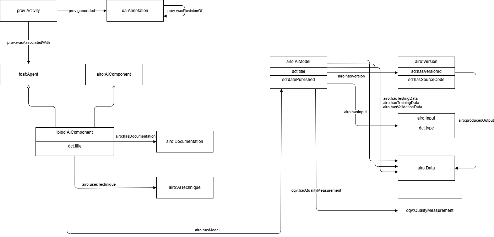

# write-up Provenance

This write-up describes the provenance and traceability pattern shared by the DECIDe data-space components. It is not a separate pipeline or a separate data store. It explains how source data, processing steps, AI output, human feedback and published data remain connected as Linked Data.

## Description UC/wanted deliverable

DECIDe collects local decisions and legislation (LD\&L) from heterogeneous sources, normalizes them to a common semantic model and enriches them with AI. Enrichments can influence search, policy reporting, geographic visualization and downstream reuse. A final RDF triple alone is not enough for a consumer to judge whether it is source data, a transformation result, an AI proposal or human feedback.

The wanted deliverable is an inspectable and queryable provenance chain for every important derived result. In practical terms, it should answer:

1. Where did a decision, document or assertion originate?
2. Which processing steps handled it and what was their result?
3. Which configured software component generated an AI enrichment?
4. Which source resource or text span supports that enrichment?
5. Has a person approved, rejected or corrected it?
6. Which retrieved decisions and prompt support a Smart Search answer?

For a machine-generated annotation, a consumer should be able to trace:

```
original source document or decision
  -> normalized ELI expression
  -> optional supporting text span
  -> processing task or PROV activity
  -> responsible configured software agent
  -> generated Web Annotation
  -> proposed assertion, entity or concept
  -> optional human review or correction
```

For a Smart Search answer, a consumer should be able to trace:

```
user question
  -> retrieved decision passages and retrieval scores
  -> complete prompt and model identifier
  -> generated answer
  -> optional reviews of the answer or its supporting passages
```

These trails make it possible to determine where a result came from, what evidence supported it, how it was produced and whether it was subsequently assessed by a person.

### Link to other deliverables

Provenance is not a separate pipeline, service or data store. It is interwoven throughout the DECIDe services and components that ingest source data, normalize decisions, generate AI enrichments, support human validation, answer Smart Search questions and publish derived results.

Each component contributes part of the overall provenance trail. Ingestion pipelines retain relationships with the original input; processing services record tasks and activities; AI services connect annotations to evidence and configured software agents; the Human Validation Tool records assessments separately from machine output; and Smart Search retains the information needed to explain how an answer was generated.

| Component                                                                                                                                                                                                                         | Role in DECIDe                                             | Contribution to provenance                                                                                                                                                                               |
| --------------------------------------------------------------------------------------------------------------------------------------------------------------------------------------------------------------------------------- | ---------------------------------------------------------- | -------------------------------------------------------------------------------------------------------------------------------------------------------------------------------------------------------- |
| [Shared AI service base](https://github.com/semantic-ai/decide-ai-service-base)                                                                                                                                                   | Common AI provenance library                               | Creates configuration snapshots, configuration-specific agents, annotation activities and task/result-container patterns used by the AI enrichment services.                                             |
| [Geocoding / NER service](https://github.com/semantic-ai/decide-geocoding-service)                                                                                                                                                | Translation, segmentation and entity extraction            | Produces source- and span-based AI annotations using the shared provenance pattern. This connects extracted information to the relevant ELI expression or exact text span.                               |
| [Entity-linking backend](https://github.com/semantic-ai/entity-linking-backend)                                                                                                                                                   | Named Entity Linking                                       | Links detected entities to authoritative URIs and records the associated activity, configured agent and linking annotation.                                                                              |
| [Codelist labeling service](https://github.com/semantic-ai/codelist-labeling-service)                                                                                                                                             | Codelist and impact annotation                             | Produces whole-expression classification annotations and records the activity and configured software agent responsible for them.                                                                        |
| [Human Validation Tool](https://github.com/lblod/frontend-decide-human-validator) and [annotation-review service](https://github.com/lblod/annotation-review-service)                                                             | Inspection, review and correction of generated annotations | Present the source context and machine annotation to a reviewer and store approval, rejection or correction separately from the original machine output.                                                 |
| [Smart Search frontend](https://github.com/lblod/frontend-decide-question-answering) and [question-answering service](https://github.com/semantic-ai/decide-question-answering)                                                   | Smart Search and retrieval-augmented question answering    | Retain the question, complete prompt, model identifier, generated answer, citations, retrieved quotations and retrieval scores. Reviews of answers and quotations extend this trace with human feedback. |
| [OSLO-to-ELI](https://github.com/lblod/decide-harvester-transformation-service), [OParl-to-ELI](https://github.com/lblod/oparl-to-eli-service) and [PDF extraction](https://github.com/semantic-ai/decide-pdf-content-extraction) | Source ingestion and normalization                         | Preserve source-specific relationships while converting heterogeneous input data into shared ELI resources used by downstream enrichment and search components.                                          |

## Glossary

<table><thead><tr><th width="254.966796875">Term / Acronym</th><th>Explanation</th></tr></thead><tbody><tr><td>LD&#x26;L</td><td>Local Decisions &#x26; Legislation, the decision and legislative documents collected and processed by DECIDe.</td></tr><tr><td>ELI</td><td>European Legislation Identifier, the vocabulary used to model legal resources as a Work, Expression and Manifestation.</td></tr><tr><td>PROV / PROV-O</td><td>W3C provenance ontology used to model activities, agents and the entities they generate or use (<code>prov:</code> namespace).</td></tr><tr><td>OA / Web Annotation</td><td>W3C Web Annotation Data Model, used to represent AI-generated and human-generated annotations on decisions and text spans (<code>oa:</code> namespace).</td></tr><tr><td>AIRO</td><td>AI Risk Ontology, used to model AI models, versions and related metadata.</td></tr><tr><td>NER</td><td>Named Entity Recognition, the process of detecting entities such as people, organizations or locations in text.</td></tr><tr><td>RDF</td><td>Resource Description Framework, the data model used to represent all DECIDe data, including provenance, as triples.</td></tr><tr><td>Turtle / TTL</td><td>A compact, human-readable text format for writing RDF triples, used for the examples in this write-up.</td></tr><tr><td>SPARQL</td><td>The query language used to retrieve and inspect RDF data, including provenance chains, from the triplestore.</td></tr></tbody></table>

## Business analysis + final feature passport (incl. functional analysis)

### Opportunity (problem, need, desire)

DECIDe makes decision data reusable by combining data from multiple cities and applying transformations and AI enrichment. This creates a trust problem: without an explicit trail, consumers cannot distinguish a publisher-provided fact from an inferred classification, an automatically translated expression, a linked entity or a human correction. They also cannot compare output from different service configurations or diagnose a failed pipeline run.

The provenance capability addresses this by retaining source, process, responsibility, evidence and review information as queryable Linked Data. It supports trustworthy reuse, explainability, debugging, reproducibility, human oversight, model comparison and auditable publication.

### Pilot partners

Provenance is implemented across the DECIDe services and therefore applies to data from all three participating partners: Ghent, Freiburg and Bamberg.

### Target audience / Personas

| Persona                    | Journey                                                                                                 |
| -------------------------- | ------------------------------------------------------------------------------------------------------- |
| **P3** Enrichment provider | Monitors jobs, tasks, configuration-specific agents and generated annotations.                          |
| **P4** Domain validator    | Inspects the source decision, evidence span, AI result and confidence before approving or rejecting it. |
| **P6** Data engineer       | Diagnoses failures, compares outputs across configurations and checks what a task consumed or produced. |
| **P7** Data space consumer | Filters or interprets data according to its source, producing component and human-review state.         |

### Functionality (requirements)

It is imperative that we know which pieces of information were generated by AI agents, which agent that was, with which configuration. These annotations must be able to be reviewed by human reviewers, marking them as correct or incorrect.

It would be very useful if we can track all the specific calls made to AI systems for the various AI-supported tasks.

Adding the ability for human reviewers to make corrections to AI generated annotations would be welcome, especially for UC0.1 where we are mapping expressions to code lists, possibly with impact.

<table><thead><tr><th width="486.056640625">Area assessed</th><th>Conclusion</th></tr></thead><tbody><tr><td>Mark AI generated content as AI generated</td><td>Must-have</td></tr><tr><td>Track the AI agent that generated a piece of content</td><td>Must-have</td></tr><tr><td>Track the configuration of the AI agent that generated a piece of content</td><td>Must-have</td></tr><tr><td>Human reviewers must be able to mark AI generated content as correct or incorrect</td><td>Must-have</td></tr><tr><td>Track the specific AI calls with input/output tokens to the specific models and link them to a task</td><td>Should-have</td></tr><tr><td>Human reviewers can add corrections to annotations</td><td>Could-have</td></tr></tbody></table>

## Datasources, datasets and datastandards

### Data sources

The data sources for the AI annotations are the different data sources defined in the [.](./ "mention") chapter. These AI annotations themselves form the source for the human validation annotations that are added on top of them. In that last case, the `oa:hasTarget` for the human validation is itself an `oa:Annotation`, either generated by an AI agent or a suggested correction by a human reviewer.

### Datasets available in the data space

The annotations, including their provenance information are available as datasets in the various different use cases and can be found in the DCAT of the project: [https://catalog.decide.lblod.info](https://catalog.decide.lblod.info)

### Data standards

Provenance and traceability rely entirely on existing Linked Data standards rather than a bespoke model. These are detailed further in [Final architecture](./#final-architecture-and-why):

* **ELI** for the Work/Expression/Manifestation structure of decisions and legislation.
* **PROV-O** for activities, the agents (services and configurations) responsible for them, and the entities they used or generated.
* **Web Annotation Model (OA)** for AI- and human-generated annotations on decisions and text spans.
* **AIRO** for registering the specific AI model and version behind an agent.
* **RDF/Turtle and SPARQL** as the underlying data model and query language tying all of the above together.

## Final architecture (and why)

The architecture uses a combination of existing standards, with each one covering a distinct part of provenance and traceability.

#### ELI: source and legal-document model

ELI uses three levels, as explained in the [UC0.0 Pipelines](./#pdf-to-eli):

1. `eli:Work` identifies the abstract decision.
2. `eli:Expression` identifies a language or version and contains the decision text used by enrichment services.
3. `eli:Manifestation` identifies a concrete representation such as a PDF.

DECIDe supplements this structure with source-lineage information. The OSLO transformation preserves `prov:wasDerivedFrom` links from source decisions. OParl also records source derivation with `prov:wasDerivedFrom` and uses ELI manifestations for concrete files. PDF conversion creates an `eli:Manifestation` and links it to the original PDF URL through `eli:is_exemplified_by`.

#### Annotation provenance

The [Web Annotation Model](./#web-annotation-model) was already briefly introduced. However, the AI services used within the DECIDe project go one step further by generating a `prov:Activity` alongside every `oa:Annotation`. As shown in the example below, this makes it possible to track timestamps, the service that generated the annotation, and the AI agent responsible for it.

```turtle
@prefix example: <http://www.example.org/> .
@prefix oa: <http://www.w3.org/ns/oa#> .
@prefix mu: <http://mu.semte.ch/vocabularies/core/> .
@prefix prov: <http://www.w3.org/ns/prov#> .
@prefix xsd: <http://www.w3.org/2001/XMLSchema#> .
@prefix foaf: <http://xmlns.com/foaf/0.1/> .
@prefix tcs: <https://w3id.org/tcs#> .

example:myAIAnnotation a oa:Annotation;
  mu:uuid "0ab45594-9909-4aea-a7d9-63476ffe6e97" ;
  oa:hasBody <http://lblod.data.gift/id/concept/SDG-11> ;
  oa:motivatedBy oa:classifying ;
  nif:confidence 0.87 ;
  oa:hasTarget <https://data.arendonk.be/id/besluiten/24.1125.2636.6731>  .

example:myAIAnnotationRun a prov:Activity ;
  mu:uuid "7dab6aa5-6a30-4ccc-86b7-dcd0c867a916" ;
  prov:startedAtTime "2025-06-20T08:09:51.032Z"^^xsd:dateTime ;
  prov:endedAtTime "2025-06-20T08:10:46.355Z"^^xsd:dateTime ;
  prov:generated example:myAIAnnotation ;
  prov:wasAssociatedWith example:myAIEnrichmentService ;
  prov:used <https://data.arendonk.be/id/besluiten/24.1125.2636.6731>, <https://data.arendonk.be/id/besluiten/24.1125.2636.6732>.

example:myAIEnrichmentService a foaf:Agent, tcs:InstancePipelineComponent  ;
  mu:uuid "029f5390-531e-41f9-abcc-d75a416f9816" ;
  foaf:name "My Decision SDG Classifier" ;
  prov:specializationOf <http://lblod.data.gift/id/components/codelist-labeling/v1.0.0/model_annotator> ;
  ext:hasConfig <http://lblod.data.gift/id/configurations/f9059c63-e806-4a88-acdd-cd91716e3362> .

```

Here, the `prov:Activity` records when the annotation was generated and links it to both the annotation it produced (`prov:generated`) and the source resources it consumed (`prov:used`). The activity is in turn associated with the responsible `foaf:Agent`, which is a specialization of a generic pipeline component and points to the specific configuration that was active at the time.

#### AI model registration with AIRO

The AI agent associated with an activity can also be modeled as a `foaf:Agent`. This allows very detailed information about the AI _component_ being used to be tracked. To model the Agent in our diverse landscape of services containing a mix of (foundation) models both local and external, we rely on [the AIRO ontology](https://delaramglp.github.io/airo/). Doing so, we have described our AI Systems, Components and Models following the structure used within the EU AI Act.

<figure><figcaption></figcaption></figure>

Most importantly, this allows to not only indicate which AI model was used, but also state the exact version of the model and, in case of trained models, all information required to replicate the training: a very powerful approach in a context where models are being retrained with the help of e.g. user feedback, leading to new and improved model versions.

In combination with the annotations and the activities, this approach allows to follow the entire chain: it can be derived which task created an annotation, which system / component / model was involved in the creation, which code and version were used, and how models were trained.

#### AI calls provenance

Alongside the activity- and annotation-level provenance, DECIDe also records the individual AI calls performed within a task. For every call, the number of input and output tokens is stored, together with the optional call duration and cost. This is tracked at a much finer granularity than a monthly provider invoice, making it possible to pinpoint exactly which tasks, configurations or AI models are responsible for the bulk of the token usage or cost, rather than only observing an aggregated total after the fact.

```turtle
@prefix example: <http://www.example.org/> .
@prefix ext: <http://mu.semte.ch/vocabularies/ext/> .
@prefix mu: <http://mu.semte.ch/vocabularies/core/> .
@prefix xsd: <http://www.w3.org/2001/XMLSchema#> .

example:myTask ext:performedAICall example:myAICall .

example:myAICall a ext:AICall ;
  mu:uuid "3f1e6ea1-2b2a-4c1c-8e5b-4a6f6f9d9b21" ;
  ext:endpoint "https://api.openai.com/v1/chat/completions" ;
  ext:aiModel <http://example.org/models/gpt-4o-2024-08-06> ;
  ext:tokenIn 1234 ;
  ext:tokenOut 567 ;
  ext:duration 2.5 ;      # optional, float seconds
  ext:cost 0.012 .        # optional, float USD
```

Each `ext:AICall` is linked to the `task` that performed it, so token, duration and cost figures can be aggregated per task, per configuration or per model, rather than only as a single monthly total.

### Final AI components (and why) (if any)

Provenance is not an AI component by itself, but two shared building blocks from the [shared AI service base](https://github.com/semantic-ai/decide-ai-service-base) are used by all AI services to make their output traceable. By implementing the injection of provenance from a fixed set of annotation types in the base package, it was automatically in all AI Services throughout DECIDe.

#### AI-call tracking

All AI services rely on a shared context manager, `record_ai_call_cm`, to record [the AI-calls provenance described above](./#ai-calls-provenance). Wrapping an actual AI call in this context manager inserts the `ext:AICall` triples into the triplestore using the given endpoint, model URI and token counts:

```python
with task.record_ai_call_cm(
    endpoint="https://api.openai.com/v1/chat/completions",
    model_uri="http://data.lblod.info/id/models/gpt-4o",
    tokens_in=1000, tokens_out=500
):
    response = openai_client.chat(...)
```

Besides timing the call to derive `ext:duration`, the context manager also estimates `ext:cost` for the call based on the given model URI and token counts, using pricing data from [OpenRouter](https://openrouter.ai/). Centralizing this in one shared utility keeps cost and usage tracking consistent across the different AI services and model providers used within DECIDe, without every service having to maintain its own pricing table.

#### Agent and configuration registration

Even though we register all models in the triplestore and how they were created, AI Components and AI Systems which wrap and call the models are also parametrized by code version and configuration. Our approach also covers this aspect.

The same shared base package also registers each AI service as a `foaf:Agent` in the triplestore at startup, based on its Docker Compose configuration. This is necessary because the exact same code or model can produce different output depending on how it is configured, e.g. a different prompt, a different environment variable or a different mounted model file, and provenance needs to be able to say "this configuration produced this result", not just "this service produced this result".

At startup, the service's Compose definition and mounted configuration files are hashed. An existing configuration and agent are reused if nothing changed, or a new versioned agent is created automatically if something did. This removes the need for services to manage their own versioning, while still making it possible to trace any AI-generated result back to the precise configuration that produced it.

```turtle
@prefix mu: <http://mu.semte.ch/vocabularies/core/> .
@prefix ext: <http://mu.semte.ch/vocabularies/ext/> .
@prefix xsd: <http://www.w3.org/2001/XMLSchema#> .

<http://lblod.data.gift/id/configurations/f9059c63-e806-4a88-acdd-cd91716e3362>
    a ext:AgentConfig ;
    mu:uuid "f9059c63-e806-4a88-acdd-cd91716e3362" ;
    ext:configHash "eee7cbcfe3fb786005399ccfa49d506eec2f4e46be56d9279a46a4029c9829d0" ;
    ext:hasConfigFile
        <http://lblod.data.gift/id/configurations/part/800961e6-ce9e-4737-abb5-f5dcfe0f4a15>,
        <http://lblod.data.gift/id/configurations/part/4dd9bdcf-bdd9-42bf-89da-624c60c6a576> .

<http://lblod.data.gift/id/configurations/part/800961e6-ce9e-4737-abb5-f5dcfe0f4a15>
    a ext:ConfigPart ;
    mu:uuid "800961e6-ce9e-4737-abb5-f5dcfe0f4a15" ;
    ext:configPath "/config/config.json" ;
    ext:configText """
{
  "llm": {
    "provider": "openai",
    "model_name": "gpt-4o",
    "temperature": 0.1,
    "timeout": 120
  },
  "codelist_prompts": {
    "default": { ... },
    "http://lblod.data.gift/id/conceptscheme/vap-klimaatadaptatie": { ... }
  }
}
""" .

<http://lblod.data.gift/id/configurations/part/4dd9bdcf-bdd9-42bf-89da-624c60c6a576>
    a ext:ConfigPart ;
    mu:uuid "4dd9bdcf-bdd9-42bf-89da-624c60c6a576" ;
    ext:configPath "docker-compose.yml:service" ;
    ext:configText """
{
  "image": "semanticai/codelist-labeling-service:0.2.0",
  "restart": "always",
  "environment": {
    "AI_GRAPH": "http://mu.semte.ch/graphs/public/pdf",
    "CONFIG_PATH": "/config/config.json",
    "LLM__MODEL_NAME": "${deployment}",
    "LLM__BASE_URL": "${azure_endpoint}",
  }
}
""" .
```

The `ext:AgentConfig` groups the individual `ext:ConfigPart` entries that were hashed to derive its `ext:configHash`, here one for the service's `config.json` and one for the relevant part of its `docker-compose.yml`. If either input changes, a new `ext:AgentConfig` is created and linked to a new versioned agent, so past results keep pointing at the exact configuration that produced them.

### Other explored AI components (and why not)

n/a

## Final UI design (and why) (if any)

There is no standalone provenance user interface. The information is surfaced through the interfaces that need it:

* the pipeline/harvester interface exposes jobs, task status and input/result containers;
* the Human Validation Tool lets a reviewer inspect an annotation and its source context before voting;
* Smart Search displays answers and source quotations;
* SPARQL and exported RDF support technical inspection across source, activity, agent, annotation and review.

### Other explored UI design (and why not)

A dedicated provenance browser was not implemented during the pilot. A future browser could render a complete source-to-review chain and make configuration differences, evidence spans and export scope inspectable without SPARQL knowledge. The existing interfaces prioritize the context specific to their user journey.

## Testing approach

The provenance data, including the tracked AI calls with input/output tokens is actively used for generating reports on the cost of the AI systems in DECIDe. No interface was created for this yet, but they SPARQL queries run can be found in the project's GitHub repository: https://github.com/lblod/app-decide/blob/development/scripts/project/export_csv/queries/ai-calls.sparql

## Possible future work

As discussed, the AI components used within the DECIDe project generate a `prov:Activity` for every `oa:Annotation`, essentially storing provenance for AI-generated data. We could expand on this by also generating activities for annotations that are the result of user-related actions.

E.g. when a user validates AI-generated data, an _accept_ annotation would be created, alongside an activity linking to the person as a `foaf:Agent`. This new annotation would also link to the _original_ AI annotation via `oa:hasTarget`. This way a chain of annotation could be created, very extensively showcasing the provenance of **all** (human- and AI-generated) affiliated data.

```turtle
@prefix example: <http://www.example.org/> .
@prefix oa: <http://www.w3.org/ns/oa#> .
@prefix mu: <http://mu.semte.ch/vocabularies/core/> .
@prefix prov: <http://www.w3.org/ns/prov#> .
@prefix xsd: <http://www.w3.org/2001/XMLSchema#> .
@prefix foaf: <http://xmlns.com/foaf/0.1/> .
@prefix as: <https://www.w3.org/ns/activitystreams#> .

example:myHumanReviewAnnotation a oa:Annotation, as:Accept ;
  mu:uuid "161325e8-4302-4331-a7ba-67743e02ea8d" ;
  oa:hasTarget example:myAIAnnotation .

example:humanReview a prov:Activity, example:HumanReview ;
  mu:uuid "5f8779f1-5ad0-4403-a757-b43535afe73d" ;
  prov:startedAtTime "2025-06-20T08:45:06.853Z" ;
  prov:generated example:myHumanReviewAnnotation ;
  prov:wasAssociatedWith example:myReviewerHuman.

example:myReviewerHuman a foaf:Agent, prov:Person ;
  mu:uuid "8694b5dd-5a98-4a2b-9de3-cb360d0a5ea1" ;
  foaf:name "Jos Test" .
```

### Monitoring model performance and data drift

The provenance information collected throughout the pipeline also provides a foundation for continuous monitoring of AI services over time. Because every annotation, AI call and configuration is linked to a specific model, version and activity, it becomes possible to compare performance across different models and configurations rather than only tracking operational metrics such as token usage or cost.

By combining provenance with human validation outcomes, future work could focus on automatically detecting performance degradation, data drift and changing error patterns. For example, increasing rejection rates for a particular model version, reduced confidence on specific document types or deteriorating performance for certain municipalities could indicate that retraining, prompt refinement or configuration changes are required. Such monitoring would make it possible to identify pain points early, compare alternative models under identical conditions and prioritize improvements based on observed real-world performance rather than anecdotal feedback.

## Relevant links

<table><thead><tr><th width="226.5830078125">Resource</th><th>Link</th></tr></thead><tbody><tr><td>ELI specification</td><td><a href="https://eur-lex.europa.eu/eli-register/about.html">https://eur-lex.europa.eu/eli-register/about.html</a></td></tr><tr><td>PROV-O ontology</td><td><a href="https://www.w3.org/TR/prov-o/">https://www.w3.org/TR/prov-o/</a></td></tr><tr><td>Web Annotation Data Model</td><td><a href="https://www.w3.org/TR/annotation-model/">https://www.w3.org/TR/annotation-model/</a></td></tr><tr><td>AIRO ontology</td><td><a href="https://delaramglp.github.io/airo/">https://delaramglp.github.io/airo/</a></td></tr><tr><td>Shared AI service base</td><td><a href="https://github.com/semantic-ai/decide-ai-service-base">https://github.com/semantic-ai/decide-ai-service-base</a></td></tr><tr><td>OpenRouter pricing data</td><td><a href="https://openrouter.ai/">https://openrouter.ai/</a></td></tr></tbody></table>
