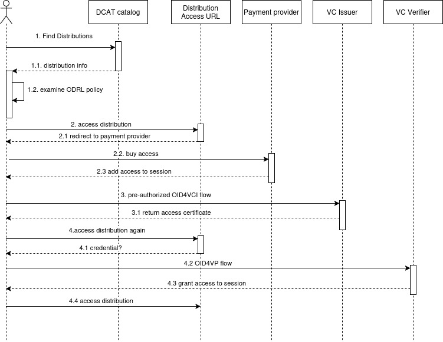

# Write-up Verifiable Credentials


This page is under construction


## Description UC/wanted deliverable

Verifiable Credentials (VC) is a foundational component of UC0.0 – "Building up the Data Space" – within the DECIDe project. Rather than a standalone use case, VC is a horizontal enabling technology that underpins trust and access control across the entire data space.

The DECIDe project aims to create a legislative and decision-making (LD\&L) data space connecting local governments in Flanders (Ghent) and Germany (Freiburg, Bamberg). A core challenge is establishing trust between participants who belong to different organizations and jurisdictions, without relying on a single central authority.

DECIDe is a brownfield data space implementation: multiple identity and authorization solutions are already in use across the participating organizations. Initial datasets in the pilot are publicly available, which reduces the immediate urgency for authentication and authorization components.

That being said, the aim is to extend this initial trust setup to handle two scenarios that require a more robust, standardized trust framework:

1. **Non-public information** – as the data space moves beyond open datasets, access control becomes essential and participants must be able to prove who they are and what they are entitled to access.
2. **Dynamically accepting new actors** – organizations and individuals joining the data space must be able to demonstrate their membership in a machine-verifiable way, without requiring manual coordination every time.

To address both scenarios, the proposal commits to studying and implementing (or reusing) a solution based on W3C DID and W3C Verifiable Credentials. The GAIA-X Trust Framework is cited as the closest existing reference implementation.

The Universal Trust Data Registry is one of three inter-dependent Reference Architecture components that DECIDe commits to incorporating, alongside the Federating Catalog and the Authorization Policies Store.

Within the project proposal, this maps to the following deliverables and tasks:

| Deliverable                                                                      | Activities                                                                                                                                        |
| -------------------------------------------------------------------------------- | ------------------------------------------------------------------------------------------------------------------------------------------------- |
| **D2.1** In depth technical analysis of current architecture                     | **T2.1** In depth analyzes of current technical architecture in use in pilot sites & gap analyzes possible solutions ‘to be’ architecture DECIDe. |
| **D2.6.3** Universal Trust Registry available                                    | **T2.8** Define, develop and test open source semantic Universal Trust Data Registry.                                                             |
| **D2.7.3** Universal Trust Registry integrated in local dataspace of pilot sites | **T2.9** Integrate Universal Trust Data Registry in local DS of all pilots                                                                        |

### Link to other deliverables

The Universal Trust Data Registry is one of three inter-dependent components of the Reference Architecture of the DS4SSCC blueprint. It therefor is deeply linked to the following:

#### Federating Catalog (DCAT)

The Federating Catalog is the primary entry point for discovering trusted data in the data space. The DECIDe project aims to explore the Universal Trust Data Registry as an augmentation of the Federating Catalog — adding W3C DID and W3C VC-based identity verification on top of the DCAT-based discovery layer. Non-public dataset distributions published in the DCAT catalog are protected by the Universal Trust Data Registry and Authorization Policies Store stack. The user discovers a distribution, reads its policy, and then acquires the necessary credential.\
[write-up-dcat.md](write-up-dcat.md "mention") [write-up-dsp.md](write-up-dsp.md "mention")

#### Authorization Policies Store (ODRL)

Whereas the credential establishes trust, the authorization policy describes the access and usage rules of a certain data set. Thus, the two components are conceived as forming a single access control stack: trust (who is this participant, what groups/roles do they hold?) and policy (what does this group/role grant access to?). Neither is fully functional without the other.\
[write-up-odrl.md](write-up-odrl.md "mention")

## Glossary


See the [UC0.0 Data space glossary](./#glossary) for definitions of DCAT, LBLOD, and ODRL.


<table><thead><tr><th width="174">Term/Acronym</th><th>Explanation</th></tr></thead><tbody><tr><td><a href="https://www.vlaanderen.be/digitaal-vlaanderen/onze-diensten-en-platformen/veiligheidsbouwstenen/toegangsbeheer">ACM/IDM</a></td><td>Access and Identification Management system used by the Flemish government. Oauth2 based.</td></tr><tr><td><a href="https://www.w3.org/TR/did-1.1/">DID (Decentralized Identifier)</a>.</td><td>A globally unique identifier that does not require a central registration authority. Resolves to a DID Document containing public keys and service endpoints.</td></tr><tr><td><code>did:key</code></td><td>Lightweight DID method where the identifier is derived directly from a public key. No web hosting required. Used for human participants in DECIDe.</td></tr><tr><td><code>did:web</code></td><td>DID method where the identifier is bound to a web domain. Allows key rotation while keeping the DID stable. Mandated for organizations in DECIDe.</td></tr><tr><td><a href="https://datatracker.ietf.org/doc/html/rfc8410">ED25519</a></td><td>A public/private key-based digital signature algorithm, supported in DECIDe</td></tr><tr><td><a href="https://datatracker.ietf.org/doc/html/rfc6979">ES256</a></td><td>ECDSA using P-256 and SHA-256. Another public/private key-based digital signature algorithm, supported in DECIDe.</td></tr><tr><td><a href="https://ec.europa.eu/digital-building-blocks/sites/spaces/EUDIGITALIDENTITYWALLET/pages/694487738/EU+Digital+Identity+Wallet+Home">EUDI</a></td><td>EU digital identity</td></tr><tr><td><a href="https://json-ld.org/">JSON-LD</a></td><td>JSON-based Linked Data format. Enables semantic interoperability through shared vocabularies. Preferred credential content format in the long term; currently limited by wallet support.</td></tr><tr><td><a href="https://datatracker.ietf.org/doc/html/rfc7517">JWK (JSON Web Key)</a></td><td>Standard format for representing cryptographic keys.</td></tr><tr><td><a href="https://openid.net/specs/openid-4-verifiable-credential-issuance-1_0.html">OID4VC (Open ID For Verifiable Credential Issuance)</a>.</td><td>The protocol used in DECIDe for issuing credentials to wallet applications (pre-authorized flow only).</td></tr><tr><td><a href="https://openid.net/specs/openid-4-verifiable-presentations-1_0.html">OID4FP (Open ID For Verifiable Presentations)</a></td><td>The protocol used in DECIDe for requesting and receiving credential presentations from wallet apps.</td></tr><tr><td><a href="https://datatracker.ietf.org/doc/draft-ietf-oauth-sd-jwt-vc/">SD-JWT-VC (Selective Disclosure JWT for Verifiable Credentials)</a></td><td>Specification for a JSON based data format for verifiable credentials with selective disclosure</td></tr><tr><td><a href="https://www.w3.org/TR/vc-data-model/">VC (Verifiable Credential)</a></td><td>W3C standard for cryptographically signed digital attestations. Allows a Holder to prove claims to a Verifier without direct interaction with the Issuer at verification time.</td></tr><tr><td><a href="https://www.ietf.org/archive/id/draft-ietf-oauth-sd-jwt-vc-15.html#name-verifiable-digital-credentia">VCT (Verifiable Credential Type)</a></td><td>A URL that dereferences to the JSON definition of the format of a SD-JWT-VC credential.</td></tr></tbody></table>

## Business analysis + final feature passport (incl. functional analysis)

### Opportunity (problem, need, desire)

A data space connecting multiple local governments requires a trust mechanism that is decentralized, interoperable, and privacy-preserving. Traditional session-based authentication (e.g. OAuth2 tokens) is siloed within a single organization's domain and cannot be carried across organizational boundaries in a verifiable way.

Verifiable Credentials address this by giving participants a portable, cryptographically signed proof of identity and membership that any participant in the data space can verify independently — without calling back to the original issuer at verification time.

For DECIDe specifically, the need is to allow civil servants from Ghent, Freiburg, and Bamberg to authenticate to the DECIDe data space and access datasets in a way that is:

* **Verifiable:** the credential cannot be forged and its issuer can be trusted.
* **Privacy-preserving:** users can disclose only the attributes needed (selective disclosure).
* **Decentralized:** no single authority controls all credentials.
* **Standards-compliant:** aligned with W3C VC, OpenID4VC, and DSSC Blueprint.

### Target audience / Persona

_**Dataspace consumer (ecosystem participation)**_

The dataspace consumer is an internal or external participant that discovers and uses datasets made available in the dataspace. They interact with the dataspace through dataset catalogs and data access endpoints.

Typical examples include:

* A consultancy
* A research organization
* A software company
* Another public authority

We also see the initial pilot partners as dataspace consumers in this regard.

### User journeys

There are two ways we demonstrate the value of Verifiable Credentials in DECIDe:

* Data Space Membership Credential
* 'Buying' a credential to access to a non-public distribution

See below [#credential-use cases](write-up-verifiable-credentials.md#credential-use cases "mention") for more detail.

## Datasources, datasets and datastandards

### Data sources

| Data source | Type/category | Brief description |
| ----------- | ------------- | ----------------- |
|             |               |                   |

### Datasets available in the data space

| Dataset | IdP/Authentication service | Country of origin | Domain | Shared within the project | Reused within the project |
| ------- | -------------------------- | ----------------- | ------ | ------------------------- | ------------------------- |
|         |                            |                   |        |                           |                           |

### Data standards

| Standard                                                        | Link                                                                                                                         |
| --------------------------------------------------------------- | ---------------------------------------------------------------------------------------------------------------------------- |
| Verifiable Credentials                                          | [https://www.w3.org/TR/vc-data-model/](https://www.w3.org/TR/vc-data-model/)                                                 |
| SD-JWT-VC (Selective Disclosure JWT for Verifiable Credentials) | [https://datatracker.ietf.org/doc/draft-ietf-oauth-sd-jwt-vc/](https://datatracker.ietf.org/doc/draft-ietf-oauth-sd-jwt-vc/) |

This section will provide some practical examples how Verifiable Credentials are used. More in depth explanation of the complete flow of verifiable credentials, cryptographic algorithms etc. will lead this write-up too far.

#### Verifiable Credentials

The VC Issuer of DECIDe is able to give credentials that links an account, group and roles to a user (`Foo Bar`). The `did` contains the DID of the holder.

Below, we can see an example of claims in JSON format conform with the Decide roles credential:

```
{ 'firstName': "Foo",
  'lastName': "Bar",
  'did': "did:key:znL1a7yYq1VqH3k3j73vKzX#zDnsdflkjdl",
  'userUri': "http://data.lblod.info/id/gebruiker/02eebd6d-c7cc-40fe-a7b7-c5c193131126",
  'accountUri': "http://data.lblod.info/id/account/9bdfbcff-11e2-423c-8ba5-657bb71839ac",
  'userId': "02eebd6d-c7cc-40fe-a7b7-c5c193131126",
  'accountId': "9bdfbcff-11e2-423c-8ba5-657bb71839ac",
  'group': "353234a365664e581db5c2f7cc07add2534b47b8e1ab87c821fc6e6365e6bef5",
  'roles': "Decide-gebruiker"
}
```

These claims are encrypted with the private key of the issuer. By retrieving the public key from the issuer's [DID endpoint](https://ds.decide.lblod.info/assets/decide-keys/decide-issuer/did.json) on the Web, others, such as verifiers, can verify that the issuer made these claims.

In DECIDe, the VC Verifier uses the VC to create a session in the triple store providing access to data. This looks as follows:

```
:Session a mu:Session ;
    ext:sessionGroup <http://mu.semte.ch/graphs/organizations/353234a365664e581db5c2f7cc07add2534b47b8e1ab87c821fc6e6365e6bef5> ;
    ext:sessionRole "Decide-gebruiker" ;
    session:account <http://data.lblod.info/id/account/9bdfbcff-11e2-423c-8ba5-657bb71839ac> .

<http://mu.semte.ch/graphs/organizations/353234a365664e581db5c2f7cc07add2534b47b8e1ab87c821fc6e6365e6bef5> mu:uuid "353234a365664e581db5c2f7cc07add2534b47b8e1ab87c821fc6e6365e6bef5" .

<http://data.lblod.info/id/gebruiker/02eebd6d-c7cc-40fe-a7b7-c5c193131126> a foaf:Person ;
    foaf:firstName "Foo" ;
    foaf:familyName "Bar" ;
    foaf:account <http://data.lblod.info/id/account/9bdfbcff-11e2-423c-8ba5-657bb71839ac> .

```

When this session data is available in the triple store, the authorization layer with ODRL is able to verify that the user is part of the `ext:organizationMemberParty` :

```
ext:organizationMemberParty a odrl:PartyCollection ;
  vcard:fn "organization-member" ;
  ext:queryParameters "session_group" ;
  ext:definedBy """PREFIX ext: <http://mu.semte.ch/vocabularies/ext/>
          PREFIX mu: <http://mu.semte.ch/vocabularies/core/>
          SELECT ?session_group ?session_role WHERE {
            <SESSION_ID> ext:sessionGroup/mu:uuid ?session_group.
          }""" .
```


?session\_role can be everything. It is not relevant for the query, thus will lead to one graph for the group, e.g. organizations/groupuuid


In our example, Foo Bar will be able to access data in the [http://mu.semte.ch/graphs/organizations/353234a365664e581db5c2f7cc07add2534b47b8e1ab87c821fc6e6365e6bef5/Decide-gebruiker](http://mu.semte.ch/graphs/organizations/353234a365664e581db5c2f7cc07add2534b47b8e1ab87c821fc6e6365e6bef5/Decide-gebruiker) graph.

#### JWT

JSON Web Token (JWT) is an open standard that defines a compact and self-contained way for securely transmitting information between parties as a JSON object (cfr [https://www.jwt.io/introduction#what-is-json-web-token](https://www.jwt.io/introduction#what-is-json-web-token)). A JWT contains three parts (header, payload, and signature) that are separated by dots. The header and payload are JSON objects that are Base64-encoded, while the signature is a Base64-encoding of the header, payload and secret of the issuer. In its compact form, it looks like this: xxxxx.yyyyy.zzzzz (header-encoded.payload-encode.signature).

#### SD-JWT VC

Selective Disclosure JWT (SD-JWT) for Verifiable Credentials is used in DECIDe. This is a special type of JWT that allows the holder of the VC disclose a limited set of claims.

An SD-JWT is composed of

* an Issuer-signed JWT, and
* zero or more Disclosures (will be provided by the holder if they want to disclose a claim)

**1. Issuer side — hashing the claims**

For each claim the issuer wants to make selectively disclosable, they:

1. Generate a random **salt**
2. Create a **disclosure** — a JSON array: `[salt, claim_name, claim_value]`
3. Base64url-encode that array
4. SHA-256 hash the encoded string
5. Place that hash in the `_sd` array inside the JWT payload

So the JWT itself contains **only hashes** — no actual claim values.

```json
// JWT payload (what verifier sees without disclosures)
{
  "iss": "did:web:ds.decide.lblod.info:assets:decide-keys:decide-issuer",
  "vct": "https://ds.decide.lblod.info/vc-issuer",
  "cnf": {
    "jwk": {
      "kty": "EC",
      "crv": "P-256",
      "x": "...",
      "y": "..."
  },
  "_sd": [
    "X9yH3mK...hash_of_firstName",
    "aB2cD4e...hash_of_group",
    "zQ7rS1t...hash_of_role"
  ],
  "_sd_alg": "sha-256"
}
```

From the `iss` issuer field, the public key material of the issuer can be retrieved through its [DID Web URL](https://ds.decide.lblod.info/assets/decide-keys/decide-issuer/did.json). The `vct` describes the JSON Schema that is used for the claims. The `cnf` confirmation field is added with the public key of the holder when the wallet does not support DIDs.

The holder of the credential can choose which claims are disclosed, by appending the (non-hashed) disclosures after the issuer-signed JWT, separated with tildes:

```
<Issuer-signed JWT>~<Disclosure 1>~<Disclosure 2>~...~<Disclosure N>~
```

For each disclosure the holder sent, the verifier:

1. Base64url-decodes it → gets `[salt, "claim_name", "claim_value"]`
2. SHA-256 hashes the encoded string
3. Checks that hash exists in `_sd`
4. If it matches → claim is genuine and issuer-signed

Claims with no matching disclosure remain hidden — the verifier only sees their hashes, which are computationally irreversible without the salt.

## Final architecture (and why)

Implementation of the VC issuer and verifier services started in August 2025, inspired by the requirements in the technical presentation on **Identity and Attestation Management** given in Ljubljana in 2025 (slide 33 in particular) and those put forward in the DSSC Blueprint. Following the advice given in Ljubljana, the team started simple — some additions were therefore left as future work and are flagged in the section [#possible-future-work](write-up-verifiable-credentials.md#possible-future-work "mention").

For more information on the implementation choices made, see the readme on [our github](https://github.com/lblod/oid4vc-login-service/blob/master/README.md).

### Human-to-machine only

Currently, we only support human-to-machine interaction for our credentials, meaning that only humans using supported wallet applications can interact with our issuer and verifier service. Human-to-machine interactions using wallet applications had the best support. We didn't find plug-and-play solutions for machine-to-machine interaction that matched our the issuer/verifier architecture. We decided to keep machine-to-machine credentials as possible future work. (see [#possible-future-work](write-up-verifiable-credentials.md#possible-future-work "mention"))

### Identity methods

We require participants of the dataspace to use **decentralized identifiers** which verifiably are under control of certain data space participants.

* **Organizations:** We mandate the use of `did:web`. This is slightly more demanding than `did:key` as it requires hosting a DID file, but allows rotation of cryptographic material while keeping the DID stable. Because `did:web` is bound to the domain it is hosted on, it provides reasonable assurance that the DID indeed belongs to the data space partner. The DID should still be verified through interpersonal communication between both parties.
* **Human participants:** We mandate the use of `did:key` derived directly from the public key in the wallet.
* **Key algorithms:** We support the use of ED25519 and ES256, chosen for good security and the best support in the libraries used.

### Credential Issuance

#### Protocol

We decided to use the [OID4VC issuance protocol](https://openid.net/specs/openid-4-verifiable-credential-issuance-1_0.html) to issue credentials to users so that they can log into our systems (or other systems that trust us as a credential issuer).

The Eclipse Decentralized Claims Protocol was researched, but the team was cautioned against using it as it was still quite new at the time and other pilot projects had run into issues implementing it. Both protocols were evaluated, and we came to the conclusion that OID4VCI/OID4VP had better support at implementation start (August 2025). OID4VCI only reached v1.0 in September 2025. Implementation of Eclipse DCP is therefor deferred. (see [#possible-future-work](write-up-verifiable-credentials.md#possible-future-work "mention"))

#### Pre-authorized only

We focus on **pre-authorized flow only**. A credential is only issued to a party that is already signed in through an existing authentication/authorization system (e.g. ACM/IDM or any other authentication/authorization mechanism used by a partner). From then on, this user can use their credential to log in to our system or systems that trust our issuer.

Our authorization codes are 16 bytes large and have a 1 minute TTL, our authorization tokens are 512 bytes large and have a 24h TTL. Both are generated in a cryptographically random fashion.

#### No transaction code

We choose not to use a transaction code in the DECIDe PoC, in order to avoid additional requirements such as setting up a secondary channel to share the transaction code for the credential (mail, text message, ...).

### Credential Presentation

#### Protocol

The [OID4VP protocol](https://openid.net/specs/openid-4-verifiable-presentations-1_0.html) is the corresponding protocol to OID4VC issuance that handles the presentation of the verifiable certificates from the wallet to the verifier.

### Supported wallets

#### Paradym

The [Paradym wallet](https://github.com/animo/paradym-wallet) was selected as providing the best support for the spec at the time. Initial implementation went rather smoothly, only minor updates were needed as Paradym caught up to the v1.0 OID4VCI and OID4VP specs.

#### EUDI

[DSSC recommended the use of the EUDI wallet architecture](https://dssc.eu/space/BVE2/1071255941/Trust+Framework#8.1-The-European-Digital-Identity-Framework-Regulation) and therefore we wanted to guarantee support for the EUDI Wallet Reference Implementation. This proved more challenging than hoped:

* At the time of writing, the EUDI wallet does not support DIDs for identifying the wallet's user. As DIDs are a recommendation from DSSC, the JWK provided by the EUDI wallet is converted into a `did:key` to keep as close as possible to the Paradym wallet implementation. This `did:key` is stored in the certificate, however, the certificate itself is still bound to the JWK through the cnf header.
* The EUDI Wallet does not support DIDs for identifying and securing issuers. The issuer must use X.509 to sign its certificates. The EUDI Wallet also added additional certificate requirements, requiring –among other things– the app to be built specifically for the DECIDe use case and rebuilt on certificate rotation.
* The EUDI Wallet does not support cookies. The API was reworked to use query parameters to pass state along during the OID4VCI and OID4VP process.

#### Other wallets considered

We researched the available wallets and what types of credentials they supported. When implementation started, it was quite hard to find wallets that implemented enough of the most recent OID4VCI and OID4VP specs to be useful. Even [the list of EBSI recommended wallets](https://ec.europa.eu/digital-building-blocks/sites/spaces/EBSI/pages/475267168/Conformant+wallets#find-your-wallet) proved to be of limited use as the spec was still in flux, many wallets implemented significantly older versions, we can only examine Open Source wallets, and some of the examples didn't provide a link to the actual implementation itself.

In the end the other wallets –in addition to Paradym and EUDI– we examined for testing were not in line with the latest version of the spec.

### Credential content

Most wallets found at the time, including Paradym, limited their support to SD-JWT-VC credentials over OID4VCI and OID4VP. The team originally wanted to use [credentials containing JSON-LD](https://www.w3.org/TR/vc-jose-cose/#with-sd-jwt) but couldn't find any wallets that supported this. As a result, we settled on SD-JWT-VC credentials containing pure JSON contents for now. The reason JSON-LD credentials were originally preferred is that they allow _any_ linked data snippet to be included in and signed with a credential, greatly improving semantic interoperability through well-known taxonomies. (See [#possible-future-work](write-up-verifiable-credentials.md#possible-future-work "mention")). Until wallet support for JSON-LD improves, a JSON-LD context can still be applied externally to the credential when processing its contents — though this is custom and thus less interoperable.

As our [VCT](https://ds.decide.lblod.info/.well-known/vct/vc-issuer) states, all properties in the SD-JWT-VC credential can be selectively disclosed, but without disclosing `group` and `roles` a user won't receive any ODRL access rules. Signature algorithms ED25519 (EdDSA) and ES256 are both supported.

### Credential Validity and Revocation

Current credentials are granted for a period of 1 year by default, but this property is easily configurable in our issuer service. Revocation of credentials is currently not implemented to keep things simple initially. See [#possible-future-work](write-up-verifiable-credentials.md#possible-future-work "mention")

### Trust Service Providers & Trust Anchors

Trust Service Providers (also referred to as Trusted Issuers) are defined by the DSSC as legal or natural persons deriving their trust from one or more Trust Anchors and designated by the data space governance authority as parties eligible to issue attestations about specific objects. They provide and preserve certificates, like digital certificates to create and validate electronic signatures and to authenticate their signatories, for instance, websites in general.

A Trust Anchor is defined as an authoritative entity for which trust is assumed and not derived. Each Trust Anchor is accepted by the data space governance authority in relation to a specific scope of attestation. In the case of DECIDe, the trust anchor is the DECIDe issuer DID. Additional trusted issuers can be added to the configuration after a manual governance vetting process.

### Credential user journeys

#### Data space membership credential

A data space membership credential is a verifiable credential that provides proof that the entity it is awarded to is a member of and adheres to the data space Rulebook. We have created a data space membership credential for the DECIDe dataspace. As explained in the previous section, this is purely to be used by human participants for now. Our data space membership credential holds the users' identifier, roles and groups because our ODRL access specification uses that information to determine fine-grained access restrictions on the data. The credential also holds the users first and last name, purely to show it in the interface as the currently logged in user.

Since we use the pre-authorized flow, we need an authorization process to secure our credential issuer. For the purpose of this pilot, we have built a demonstration scenario where this authorization is performed by the Flemish ACM/IDM system, an OAuth2 solution. To obtain a data space membership credential, the user first logs in using ACM/IDM, which then adds the appropriate groups and roles to the user's session. The user can then request a credential from the DECIDe Issuer service that proves that they hold these groups and roles.

Of course, ACM/IDM is just an example authentication/authorization solution. Any other solution can be used by a data space participant should they want to offer their own credentials. It's then just a governance question of whether to trust these credentials and add said issuer to the trusted issuers list of the DECIDe verifier (or any other verifier service).

A demo of this flow is shown in the first part of our [recording on the use of Verifiable Credentials in the DECIDe project](https://drive.google.com/file/d/1bZEzV7rvGmMHDz1ZR0jo74DnJ4U6IwVq/view?usp=sharing).

#### 'Buying' access to a data space

DECIDe primarily targets public data, so restricted access and monetisation are not the core focus. However, this was an important pillar of the DS4SSCC project and the team wanted to demonstrate a solution for this process.

The sequence below describes the approach taken:

1. The user browses the [DCAT catalog of the data space](https://ds.decide.lblod.info/dcat/datasets) (the DECIDe catalog or a catalog that federates it) and selects a distribution they are interested in.
   * 1.1 The user receives all information about the distribution.
   * 1.2 Included with the distribution info is the ODRL policy the user must agree to. The policy states that the distribution is only accessible after a payment has been processed, and states the duration for which access will be granted. Note: explicit signing and enforcement of the ODRL policy is not yet implemented (see [write-up-odrl.md](write-up-odrl.md "mention")).
2. The user attempts to access the distribution through its `accessURL`.
   * 2.1 The user is informed they need an access credential, or is redirected to a payment provider to complete the payment. This is handled on the side of the dataset provider.
   * 2.2 The user buys access. In the DECIDe demonstration, this step is mocked — no partner was found that was interested in actually implementing this approach for the pilot.
   * 2.3 Once the (mock) payment is complete, the payment provider module modifies the user's session so that they have access to the distribution. This session modification also counts as the pre-authorization needed to start the OID4VCI credential flow in step 3.
3. The user's session now has the required access privileges to start a pre-authorized OID4VCI flow with the issuer service of the dataset provider. In the demonstration, the DECIDe issuer component is reused with default account and role information added to the credential.
   * 3.1 The user completes the OID4VCI flow and stores the access credential in their wallet.
4. The user attempts to access the distribution again (this can be done automatically via a redirect).
   * 4.1 The user is again shown that they need to provide a credential (or buy one for access).
   * 4.2 The user starts the OID4VP flow and presents their credential.
   * 4.3 Upon validation, the user's session receives access to the distribution.
   * 4.4 The user proceeds to access the distribution.

On a high-level, the following figure illustrates this flow:

<figure><figcaption><p>source for this image on <a href="https://drive.google.com/file/d/15JyvFPPSwQ0ZHL1Idhmo1x1buez9H8RA/view?usp=sharing">google drive</a> and below</p></figcaption></figure>



A demo of this flow is shown in the second part of[ our recording on the use of Verifiable Credentials in the Decide project](https://drive.google.com/file/d/1bZEzV7rvGmMHDz1ZR0jo74DnJ4U6IwVq/view?usp=sharing).

Note this is, again, only demonstrated for human users that make use of a wallet app on their phone. Generalising this to machine-to-machine access would require implementing a custom wallet service acting on the consumer side, or allowing users with such a credential to obtain an API key for the non-public service.

### Conformity Assessment Scheme

DSSC defines the Conformity Assessment Scheme as

> the set of rules and procedures that describe the objects of conformity assessment, identifies the specified requirements and provides the methodology for performing conformity assessment

In the context of DECIDe, this is largely defined through the technical implementation choices made for the VC issuer and verifier services.

Any participant wanting to **issue** credentials compatible with DECIDe must:

* Use the credential format ([VCT)](https://ds.decide.lblod.info/.well-known/vct/vc-issuer) as defined by the DECIDe issuer.
* Sign credentials with a `did:web` using an ED25519 or ES256 verification method, and provide their DID to the DECIDe team for addition to the trusted issuers list after a manual vetting process.
* Set up their own issuer service (the [DECIDe open-source issuer service](https://github.com/lblod/oid4vc-login-service) can be reused and configured).
* Secure their issuer using an OAuth2 solution or equivalent (ACM/IDM is used in the DECIDe demonstration, but any OAuth2 solution works).

Any participant wanting to **verify** DECIDe credentials must:

* Set up their own verifier service (the [DECIDe open-source verifier service](https://github.com/lblod/oid4vc-login-service) can be reused and configured).
* Configure how the credential attributes (groups/roles) are mapped to access rights in their own system. Note: this mapping is highly custom and specific to each implementation.

Once this is done, a participant can use any of our supported wallets to confirm that the OID4VCI and OID4VP interaction works as expected. Paradym wallet is recommended as it builds on the DID specification and has a great debug support to understand what exactly is going wrong when building the issuer or verifier. The EUDI Wallet reference implementation requires additional configuration effort on the participant's end (see earlier).

## Final UI design (and why) (if any)


For this project, in the interest of time, all interfaces designed and built by ABB have been using ABB’s design system: [Appuniversum](https://appuniversum.github.io/ember-appuniversum/?path=/story/introduction--page).

Where illustrations are needed to support the interface, ABB uses [unDraw](https://undraw.co/illustrations), a free illustration library.

This applies for all use cases.


From the user journeys described above, there is a clear need for an interface to allow the user to:

1. Request a verifiable credential
2. Logging in with the received credential

The interface and the different journeys can be found on figma:



Both journeys start on the same login screen. Here the user chooses whether they’re logging in for the first time and need to request a verifiable credential, or whether they already have one and which to use this credential to log in.

The login screen can be triggered, for example, from the DCAT interface, where a verifiable credential is needed to access certain data.

#### Journey 1: Requesting the verifiable credential

When a user chooses this option, they get presented with a multi-step process. Splitting up complex journeys into concise tasks allows the user to feel more calm and in control about what they’re doing. The user is always aware in which step of the process they are (1st UX heuristic: Visibility of System Status) and can always go back to the previous step (3rd UX heuristic: User Control and Freedom).

In the first step, we prompt the user to download a digital wallet. In the second step, we ask the user to scan the presented QR-code with the digital wallet they just downloaded. Showing the QR-code is in a separate step ensures a safer credential generation: Timing out the QR-code every 30 seconds in case the user takes too long.

Once the user scans the QR-code with their digital wallet successfully, they need to complete their journey using the wallet. We show this with a very simple screen with an illustration and a heading telling them to do so. A loading element is also being shown, implying that the screen is waiting to show something: A success/error message.

The success message is shown for a short amount of time, before redirecting the user to the login screen, where they can login with their newly generated credential.

The error message will let the user know their credential has not been issued. Following the 8th UX heuristic (Help Users Recognize, Diagnose, and Recover from Errors), we are showing the user why the credential has not been granted, and how they can solve this.

#### Journey 2: Logging in with the received credential

Once the user completed the first journey (once), they can now log in to view the data. To do this, the user needs to choose the login option on the first screen of the interface. The user will then be presented with a QR-code (which also regenerates after 30 seconds), which they need to scan with the digital wallet that granted their verifiable credential.

Once this is done, the user will see the same _redirect-to-wallet_ screen they see in the first journey. Just like in the first journey, they will either get a success or an error message, which will either grant or deny them access, respectively.

### Other explored UI design (and why not)

#### Read manual

To comply with the 10th UX heuristic (Help and Documentation) the different interface screens show a link to read a manual. This is necessary to help the user complete the journeys in case of any issues or confusion. In the interest of time, this manual has not yet been created for this project.

#### Blurry QR-code

As an extra safety precaution, We can add an extra step to the first (Request a verifiable credential) journey. This step would force the user to click a “Reveal QR-code” button manually, which would allow the user to ensure they are in a secure location where nobody can scan the QR-code over their shoulder. In the interest of time, this manual has not yet been created for this project.

<br>

## Testing approach

### Risks & mitigations

## Possible future work

The following items were identified during implementation as out-of-scope for the current DECIDe project but relevant for the longer-term evolution of the DECIDe data space and beyond. Whether and when these will be tackled will depend on timing, scope, and budget.

To start simple, we did not yet harmonise the authentication/authorization solutions across all partners, but stuck to a demonstration case using the ABB implementation (i.e. ACM/IDM).

### Possible future work DECIDe data space related

#### Machine to Machine

Currently only human-to-machine credential flows are supported. Machine to machine credentials are needed for organization-level data space membership and automated pipeline access. The Eclipse Decentralized Claims Protocol claims to provide better support for these situations, but we were cautioned not to implement it yet as other pilots had run into difficulties during their attempts. We concluded it's wise to wait until the specification and its implementations are more mature.

Supporting machine-to-machine credentials requires building a backend wallet service that can interact with our issuer and verifier services.with the existing OID4VCI/OID4VP infrastructure

#### Data space membership credential for organizations

The new [DSSC Blueprint (v3)](https://blueprint.dssc.eu/) now states regarding which types of attestations are needed that:

> As a minimum, this includes a data space membership credential. What is needed for obtaining such a credential? This is linked to the participation management building block. The data space membership credential provides proof that the entity adheres to the data space Rulebook.

We don't currently have a data space membership credential for organizations. This is because we only support awarding credentials to human participants of the data space and such a credential would have to be issued to an organization party, not a human participant.

Once M2M support is in place, a DECIDe Data Space Membership Credential for organizations would be a relatively straightforward extension:

* the organization publishes their `did:web`
* set up a service to interact with the DECIDe OID4VCI issuance service signed with the private key corresponding to their their `did:web`,
* and receive a signed verifiable credential linked to the `did:web`, thus providing proof they adhere to the data space Rulebook.

#### Other issuer services

One of our partners, UI, is considering adding support for DECIDe Verifiable Credentials in their platform. Enabling partners to operate their own issuer services (using the open-source issuer component) would strengthen decentralization and federation of trust. This is something to keep an eye out for, but will likely only be possible after DECIDe concludes.

#### Arbitrary linked data (JSON-LD) credentials

Wallet support for JSON-LD-based credentials is currently lacking. Regardless, we see value in creating such credentials for M2M that certify arbitrary linked data as signed by a certain party and unmodified since its creation. An obvious example would be the Data Space Membership credentials above, but other use cases come to mind, for instance a signed DCAT description of the datasets and services in the data space or a credential proving that a data space participant agrees to the ODRL policy related to a specific dataset.

That said, it seems that such an implementation would be quite custom at the moment, see the service that needs to be set up in the previous section.

#### Credential revocation

Current credentials are valid for 1 year with no revocation mechanism. This should be improved. A possible approach is to add a `credentialStatus` property to issued credentials referencing a revocation entry managed by the issuer.

#### Contract Negotiation and Enforcement

We currently only have very simple ODRL contracts attached to our datasets. We would need to provide more options for these contracts and support a contract negotiation protocol, e.g. the one in the Data Space Protocol. We should also look into enforcing these contracts. Neither were a high priority at this stage as our partners at the moment only intend to offer public datasets.

### Possible future work LBLOD related

#### Integration with Flemish government identity infrastructure

ACM/IDM is currently used only as a pre-authorization mechanism. Deeper integration (e.g. using ACM/IDM as a trust anchor for organizational identity, or issuing VCs to civil servants tied to their official ACM/IDM identity) would strengthen the link between VC identity and the existing Flemish government identity ecosystem.

## Relevant links

* [LBLOD github repository](https://github.com/lblod/oid4vc-login-service)
* [OID4VC login service](https://github.com/lblod/oid4vc-login-service): implements [OID4VC Issuance](https://openid.net/specs/openid-4-verifiable-credential-issuance-1_0.html) and [OID4VP](https://openid.net/specs/openid-4-verifiable-presentations-1_0.html)
* [Demo video](https://www.youtube.com/watch?v=M6LQeelM0BY\&list=PL4lITq-CVBnvVOkVYNI5Y94BqQNcIUHN1\&index=3)
* [Application](https://yasgui.decide.lblod.info/authorization)
