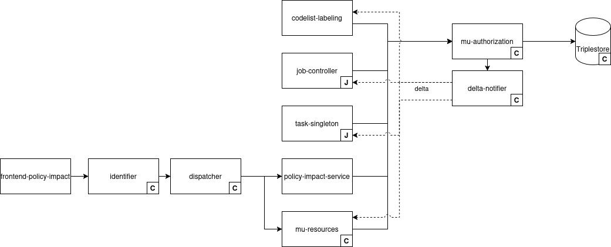
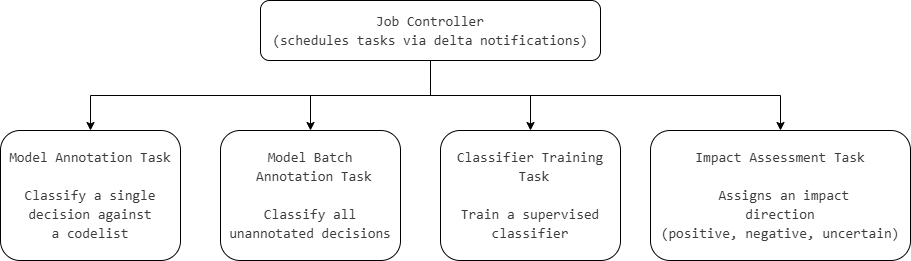

# Write-up UC0.1 Policy Impact Report


**Note:** In the original project proposal, this use case is embedded within Use Case 0.

UC0.1 was scoped out from UC0 by the DECIDe team as a distinct use case. While UC0.0 establishes the data space infrastructure and the pipelines to ingest LD\&L in standardized form, UC0.1 is the first concrete, end-user-facing application built on top of it. The separation allows each write-up to focus clearly on its scope: infrastructure versus application.


## Description UC/wanted deliverable

The DECIDe project proposal outlines an ambition to go beyond making local decisions available as structured linked data: it also foresees tools that can make the _policy relevance_ of those decisions legible. Specifically, the proposal describes the integration of AI-supported semantic enrichment as a mechanism for linking local decisions to strategic policy frameworks, such as the UN Sustainable Development Goals (SDGs).

The underlying hypothesis is that local governments already produce formal decisions (LD\&L) that are consequential for achieving broader policy goals, but that the relationship between individual decisions and those goals is rarely made explicit in a structured, machine-readable way. The proposal envisions demonstrating that, given a standardized corpus of local decisions and an AI-assisted annotation pipeline, it becomes possible to generate meaningful policy insights at scale, without requiring manual review of every document.

The envisioned deliverable is an interactive Policy Impact Report: a tool built on top of the DECIDe data space infrastructure that visualizes, in aggregated form, how local legislative and decision-making activity across the pilot cities relates to a chosen policy framework.

Within the project proposal, this maps to the following deliverables and tasks:

| Deliverable                                                                                                                 | Activities                                                                                                                                                                                                                                                                                                               |
| --------------------------------------------------------------------------------------------------------------------------- | ------------------------------------------------------------------------------------------------------------------------------------------------------------------------------------------------------------------------------------------------------------------------------------------------------------------------ |
| **D1.2.2** Data ready for decentralized ingestion into the data space — scope of data plan for UC0.1 (Policy Impact Report) | **T1.1-T1.7** Analyze available data sets and standards, develop and execute data plan for the use case                                                                                                                                                                                                                  |
| **D2.1.2** In-depth technical analysis of current architecture UC0.1                                                        | **T2.1** In-depth analysis of current technical architecture at pilot sites & gap analysis                                                                                                                                                                                                                               |
| **D2.8** Thesauri and registries available for AI assisted enrichment                                                       | **T2.12** Define and set up thesauri and registries as input for labeling and matching                                                                                                                                                                                                                                   |
| **D2.11** AI tool for matching LD\&L to relevant policies and legislation ready                                             | **T2.15** Define, develop, train and test open source semantic AI tool for matching LD\&L to relevant policies and legislation, including interface for human review                                                                                                                                                     |
| **D2.12** AI tool for matching LD\&L implemented at relevant pilot sites                                                    | <p><strong>T2.16</strong> Implement AI tool for matching LD&#x26;L to relevant policies and legislation, including interface for human review at lead<br>pilot and at least one following pilot site</p>                                                                                                                 |
| **D3.1** Policy Impact Reporting implemented by Flanders as lead pilot site                                                 | <p><strong>T3.1</strong> User centred design of Policy Impact Report</p><p><strong>T3.2</strong> Build and test Policy Impact Report (incl. user testing)<br><strong>T3.3</strong> Setup and/or configure connection to data space (via federated catalogue) to show data of lead pilot site in Policy Impact Report</p> |
| **D3.2** Policy Impact Reporting implemented by at least one following pilot site                                           | **T3.4** Setup and/or configure connection to data space to show data of following pilot site(s) in Policy Impact Report                                                                                                                                                                                                 |

### Link to other deliverables

#### UC0.0 Pipelines

UC0.1 builds directly on top of the data and infrastructure established in UC0.0. The data ingestion pipelines, LD\&L standardization, and AI enrichment established in UC0.0 produce the corpus of linked decisions and annotations that the Policy Impact Report queries.

[write-up-uc0.0-pipelines.md](write-up-uc0.0-data-space/write-up-uc0.0-pipelines.md "mention")

#### UC0.0 Human Validation

The Human Validation interfaces provide the human-in-the-loop validation layer for AI-generated annotations. The cross-use case HV architecture, shared validation logic, and data model are described within UC0.0 HV write-up. This write-up covers the UC0.1-specific interface, which validates codelist mappings (of a decision to an SDG target and its impact).

[write-up-uc0.0-human-validation-hv.md](write-up-uc0.0-data-space/write-up-uc0.0-human-validation-hv.md "mention")

#### UC1 Restrictive Mobility Zones

UC1 uses the same codelist mapping and human validation patterns established in UC0.1, as well as similar AI enrichment tooling as LD\&L standardization of UC0.0, making the data model and interface approach directly reusable across use cases.

[write-up-uc1-restricted-mobility-zones.md](write-up-uc1-restricted-mobility-zones.md "mention")<br>

## Glossary


See the [UC0.0 Data space glossary](https://github.com/lblod/gitbook-decide-write-up/blob/master/decide-project/write-up-uc0.0-data-space#glossary) for definitions of ELI, HV (Human Validation), Human-in-the-loop, LBLOD, LD\&L, `oa:Annotation`, and Triplestore.

See the [UC0.0 Pipelines glossary](write-up-uc0.0-data-space/write-up-uc0.0-pipelines.md#glossary) for definitions of Context window, Fine-tuning, LangChain, LLM, NER, and Ollama.


<table><thead><tr><th width="202.6376953125">Term/Acronym</th><th>Explanation</th></tr></thead><tbody><tr><td>AIRO</td><td><a href="https://delaramglp.github.io/airo/">AI Risk Ontology</a>. An ontology for describing AI models, their training provenance, evaluation metrics, and deployment context. Clear link with AI Risk Assessments (EU AI Act). Used to store information related to the systems, services and components using AI in the triplestore. The URIs of these components are used to store the provenance of annotations.</td></tr><tr><td>Class imbalance</td><td>A situation where some labels appear far more often than others in the training data. For example, most decisions are <em>not</em> about a given SDG, so the "no SDG X" class dominates. Imbalance can mislead simple metrics: a classifier that always predicts "no SDG X" can achieve high accuracy while being useless. Weighted F1 and similar metrics correct for this.</td></tr><tr><td>Codelist</td><td>A controlled vocabulary or taxonomy; in UC0.1 context, the SDG goals and targets used to categorize local decisions.</td></tr><tr><td>Codelist Mapping Tool</td><td>The AI component that maps a decision to one or more concepts in a SKOS codelist, producing an <code>oa:Annotation</code> linking the decision to matched codelist concept(s). Developed in UC0.1 for the SDG codelist, reused in UC1 for the RMZ codelist.</td></tr><tr><td>Cold start</td><td>The scenario where no labelled training data exists and the system must produce useful predictions from the codelist definition alone.</td></tr><tr><td><a href="https://huggingface.co/distilbert/distilbert-base-uncased">DistilBERT</a></td><td>A smaller, faster version of BERT (~66M parameters, ~40% smaller than BERT-base). Used in DECIDe as the base model for the supervised classifier trained on validated codelist annotations. Note: standard <code>distilbert-base-uncased</code> is English-only.</td></tr><tr><td>F1 score</td><td>The harmonic mean of precision and recall, balancing both metrics into a single number between 0 and 1, where 1 represents perfect and near zero is no better than coin flip.</td></tr><tr><td>Impact</td><td>In the context of UC0.1 SDG annotations: whether a given local decision has a positive, negative, or no discernible impact on the linked SDG goal.</td></tr><tr><td>Multi-label classification</td><td>A classification task where each item can belong to more than one class simultaneously. A decision about housing with solar panels can be both SDG 7 and SDG 11. Distinct from <em>single-label classification</em>, where each item gets exactly one class.</td></tr><tr><td>Policy framework</td><td>A structured set of strategic goals or objectives (e.g. SDGs, the European Green Deal, etc.) against which LD&#x26;L can be assessed for relevance or impact.</td></tr><tr><td>Policy Impact Report</td><td>The interactive data product delivered in UC0.1. Visualizes aggregated insights on how local decisions across the pilot cities relate to SDGs, based on AI-generated and human-validated codelist annotations.</td></tr><tr><td><a href="https://sdgs.un.org/goals">SDGs (Sustainable Development Goals)</a></td><td>The 17 UN goals adopted in 2015 as part of the 2030 Agenda for Sustainable Development. Used in UC0.1 as the target policy framework for annotation.</td></tr><tr><td>Single-label classification</td><td>A classification task where each item belongs to exactly one of the candidate classes, as opposed to <em>multi-label classification</em>.</td></tr><tr><td><a href="https://www.w3.org/TR/skos-reference/">SKOS (Simple Knowledge Organization System)</a></td><td>W3C standard for representing knowledge organization systems (e.g. thesauri, classification schemes, codelists) as RDF. Used in UC0.1 to model the SDG codelist that decisions are mapped against.</td></tr><tr><td><a href="skos:prefLabelhttps://www.w3.org/TR/skos-reference/"><code>skos:prefLabel</code></a></td><td>SKOS property, used to surface the human-readable label of a codelist concept (e.g. the name of an SDG) in the HVT interface.</td></tr><tr><td>Stratified splitting</td><td>When dividing data into training and evaluation sets, stratified splitting preserves the proportion of each class in both halves. For example, if 10% of decisions are tagged SDG 13 in the full dataset, both train and test sets will contain ~10% SDG 13. Avoids the failure mode where a small class ends up entirely in one half.</td></tr><tr><td>System prompt</td><td>The fixed instructions given to an LLM, setting its role and behavior, as opposed to the <em>user prompt</em>, which contains the specific request and data. The system prompt is normally fixed across calls; the user prompt changes per request. In DECIDe, system prompts constrain what the model is allowed to do.</td></tr><tr><td>Weighted precision / Weighted recall / Weighted F1</td><td>Variants of precision, recall, and F1 used when there are many classes of unequal size. The metric is computed per class and then averaged with each class weighted by how many examples it has. This stops a small class with a poor score from being washed out by larger, easier classes — and conversely stops a tiny class from dominating the average.</td></tr><tr><td>Zero-shot classification</td><td>Classifying text without any task-specific training data. The model uses only the names and descriptions of the candidate classes (e.g. SDG titles and definitions) plus its general pre-trained understanding of language to assign labels. Useful for <em>cold start</em> approach: getting started before any human-labelled examples exist.</td></tr></tbody></table>

## Business analysis + final feature passport (incl. functional analysis)

### Opportunity (problem, need, desire)

Local governments produce large volumes of formal decisions across many policy domains –urban planning, social services, mobility, environment. Yet the relationship between those day-to-day decisions and the strategic goals a city has committed to (such as the SDGs) is rarely made explicit. Policy assessment is typically done manually, retrospectively, and incompletely. There is no structured, automated mechanism to ask: _given the formal decisions our city has made, how are we performing against SDG Goal 11, or SDG Goal 13?_ This gap is not merely a reporting inconvenience –it represents a structural disconnect between local legislative activity and the policy ambitions cities publicly endorse.

UC0.1 addresses this by demonstrating that, based on information contained in LD\&L and AI-supported annotations, it is possible to generate meaningful insights into how local decisions relate to, and contribute to, policy goals.

The demonstration is deliberately scoped: the chosen policy framework is the UN Sustainable Development Goals (SDGs), and the impact dimensions are: positive impact, negative impact, and no discernible impact. This scoping is a pragmatic choice for the pilot phase, not an architectural limitation.

The underlying technical deliverable of UC0.1 is the Codelist Mapping Tool: a general-purpose classification service that maps municipal decisions to concepts in any SKOS codelist. The tool was designed from the outset to be framework-agnostic: the SDG codelist is the pilot-phase target, but the same service, data model, and pipeline infrastructure are reused in UC1 against a Restricted Mobility Zone codelist. Any well-structured SKOS codelist can, in principle, serve as the annotation target.

### Pilot partners

All three pilot cities participate in UC0.1: Ghent (Belgium), Bamberg (Germany), and Freiburg (Germany).

### Target audience / Personas

The Policy Impact Report is intended for non-technical users in local government, e.g. policy officers, sustainability coordinators, and decision-makers who need to understand the policy footprint of their city's formal decisions without querying raw data or interpreting linked data structures.

<table><thead><tr><th width="291.431640625">Persona</th><th>Journey</th></tr></thead><tbody><tr><td><strong>P2</strong> Semantic framework owner</td><td>Defines and maintains the SDG concept scheme used as the codelist, ensuring the hierarchy is correctly modelled and labelled in linked data form.</td></tr><tr><td><strong>P3</strong> Enrichment provider</td><td>Runs the AI annotation pipeline that generates the SDG-annotated dataset; produces the <code>oa:Annotation</code> objects that feed the report.</td></tr><tr><td><strong>P4</strong> Domain validator</td><td>Reviews AI-generated codelist mappings via the HV interface and votes on their accuracy, e.g. a sustainability officer with knowledge of the SDG framework.</td></tr><tr><td><strong>P5</strong> Non-technical application user</td><td>Primary audience for the Policy Impact Report, who interacts with the report as a consumer –filtering, exploring, and drawing conclusions– without needing to understand the underlying linked data or AI pipeline.</td></tr></tbody></table>

### Functionality (Requirements)

The Policy Impact Report is an interactive web application that queries the DECIDe data space for AI-generated annotations linking LD\&L decisions to SDG codelist items. It aggregates these across the selected city and SDG scope and surfaces them through KPI cards, ranked lists, a donut chart, an impact bar chart, and a time-trend line chart. The application is delivered in English for the pilot phase. Embedded within the same application is the UC0.1 HV interface, which allows domain experts to review and vote on AI-generated SDG codelist mappings decision-by-decision.


The Policy Impact Report builds on two shared components described in their respective write-ups: the [UC0.0 Pipelines](write-up-uc0.0-data-space/write-up-uc0.0-pipelines.md) and the [UC0.0 Human Validation](write-up-uc0.0-data-space/write-up-uc0.0-human-validation-hv.md). The Codelist Mapping Tool, the classification service that maps decisions to SKOS codelist concepts, is developed as part of UC0.1 and documented in the Final AI components section below. The HV's general architecture is described in the UC0.0 HV write-up; the requirements below cover the UC0.1-specific interface for both the report and the codelist mapping human validation.


#### Policy Impact Report

<table><thead><tr><th width="500.250732421875">Feature</th><th>Priority</th></tr></thead><tbody><tr><td>Filter by one or more SDG goals</td><td>Must-have</td></tr><tr><td>Filter by local authority (city)</td><td>Must-have</td></tr><tr><td>Display breakdown of LD&#x26;L decisions by SDG goal(s)</td><td>Must-have</td></tr><tr><td>Click-through from aggregate charts datapoints to list of decisions</td><td>Must-have</td></tr><tr><td>Available in English</td><td>Must-have</td></tr><tr><td>Split of positive vs. negative impact per SDG goal</td><td>Nice-to-have</td></tr></tbody></table>

#### Codelist Mapping Tool

<table><thead><tr><th width="499.8416748046875">Feature</th><th>Priority</th></tr></thead><tbody><tr><td>Classify decisions against any SKOS codelist (framework-agnostic, not SDG-specific)</td><td>Must-have</td></tr><tr><td>Operate in zero-shot LLM mode without labelled training data (cold start capability)</td><td>Must-have</td></tr><tr><td>Assess impact direction per annotation (positive / negative / neutral / unknown)</td><td>Must-have</td></tr><tr><td>Store codelist mapping results as <code>oa:Annotation</code> triples without modifying source data</td><td>Must-have</td></tr><tr><td>Record AI model at time of annotation</td><td>Must-have</td></tr><tr><td>Train a supervised classifier on validated annotations and replace LLM for future runs</td><td>Nice-to-have</td></tr></tbody></table>

#### Human Validation

<table><thead><tr><th width="500.7718505859375">Feature</th><th>Priority</th></tr></thead><tbody><tr><td>Paginated table of AI-generated annotations showing decision name, AI model, linked SDG target, and impact score</td><td>Must-have</td></tr><tr><td>Thumbs-up / thumbs-down voting per annotation row</td><td>Must-have</td></tr><tr><td>View/download access to source decision document per row</td><td>Must-have</td></tr><tr><td>Validation votes persisted as linked data (<code>oa:Annotation</code>), separate from source LD&#x26;L and AI layers</td><td>Must-have</td></tr><tr><td>Interface embedded in the Policy Impact Report (same sidebar, breadcrumb navigation)</td><td>Must-have</td></tr><tr><td>"Hide already reviewed entries" toggle</td><td>Nice-to-have</td></tr><tr><td>Filter by decision name and impact type</td><td>Nice-to-have</td></tr></tbody></table>

## Datasources, datasets and datastandards


The foundational data sources and datasets for DECIDe are documented in the UC0.0 write-up. This section covers only what is new or specific to UC0.1.


### Data sources

<table><thead><tr><th width="190.6162109375">Data source</th><th width="196.818359375">Type/category</th><th>Brief description</th></tr></thead><tbody><tr><td>ELI-normalized LD&L decisions</td><td>Internal (triple store)</td><td>The ELI data from the pipeline</td></tr><tr><td><a href="https://research.un.org/en/thesaurus/downloads">SDG codelist</a></td><td>Controlled vocabulary–RDF/SKOS</td><td>The UN Sustainable Development Goals taxonomy (17 goals and associated targets) used to generate a flattened SDG codelist.</td></tr><tr><td><a href="https://github.com/lblod/app-decide/blob/development/config/migrations/add-sdg-codelist/20260310123608-add-simple-sdg-codelist.ttl">SDG Flattened codelist</a></td><td>Controlled vocabulary–RDF/SKOS</td><td>A flattened version of the UN Sustainable Development Goals taxonomy (17 goals) used as the annotation target for linking local decisions to policy goals.</td></tr><tr><td><a href="https://github.com/lblod/app-decide/blob/development/config/migrations/20260407111121-create-impact.sparql">Impact codelist</a></td><td>Controlled vocabulary–RDF/SKOS</td><td>The impact taxonomy used to indicate the impact of a decision on an SDG.</td></tr></tbody></table>

### Datasets available in the data space

| Dataset                                                              | IdP/Authentication service                                                      | Country of origin | Domain     | Shared within the project | Reused within the project |
| -------------------------------------------------------------------- | ------------------------------------------------------------------------------- | ----------------- | ---------- | ------------------------- | ------------------------- |
| LD\&L decisions annotated with SDG codelist mappings (`oa:Annotation`) | Data space authentication | Belgium / Germany | Government | Yes                         | Yes - consumed by Human Validation Tool and Policy Impact Report                        |
| Human feedback on LD\&L decisions annotated with SDG codelist mappings (`oa:Annotation`) | Data space authentication | Belgium / Germany | Government | Yes                         | Yes - consumed by codelist labeling service for training                         |

### Data standards

<table><thead><tr><th width="371.2509765625">Standard</th><th>Link</th></tr></thead><tbody><tr><td>SKOS (Simple Knowledge Organization System)</td><td><a href="https://www.w3.org/TR/skos-reference/">https://www.w3.org/TR/skos-reference/</a></td></tr><tr><td>Web Annotation Vocabulary (<code>oa:Annotation</code>)</td><td><a href="https://www.w3.org/TR/annotation-vocab/">https://www.w3.org/TR/annotation-vocab/</a></td></tr></tbody></table>

As with all annotations used in the DECIDe project, the annotations created for UC0.1 are expressed using the Web Annotation Vocabulary and are, as such, instances of the type `oa:Annotation`.

To ensure reusability, the codelist labelling service is designed to map decisions to any `skos:Concept` from any codelist (`skos:ConceptScheme`), as defined by the Simple Knowledge Organization System. This makes the component reusable beyond the SDG mapping required for UC0.1; e.g. the same service is reused in UC1 for Restricted Mobility Zone classification.

Below is an example of an annotation that links a decision (`eli:Expression`) to a `skos:Concept` it has an impact on.


```turtle
@prefix ex: <http://example.org/> .
ex:1	a	<http://www.w3.org/ns/oa#Annotation> .
ex:1	<http://mu.semte.ch/vocabularies/core/uuid>	"32f0447a-b4d1-11f0-aa04-fe577d3a7416" .
ex:1	<http://www.w3.org/ns/oa#hasBody>	<http://metadata.un.org/sdg/13> .
ex:1	<http://www.w3.org/ns/oa#motivatedBy>	<http://www.w3.org/ns/oa#classifying> .
ex:1	<http://www.w3.org/ns/oa#hasBody>	<http://mu.semte.ch/vocabularies/ext/impact/positive> .
ex:1	<http://persistence.uni-leipzig.org/nlp2rdf/ontologies/nif-core#confidence>	"1"^^<http://www.w3.org/2001/XMLSchema#float> .
ex:1	<http://www.w3.org/ns/oa#hasTarget>	<https://data.gent.be/id/besluiten/21.0915.4958.3076> .

```


This is the most simple version of annotations in the DECIDe project because they don't need a specific resource to point to a specific part of a decision. The target of the annotation is therefore simply the ELI Expression itself, not an `oa:SpecificResource` referring to a specific part of the expression.

This annotation has two values for `oa:hasBody` because on the one hand, it references the `skos:Concept` the decision is being mapped to, on the other hand, it references the impact the decision has on the concept from the codelist.

Possible values for impact are:

* positive: `http://mu.semte.ch/vocabularies/ext/impact/positive`
* negative: `http://mu.semte.ch/vocabularies/ext/impact/negative`
* neutral: `http://mu.semte.ch/vocabularies/ext/impact/neutral`
* unknown: `http://mu.semte.ch/vocabularies/ext/impact/unknown`

Impact is optional: if left blank, the value is taken to be 'unknown'. AI agents may not be able to make the distinction between neutral and unknown; in that case, they should flag the impact as unknown. The current DECIDe classifier does not yet make this distinction.

The confidence score is also optional; its meaning is defined by the AI agent that generated the annotation. It may express confidence in the full annotation (concept and impact together), in the concept mapping only, or in the impact classification only –consult the documentation of the relevant agent for the precise interpretation. The DECIDe classifier agent uses this score to express how certain it is that a link exists between the ELI Expression and the concept.

## Final architecture

### Final semantic components

Like all other components developed in the DECIDe project, the components for UC0.1 are created as microservices in the semantic.works architecture.

The components involved in UC0.1 are shown in the diagram below:

<figure><figcaption></figcaption></figure>

In this drawing, services are depicted as rectangles, the Virtuoso triplestore is shown as a cylinder and HTTP requests are shown as arrows pointing from the origin of the request to the receiver of the request. Core components, marked with a **C**, are described in the core semantic.works components section of the [UC0.0 Data space write-up](https://github.com/lblod/gitbook-decide-write-up/blob/master/decide-project/write-up-uc0.0-data-space#core-semantic.works-components), whereas the job-controller and the singleton task, marked with a **J**, are described in [UC0.0 Pipelines writeup](write-up-uc0.0-data-space/write-up-uc0.0-pipelines.md).

From this diagram, it becomes clear that on a microservice level, UC0.1 is fairly simplistic. The main challenges lie in the AI models used (see later).

#### Codelist labelling service

The codelist labeling service is the main component handling the work for UC0.1. It functions as a Custom Task Execution Service described in [the writeup on pipelines](write-up-uc0.0-data-space/write-up-uc0.0-pipelines.md). The way the codelist labeling service works is described more in detail in the AI components section.

**GitHub:** [https://github.com/semantic-ai/codelist-labeling-service](https://github.com/semantic-ai/codelist-labeling-service)


#### Frontend policy impact

TODO

#### Policy impact service

TODO

<mark style="background-color:$warning;">missing: PIR (frontend) itself, not just the component also what, how, why</mark>

### Other explored semantic components (and why not)

#### Codelist Management tools

Initially, the creation of custom codelist management tools was considered. These tools would allow the user to create their own codelist or import a csv file with the labels and descriptions of the concepts and turn that into a linked data codelist for them. However, there are already many tools on the market that do just that. [SEMIC even published a nice list of tools to manage codelists](https://interoperable-europe.ec.europa.eu/collection/semic-support-centre/toolkit). All of the tools there work on SKOS codelists. These can then easily be imported into the DECIDe triplestore as a migration (see the [migrations service](../README.md#migrations) in the Core Components section of UC0.0).

Since the creation of codelists is a solved problem and not the core of the DECIDe project, we decided against creating our own solution. 

### Final AI components (and why) (if any)

The core technical challenge in UC0.1 is creating a tool that can automatically classify local decisions against any SKOS codelist from day one, even when no labelled training data exists. At the same time, the architecture must still allow a transition toward smaller, locally deployable supervised models as human-validated annotations accumulate.

This creates two architectural requirements:

1. Immediate usability (cold start)\
   The tool must produce useful classifications from day one, using only the codelist definition as a signal. No training data, no keyword lists, no pre-built classifiers.
2. Training loop\
   The tool must support continuous learning: human validators correct the LLM's predictions, those corrections feed into a training pipeline, and the resulting classifier can replace the LLM with known precision, recall, and F1 scores.

To satisfy these requirements, the architecture implements a two-phase classification lifecycle:

* Phase 1: Cold Start (Zero-shot LLM)\
  A zero-shot LLM classifier uses only the semantic information contained in the codelist definitions to generate initial classifications
* Phase 2: Gold Standard (Supervised Classifier)\
  Validated annotations are used to train a smaller supervised classifier that can eventually replace the LLM with deterministic, lower-cost inference and reduced latency. User corrections continue to feed back into retraining, anchoring the model against drift.

<figure><figcaption></figcaption></figure>

This lifecycle is implemented as the Codelist Mapping Tool, a standalone microservice (`codelist-labeling-service`) within the semantic.works stack as mentioned above. The service handles four types of task operations. As always, the tasks with those operations are each created by the job controller through the standard jobs/tasks workflow:

<figure><figcaption></figcaption></figure>

| Task                       | Operation URI                                                                                         | Purpose                                                                                                |
| -------------------------- | ----------------------------------------------------------------------------------------------------- | ------------------------------------------------------------------------------------------------------ |
| `ModelAnnotatingTask`      | [model-annotating](http://lblod.data.gift/id/jobs/concept/TaskOperation/model-annotating)             | Zero-shot classification of one decision against one codelist                                          |
| `ClassifierTrainingTask`   | [classifier-training](http://lblod.data.gift/id/jobs/concept/TaskOperation/classifier-training)       | Train a supervised classifier on validated annotations                                                 |
| `ModelBatchAnnotatingTask` | [model-batch-annotating](http://lblod.data.gift/id/jobs/concept/TaskOperation/model-batch-annotating) | Iterate over all unannotated decisions and classify each                                               |
| `ImpactAssessmentTask`     | [impact-assessing](http://lblod.data.gift/id/jobs/concept/TaskOperation/classifier-training)          | Downstream assessment of impact direction on assigned policy labels. Running after the classification. |

The architecture is intentionally codelist-agnostic. The same service, data model, and processing pipeline can be reused across any SKOS codelist. While the primary use case in UC0.1 is mapping LD\&L to the UN Sustainable Development Goals (SDGs), the same infrastructure is reused in [UC1 for classification against a Restricted Mobility Zone codelist](write-up-uc1-restricted-mobility-zones.md#q1-is-this-decision-about-a-restricted-mobility-zone).

The classification problem itself is multi-label: a single decision can map to zero, one, or several concepts simultaneously. For example, a decision about expanding social housing with solar panels might map to both SDG 7 (Affordable and Clean Energy) and SDG 11 (Sustainable Cities and Communities). The tool must also operate across multiple languages (Dutch, German, French, English), varying codelist granularities (17 broad SDG goals vs. a single binary RMZ concept), and across municipalities with different administrative traditions.

The current deployment operates in the Cold Start phase, gathering validated annotations to eventually transition to a Gold Standard model. The sections below detail the technical implementation of each strategy.

#### Phase 1: Cold Start classification (Zero-shot LLM)

The primary classification strategy uses a Large Language Model in a zero-shot configuration, requiring no labelled training dataset.

The `ModelAnnotatingTask` implements the end-to-end workflow for classifying a single decision:

1. **Fetch the codelist.** The task resolves the SKOS `ConceptScheme` URI from the job that triggered it. It queries the triplestore for all `skos:Concept` entries in that scheme, retrieving their English `skos:prefLabel` values. This produces a list of concepts, each holding a concept URI and its label. The SDG codelist, for instance, can be viewed [here](https://github.com/lblod/app-decide/blob/203764139125744df4ff55757f645a8849837e02/config/migrations/add-sdg-codelist/20260310123607-add-simple-sdg-codelist.ttl).
2. **Fetch the decision text.** The task retrieves the `epvoc:expressionContent` of the target `eli:Expression` from the triplestore. This is the full text of the decision, typically the English translation produced by the upstream Translation Task in the[ AI pipeline of UC0.0](write-up-uc0.1-policy-impact-report.md#uc0.0-pipelines-incl-codelist-mapping-tool).
3.  **Construct the LLM prompt.** The task builds a prompt with two parts:

    * A **system prompt** that sets the role: _"You are a juridical and administrative assistant that must determine the best matching codes from a list with a given text."_
    * A **user prompt** that presents the codelist labels and the decision text, and instructs the LLM to return matching labels as a list of strings:

    ```
    Determine the best matching codes from the following list for the given
    public decision.

    """
    CODE LIST:
    ['Affordable and Clean Energy', 'Climate Action', ...]
    """

    """
    DECISION TEXT:
    [full decision text]
    """

    Provide your answer as a list of strings representing the matching codes.
    Provide all matching codes (can be a single one), but only those that are
    truly matching and only from the given list! If none of the codes match,
    return an empty list.
    ```
4. **Call the LLM.** The prompt is sent to the configured LLM via [LangChain's ](https://www.langchain.com/)unified chat interface. The service supports multiple providers (including Mistral, OpenAI, Anthropic, and Ollama) permitting configurability later on. Within DECIDe, Mistral Large 3, an external proprietary model, is used to generate an initial qualitative annotation set. Tests using smaller LLMs (used locally) were not considered to be sufficiently performant.
5. **Resolve labels to URIs.** Each returned label is mapped back to its SKOS concept URI.
6. **Store the annotation.** For each resolved concept URI, an annotation is created and inserted into the triplestore. The annotation follows the Web Annotation Data Model (`oa:Annotation`) with:
   * `oa:hasTarget` → the decision's `eli:Expression` URI
   * `oa:hasBody` → the matched `skos:Concept` URI
   * `oa:motivatedBy` → `oa:classifying`

> **Example**
>
> Consider a decision titled _"Subsidie aan stad Antwerpen voor aanleg fietspad. Goedkeuring."_ (Subsidy to the city of Antwerp for construction of a bicycle path. Approval.), translated to English by the upstream Translation Task.
>
> 1. The codelist is fetched: 17 SDG concepts with labels like "Affordable and Clean Energy", "Sustainable Cities and Communities", "Climate Action", etc.
> 2. The prompt is constructed with the full codelist and the decision text.
> 3. The LLM responds with: `{"designated_classes": ["Sustainable Cities and Communities"]}`.
> 4. The label "Sustainable Cities and Communities" is resolved to its SKOS concept URI (SDG 11).
> 5. An `oa:Annotation` is stored linking the decision's `eli:Expression` to the SDG 11 concept with motivation `oa:classifying`.
>
> If the LLM had returned `["Sustainable Cities and Communities", "Partnerships for the Goals"]`, both SDG 11 and SDG 17 would be stored as separate annotations on the same decision.

The zero-shot approach was chosen as the primary strategy because it offers several advantages during the cold-start phase:

1. **No labelled data required.** Creating a high-quality, expert-labelled training dataset for municipal decisions is costly and domain-specific. With zero-shot classification, the codelist definition itself serves as the only "training" signal need to start the classification process.
2. **Language-agnostic.** The LLM operates on the English translation of the decision, but the approach does not require language-specific keyword lists or language-specific training data. Adding a new source language only requires a translation step upstream.
3. **Codelist-agnostic.** The same task code classifies SDGs, RMZ types, or any other SKOS codelist. The codelist is resolved dynamically from the job at runtime; no code changes are needed to switch codelists.
4. **Adaptable through codelist enrichment.** Classification quality can be improved by enriching the codelist's `skos:definition` and `skos:prefLabel` values, without retraining any model. The richer the concept descriptions, the more context the LLM has for classification.

#### **Phase** 2: Supervised classification (trained classifier)

The second phase relies on a traditional supervised classifier trained on validated annotations.

The intended lifecycle is iterative: zero-shot predictions are reviewed by human validators, corrected where necessary, and accumulated into a curated reference dataset. This validated corpus then becomes the basis to train a smaller, more efficient model. This model can then classify new decisions, and its outputs can be reviewed and fed back into the system, creating a continuous improvement loop as illustrated bellow:

<figure><figcaption></figcaption></figure>

The `ClassifierTrainingTask` implements this training pipeline. To illustrate, suppose 500 decisions have been classified by the LLM against the SDG codelist and subsequently reviewed by human validators through the HVT. Of these, 420 were confirmed correct and 80 were corrected (e.g., a decision about "occupation of public domain" was changed from SDG 11 to no SDG, and a budget decision was changed from no SDG to SDG 16).

The pipeline consists of following steps:

1. **Fetch labelled decisions.** The task queries the triplestore for all decisions with validated `oa:classifying` annotations in the AI graph, where the annotation body is a `skos:Concept` in the task's codelist. For each decision, it concatenates the available text fields (`eli:title`, `eli:description`, `eli-dl:decision_basis`, `epvoc:expressionContent`) into a single training text. In the example, this yields 500 labelled text-label pairs.
2. **Determine problem type.** The task inspects the training data to determine whether it is a single-label or multi-label classification problem. If any decision has more than one assigned concept, the problem is treated as multi-label classification; otherwise, single-label classification.
3. **Prepare the dataset.** The training data is formatted into a Hugging Face dataset:
   * For single-label classification: each example has a text field and a label field (integer index). The dataset is split 90/10 into train/test sets, stratified by label when class sizes permit.
   * For multi-label classification: each example has a text field and a label field that is a binary vector (one position per concept, 1.0 if the concept applies, 0.0 otherwise). The dataset is split 90/10 without stratification.
   * In the example, this produces 450 training and 50 evaluation examples, each with a 17-dimensional binary label vector.
4. **Train a classifier.** Train a classifier by fine-tuning a DistilBERT model using Hugging Face’s training tools by default, [distilbert/distilbert-base-uncased](https://huggingface.co/distilbert/distilbert-base-uncased) is used as the base model.
5. **Evaluate.** After training, the model is evaluated on the held-out 50 examples. Following evaluation metrics are used:
   * **Accuracy**: The proportion of correctly predicted instances out of all predictions. It measures overall correctness but can be misleading with imbalanced data.
   * **Weighted precision**: The average precision across all classes, weighted by the number of true instances per class. It reflects how many predicted positives are actually correct, accounting for class imbalance.
   * **Weighted recall**: The average recall across all classes, weighted by their support. It measures how well the model identifies all actual instances of each class, adjusted for imbalance.
   * **Weighted F1**: The weighted average of F1-scores (harmonic mean of precision and recall) across classes. It provides a balance between precision and recall while accounting for class distribution.
6. **Push to the Hugging Face Hub**. If a Hugging Face token and output model ID are configured, the best model checkpoint is pushed to the Hub (e.g., as `decide/sdg-classifier-v1`), making it publicly accessible for others to use as well.
7.  **Record provenance.** The task builds a SPARQL INSERT query following the AIRO (AI Risk Ontology) model to record:

    * The model URI, its Hugging Face repository URL, and the commit OID
    * The source code's Git SHA
    * All evaluation metrics

    This provenance information is stored in the triplestore as well, ensuring full traceability from trained model back to training data and source code. Once deployed, the resulting classifier can replace the LLM for SDG classification, producing deterministic predictions without API costs.

Compared to continued reliance on zero-shot LLM classification, supervised models provide several operational advantages:

1. **Computational efficiency.** A fine-tuned transformer model (such as DistilBERT) runs orders of magnitude faster than large LLMs and does not require external API calls.
2. **Cost.** Local inference eliminates per-token costs associated with LLM APIs, making it practical for batch processing of thousands of decisions.
3. **Latency.** Local models produce predictions in milliseconds, enabling near-instant feedback for interactive use cases, whereas LLM API calls can take seconds.
4. **Reproducibility.** A frozen classifier checkpoint produces deterministic predictions, while LLM outputs can vary between calls, even at low temperature.

#### Batch classification

The `ModelBatchAnnotatingTask` orchestrates classification at scale. It:

1. Queries the triplestore for all `eli:Expression` instances that do not yet have a `oa:classifying` annotation in the AI graph.
2. For each unannotated decision, creates and runs a `ModelAnnotatingTask` with the same codelist.

This allows an operator to trigger a single batch job that classifies the entire corpus against a given codelist.

### Impact assessment

The fourth task, `ImpactAssessmentTask` extends the classification with a policy impact analysis. For each decision that has been classified against a codelist concept, it assesses whether the decision's impact on that concept's domain is **positive**, **negative**, or **unknown**.

1. **Fetch classified decisions.** The task retrieves the `eli:Expression` instances along with their content, language, and corresponding `eli:Work` URI.
2. **Fetch policy labels.** For each expression, the task queries the AI graph for existing `oa:classifying` annotations whose body is a concept in the task's codelist. Each annotation represents a previously assigned policy label.
3. **Assess impact.** For each (decision, policy label) pair, the task sends the decision text and the policy label to the LLM with a structured system prompt. The LLM is instructed to:
   * Identify the core intent and mechanisms of the policy
   * Consider the specific scope and targets of the label
   * Assess direct effects, then second-order effects
   * Weigh short-term and long-term consequences
   * Conclude with an impact direction (positive / negative / unknown) and confidence level (low / medium / high)
4. **Store the result.** The impact direction is as a separate `oa:hasBody` triple pointing to a SKOS concept from the impact codelist, see 'Data Standards'.

### Other explored AI components (and why not)

Before building the Codelist Mapping Tool, existing SDG classification tools and related literature were reviewed to assess reuse potential and limitations on municipal decision texts. From the start, the goal was not only to classify SDGs, but to build a reusable system that can map decisions to multiple policy frameworks (e.g. SDGs, local policy codes, thematic codelists), rather than a solution limited to SDGs alone.

However, the first step was to survey existing, publicly available SDG classification tools to assess whether any could be reused or adapted. The following two tools were evaluated in depth:

[**OSDG**](https://osdg.ai/) is a two-stage pipeline that combines ML screening (16 one-vs-rest classifiers, one per SDG) with a keyword-ontology verification step. A label is only assigned when both the ML model and the ontology agree, which reduces false positives but increases false negatives. OSDG supports 15 languages via neural machine translation to English, and its reported accuracy on its own benchmark dataset reaches around 80%. However, OSDG is not open source and cannot be customized or retrained, making it unsuitable for domain-specific fine-tuning on municipal decision text.

[**text2sdg**](https://cran.r-project.org/package=text2sdg) is an open-source R package that integrates six independently developed query-based labelling systems: Aurora, Elsevier, SIRIS, Auckland, SDGO, and SDSN. Each system is a curated set of keyword and phrase queries per SDG goal. The package also incorporates OSDG as a seventh source and offers an ensemble approach that combines all systems using a random-forest meta-classifier trained on top of their individual outputs. On a dataset of news articles, the best individual system (Elsevier) achieved an accuracy of 0.82 and F1 of 0.46; the ensemble improved this to accuracy 0.83 and F1 of 0.54. text2sdg is English-only, written in R, and all underlying systems are query-based; meaning they do not use any neural models or trainable components. The ensemble adds a random forest on top, but the base signals are all keyword lookups.

Additional tools and literature surveyed:

* KnowSDGs SDG Mapper (keyword-based, covers 17 goals and 169 targets) ([knowsdgs](https://knowsdgs.jrc.ec.europa.eu/))
* Aurora SDG Classifier ([aurora-universities.eu](https://aurora-universities.eu/sdg-research/))
* SVM with label multiset for SDG classification of scientific papers ([IEEE, 2022](https://ieeexplore.ieee.org/stamp/stamp.jsp?arnumber=9954368))
* Elsevier 2023 SDG Mapping (query-based)([Elsevier](https://elsevier.digitalcommonsdata.com/datasets/y2zyy9vwzy/1))
* LLM-based approaches for SDG Labeling([ScienceDirect](https://www.sciencedirect.com/))
* Ensemble of 7 existing models for SDG labeling ([ScienceOpen](https://www.scienceopen.com/))

#### Why the existing tools were insufficient

Neither keyword-based approaches nor existing ML tools are sufficient for municipal decision texts.

First, keyword-based systems tend to generate more false positives. For example, a policy document about a “declaration of unfitness of housing at Fishery Street” contains the word “Fishery”, which text2sdg incorrectly classified as SDG 14 (Life Below Water), even though the document is about housing regulation. All six systems in text2sdg are vulnerable to this issue, and false positives increase with document length.

Second, existing tools focus on detecting whether a text mentions or overlaps with SDG-related terminology, but not whether it represents a concrete policy action contributing to an SDG. In municipal decision-making, this distinction is essential: many documents contain SDG-related terms in administrative, legal, or contextual ways without reflecting actual policy intent or impact.

Third, and most critically, these tools cannot be fine-tuned to legislative language. Municipal decisions follow a highly specific style: formal, domain-specific, and often indirect in how actions are described (e.g. approvals, amendments, budget allocations, regulatory changes). Models trained on news articles, scientific papers, or generic corpora do not capture these patterns well. Without fine-tuning on annotated legislative text, systems struggle to:

* recognize implicit policy actions,
* distinguish procedural text from substantive decisions,
* and correctly interpret domain-specific terminology.

OSDG cannot be retrained, and text2sdg’s underlying systems are not trainable at all. Its ensemble layer is trained on news data, not on legislative or administrative text. None of the surveyed tools support a human-in-the-loop feedback loop to iteratively adapt the model to this domain.

Finally, existing tools are SDG specific by design. Extending them to other policy frameworks (e.g. local mobility taxonomies or thematic codelists) would require rebuilding the system from scratch. Even if one of these tools could be made to work for SDGs, the project requires classification across different frameworks (e.g. SDGs in UC0.1, Restricted Mobility Zone types in UC1, and future codelists). Maintaining separate specialized tools per framework would lead to a fragmented and operationally unsustainable setup, with duplicated pipelines, and more complex validation workflows.

This motivated a purpose-built solution: a system capable of classifying decisions against any SKOS codelist out of the box, without prior labelled data, while also providing the infrastructure to build a validated dataset over time and train custom models with known, measurable performance on this specific domain.

## Final UI design (and why) (if any)

The Policy Impact Report allows a sustainability policy officer (P5) to view, per local authority, statistics about decisions linked to a Sustainable Development Goal and with what impact (positive/negative/unknown). It also gives a domain expert (P4), e.g. a sustainability officer with knowledge of the SDG framework, the option to validate whether the decisions are properly linked to the SDG.



The report works as follows:

A user opens the Policy Impact Report. Once the user selects a local authority from a dropdown menu, the report dashboard loads.

The user can also filter the report by SDGs. These are color-coded based on the SDG colors decided by the UN on the [SDG website](https://sdgs.un.org/goals).

The tool aims to demonstrate the reporting possibilities; the following statistics were chosen as a starting point:

* **Decisions about SDGs**: The proportion of all decisions from that local authority linked to the selected SDGs.
* **Decisions with positive impact**: The proportion of all decisions from that local authority linked to the selected SDGs, where the impact is found to be positive.
* **Decisions with negative impact**: The proportion of all decisions from that local authority linked to the selected SDGs, where the impact is found to be negative.
* **Top three decisions**: For each of the previously mentioned statistics, we also offer a top three SDG.
* **Decisions split per SDG**: A pie chart visualization of all selected SDGs where the total of decisions with an SDG equals 100%, showing the user which SDGs are more prevalent for this local authority. The user can also choose to view this as a bar chart.
* **Impact per SDG**: a horizontal bar chart showing the positive-vs-negative impact split per SDG for decisions where an impact has been assessed.
* **Decision impact over time**: a line chart (one line per SDG, color-coded) showing trends across years.

For the last three, users can hover over or click on a segment of a chart to view more numerical information about that segment.

#### Validating the decision-SDG linking

A user can click on the percentage, an SDG in the top three lists, or the decision amount in the segment-cards. This will open a new view, very similar to the validation view described in the [design section of the write-up for UC1](write-up-uc1-restricted-mobility-zones.md#final-ui-design-and-why-if-any).



The user needs to validate both the SDG and the impact in one row rather than separately. Note that, at the moment, validated annotations do not yet feed back into the report's underlying dataset (see Future work).

The user can also navigate back to the report by using the back button on the top-left.

### Other explored UI design (and why not)

#### Report visualization



Different visualizations were explored, including side-by-side comparison of local authorities. This feature was not considered relevant for this phase: cities differ in size, country, and administrative context, making unweighted comparison potentially misleading –and the higher-value outcome for each city is a detailed view of its own decisions rather than inter-city rankings.

#### SDG linking validation



The validation journey explored approaches where users validate the SDG link and the impact separately. The decision was made to merge these into a single step, so users validate both the SDG and its impact at once.<br>

## Testing approach

### Risks & mitigations

## Possible future work

### Possible future work DECIDe data space related

#### Date-based filtering on the main dashboard

The main report dashboard does not offer date range filtering on its aggregate KPIs and charts –pilot data volume and temporal coverage were insufficient to make dashboard-level date filtering meaningful at the time of development. The dedicated "Decision impact over time" view does include start/end year filters. Adding date range filters to the top-level dashboard view would increase the report's utility for periodic reviews and annual reporting cycles, and becomes more viable as the data space matures.

#### Multi-city and cohort comparison

The report allows filtering by local authority but does not support side-by-side comparison of cities. The underlying datasets come from widely varying types of cities, and to create reliable comparisons, one has to normalize the data (e.g. per capita). Once data from more cities becomes available, enabling side-by-side comparison or comparison against a cohort (eg. province, country, EU) aggregate, could increase the report's value for inter-city learning and benchmarking.

#### Additional policy frameworks

The underlying codelist mapping architecture is framework-agnostic: any well-structured codelist can serve as the annotation target. Future work could extend the report to cover additional frameworks, such as national climate strategies, local themes or policies, or European Green Deal indicators, by configuring new codelist mappings and updating the AI annotation pipeline accordingly.

#### Article level codelist mapping

The current Codelist Mapping Tool operates at the whole-decision level: an entire decision is mapped to one or more codelist concepts. Decisions that contain multiple distinct measures –e.g. a Reglement in Flanders– could in principle be mapped at the article level, with each part linked to the most relevant concept. The pipeline's text segmentation step already produces article-level structure as a by-product of the title detection process, making this technically feasible without requiring architectural redesign. For the DECIDe pilot scope, whole-decision mapping is sufficient; whether article-level granularity is needed for any new use case should be evaluated before investing in implementation.

#### Transition to supervised classifier for production

The current deployment operates in cold start mode: the LLM (Mistral Large 3) generates the initial SDG annotations, which human validators then review. The architecture already includes the full training pipeline (ClassifierTrainingTask) and the evaluation infrastructure to move to a supervised DistilBERT classifier once sufficient validated annotations are available. Executing this transition –determining the threshold of validated annotations needed, running the training job, evaluating the resulting model against the held-out set, and deploying the checkpoint– is the next concrete operational step for the Codelist Mapping Tool. Once the supervised classifier is in production, LLM calls are only needed for new codelists or retraining cycles, substantially reducing per-annotation cost and latency.

#### Classifier that is able to distinguish neutral impact and unknown

The current classifier cannot distinguish between genuinely neutral impact –a decision that has no effect on a given concept– and unknown impact, where the model is not confident enough to assign a direction. Retraining with better-labelled data that preserves this distinction would yield higher-quality impact assessments and make the report more precise for end users.

#### Active learning to reduce annotation effort

The current validation workflow presents AI-generated annotations without prioritization. A next step is to introduce active learning, where the system selects the most informative annotations for human review.

This can be based on signals such as low confidence scores, ambiguity, or disagreement between models. By focusing validation effort on these high-value cases, the system can improve model performance more efficiently while reducing the total annotation burden.

#### Improved explainability for users and validators

At present, annotations consist mainly of labels and confidence scores, with limited insight into the reasoning behind them. For both validators and end users, clearer explanations are needed to support interpretation and trust.

Future iterations could provide lightweight explainability, such as:

* Highlighted text fragments supporting a classification
* Short natural-language rationales
* References to similar validated decisions

#### Production monitoring and drift detection

As the system moves into operational use, monitoring model behavior over time becomes essential. Legislative language, administrative practices, and policy priorities evolve, which may lead to performance degradation if not detected.

Future work could introduce a monitoring layer that tracks both model outputs and human validation patterns. This includes observing label distributions and confidence trends over time, as well as tracking validator agreement and correction rates as indicators of model quality. In addition, the supervised classifier can be periodically evaluated against validated datasets to ensure stable and measurable performance.

Alerting mechanisms could be implemented to flag potential drift or degradation when thresholds are exceeded, enabling timely retraining and maintaining reliability as the system scales.

### Possible future work LBLOD related

#### Embedded annotations in local environments

Surfacing annotation context within source decision text –showing which parts of a decision triggered a particular SDG link– would be more natural and useful in local environments such as Lokaal Beslist (Ghent) or Freiburg's RIS than in a standalone cross-city tool.

## Relevant links

* Frontend application: [https://policy-impact-report.decide.lblod.info/](https://policy-impact-report.decide.lblod.info/)






