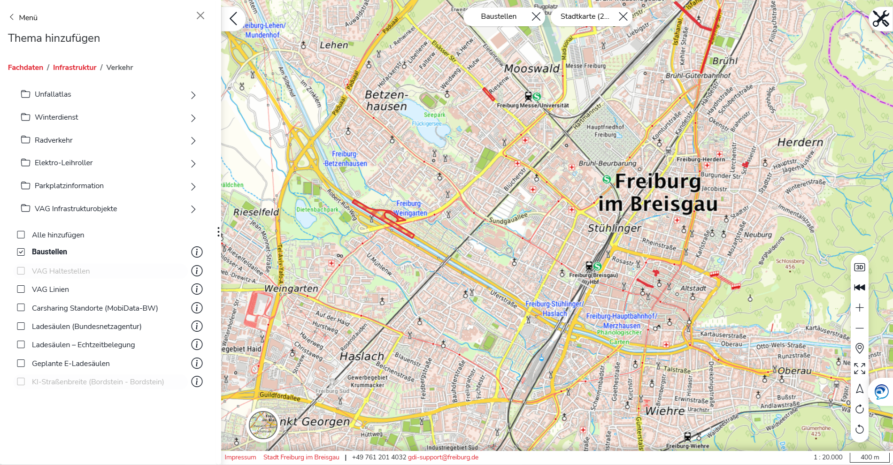
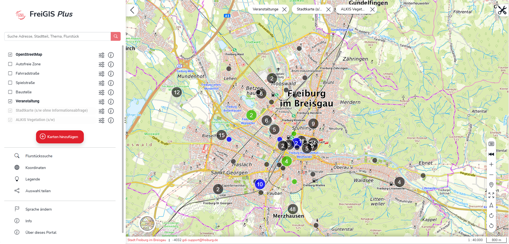
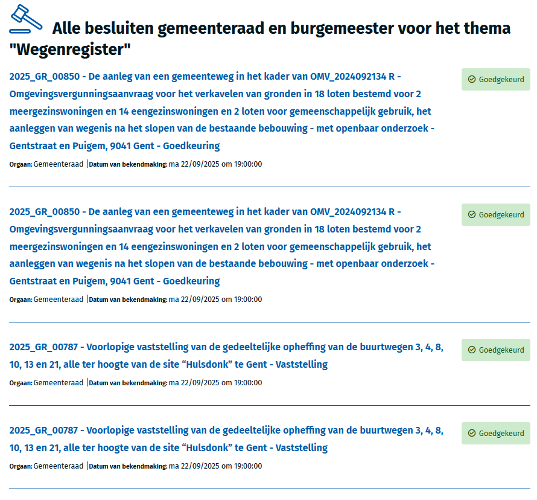

# Write-up UC1 Restricted Mobility Zones

Basic information on the DECIDE project can be found on the [website ](https://www.vlaanderen.be/lokaal-bestuur/digitale-transformatie/slimme-lokale-databronnen/over-decide)in Dutch, English and German. The webpage explains what the project acronym stands for, what the project is about, who the partners are, ... .&#x20;


This page is under construction


## Description UC/wanted deliverable

UC1 builds on the data space infrastructure established in UC0.0 to address a specific category of local government decisions: those that establish or modify a **Restricted Mobility Zone** (RMZ). Municipal decisions of this type –e.g. creating a low-emission zone, designating a pedestrian area, or regulating a school street– are published as unstructured pieces of text within decisions. UC1 creates the extraction and linking layer that bridges that text to structured, spatially referenced output: whether an RMZ is established, which location it covers, and when it applies.

The wanted deliverable is a solution that extracts this structured information from decision text, links the resulting data to authoritative address and geometry registries, and exposes it through a machine-readable endpoint that GIS tools can consume for visualization. The solution should include a human validation step to ensure annotation quality, and should make the structured output available in a GIS-compatible format through a SPARQL endpoint.

Within the project proposal, this maps to the following deliverables and tasks:

| Deliverable                                                                              | Activities                                                                                                                          |
| ---------------------------------------------------------------------------------------- | ----------------------------------------------------------------------------------------------------------------------------------- |
| **D1.3** Data ready for decentralized ingestion into data space — scope of data plan UC1 | **T1.1-T1.7** Analyze available data sets and standards, develop and execute data plan for UC1                                      |
| **D2.1.3** In-depth technical analyzes of current architecture UC1                       | **T2.1** In-depth analysis of current technical architecture at pilot sites & gap analysis                                          |
| **D2.8** Thesauri and registries available for AI assisted enrichment                    | **T2.12** Define and set up thesauri and registries as input for labeling and matching                                              |
| **D2.9** AI tool for labeling LD\&L available for UC1 ready                              | **T2.13** Define, develop, train and test open source semantic AI tool for labeling LD\&L, including interface for human review UC1 |
| **D2.10** AI tool for labeling implemented at relevant pilot sites                       | **T2.14** Implement AI tool for labeling LD\&L at lead pilot and at least one following pilot site                                  |
| **D3.3** Use case 1 implemented by Freiburg as lead pilot site                           | **T3.5–T3.7** UC1 implementation at Freiburg                                                                                        |
| **D3.4** Use case 1 implemented by Ghent and/or Bamberg                                  | **T3.8** UC1 implementation at Ghent and/or Bamberg                                                                                 |

### Link to other deliverables

#### UC0.0 Pipelines

UC1 builds directly on top of the data and infrastructure established in UC0.0. The data ingestion pipelines, LD\&L standardization, and AI enrichment established in UC0.0 produce the corpus of linked decisions and annotations that the RMZ tool queries. Specifically, UC1 relies on:

* The **Named Entity Recognition** model to detect location and date entities in decision text.
* The **Named Entity Refinement** model to distinguish between impact locations and contextual locations, and between entry dates, expiry dates, validity periods, and other date sub-types.
* The **Entity Formatting** step to parse raw location spans into structured address components and raw date spans into standardized start/end date pairs.

[write-up-uc0.0-pipelines](write-up-uc0.0-data-space/write-up-uc0.0-pipelines/ "mention")

#### UC0.0 Human Validation

The Human Validation interfaces provides the human-in-the-loop validation layer for AI-generated annotations. The cross-use-case HV architecture, shared validation logic, and data model are described within UC0.0.

[write-up-uc0.0-human-validation-hv.md](write-up-uc0.0-data-space/write-up-uc0.0-human-validation-hv.md "mention")

#### UC0.1 Policy Impact Report

UC1 uses the same codelist mapping established in UC0.1, making the data model and interface approach directly reusable across use cases. The Codelist Mapping Tool from UC0.1 is the mechanism through which decisions are classified as RMZ-related or not.

[write-up-uc0.1-policy-impact-report.md](write-up-uc0.1-policy-impact-report.md "mention")

## Glossary


See the [UC0.0 Data space glossary](write-up-uc0.0-data-space/#glossary) for definitions of ELI, HV (Human Validation), Human-in-the-loop, LBLOD, LD\&L, `oa:Annotation`,and Triplestore.

See the [UC0.0 Pipelines glossary](write-up-uc0.0-data-space/write-up-uc0.0-pipelines/#glossary) for definitions of Context window, Dual-head NER model, (BERT) Encoder, Fine-tuning, LLM, NER, NEL, Ollama, Regex, Span, and Token.

See the [UC0.1 Policy Impact Report glossary](write-up-uc0.1-policy-impact-report.md#glossary) for definitions of Codelist Mapping Tool, SKOS, Zero-shot classification, and [UC2 Smart Search glossary](write-up-uc2-smart-search.md#glossary) for the definition of Inference.


<table><thead><tr><th width="221.3876953125">Term/Acronym</th><th>Explanation</th></tr></thead><tbody><tr><td>BIO labels / BIO tagging</td><td>A standard labeling scheme for sequence tasks like NER. Each token in the text gets one of three tag prefixes: <strong>B</strong> (beginning of an entity), <strong>I</strong> (inside / continuation of an entity), or <strong>O</strong> (outside any entity). Combined with an entity type, this gives labels like <code>B-LOCATION</code> (start of a location) and <code>I-LOCATION</code> (continuation of the same location). The scheme makes it possible to detect where one entity ends and the next begins.</td></tr><tr><td>Geocoding</td><td>Converting addresses into map coordinates.</td></tr><tr><td>GIS (Geographic Information System)</td><td>A system for capturing, storing, and analyzing spatial and geographic data. UC1 outputs are designed for direct consumption by GIS tools via SPARQL.</td></tr><tr><td>RMZ (Restricted Mobility Zone)</td><td>An area defined by a local authority in which movement of certain vehicle types, or of all traffic, is restricted. Encompasses zone types including low-emission zones, pedestrian zones, car-free zones, cycling streets, school streets, and zones established for works or events.</td></tr></tbody></table>

## Business analysis + final feature passport (incl. functional analysis)

### Opportunity (problem, need, desire)

Local authorities regularly establish, modify, and lift mobility restrictions through formal decisions. These decisions are published as PDFs or sometimes as linked data. However, even where linked data is available, the RMZ-relevant content is not extracted or structured: the decision text describing which zones are affected, where, and when remains buried in unstructured prose.

The gap UC1 addresses is the absence of automatic extraction between authoritative decision text and the GIS layer where mobility restrictions are managed and visualized. Without this extraction, staff must manually read decisions and re-enter geographic and temporal information into GIS systems –a process that is slow, error-prone, and dependent on individual follow-through. This is particularly acute for cities which generate a large volume of mobility-related decisions and maintain public-facing GIS services that are expected to reflect the current regulatory situation.

UC1 proposes to close that gap by automatically classifying RMZ decisions, extracting locations and dates, linking locations to geometry registries, and exposing the resulting structured data through a SPARQL endpoint that GIS tools can query directly. The value is twofold: reduced manual effort for individual cities maintaining spatial databases, and a demonstration that AI-extracted annotations on LD\&L data can produce structured, queryable outputs suitable for downstream applications beyond document search –a pattern that generalizes to other classes of decisions and to UC2.

### Pilot partners

Both Freiburg and Ghent are pilot sites for UC1. Also Ui! is using the data that results from this use case.

#### Freiburg

For the City of Freiburg, UC1 addresses a use case of direct strategic relevance. As part of its ongoing efforts to position itself as a smart city, Freiburg has already invested in the digital infrastructure that UC1's outputs would plug into directly: the city's open dataspace initiative ([DATEN:RAUM:FREIBURG](https://www.freiburg.de/pb/datenraum/daten_raum_freiburg.html)) and its geoportal, [FreiGIS](https://geoportal.freiburg.de/freigis/), which already serves as the public-facing platform for spatial data in the city. UC1's automatic extraction pipeline would integrate naturally into this existing ecosystem rather than requiring a parallel system, lowering the barrier to adoption and giving the city a concrete, visible example of what AI-supported LD\&L processing can deliver operationally.

For now, live or continuously updated data on RMZ is currently only available for select zone types in the geoportal — for example, construction sites ("Baustellen", see Screenshot).

<figure><figcaption></figcaption></figure>

Most other RMZ categories are not yet represented as structured, queryable layers, meaning that the underlying decisions still exist primarily as unstructured text. This is precisely the gap UC1 is positioned to close: rather than starting from scratch, Freiburg offers a partial live-data baseline to build from and expand, alongside a clear, visible model of what a fully populated RMZ layer could look like across zone types.

Beyond the technical fit, Freiburg's participation in the UC is further reinforced by the fact that the taxonomy and standardisation work that UC1 requires would benefit Freiburg beyond the pilot itself: a shared, well-defined RMZ classification would make it easier for the city to benchmark its own mobility policies against peer cities, thus supporting evidence-based policy development rather than isolated local decision-making.

#### Ghent

As stated in [the data space section](write-up-uc0.0-data-space/#pilot-partners) the annotations on location are very important in the long term vision for Ghent. In UC1 of the DECIDe project this goals is incorporated in a bigger picture: how can we identify decision that establish or modify a Restricted Mobility Zone (RMZ).&#x20;

The restricted mobilityzones like the pedestrian areas, bike streets and traffic blocks are very important within the Ghent mobility plan, and can sometimes be temperarily altered due to circumstances. Moreover Ghent is working in other projects on establishing on overview of all elements that have an impact on the traffic within the city.&#x20;

The combination of the entity recognition and linking of  RMZ decisions, extracting locations and dates, linking locations to geometry registries is very relevant for the city of Ghent. By exposing the resulting structured data through via SPARQL endpoint it is possbile that SPARQL queries and even GIS tools can query directly.&#x20;

As this solution can be made in a central architecture (as part of a dataspace business model), but also can be used in a decentral architecture (installing it on the city's own servers), Ghent is testing both scenario's. After the projects ends, Ghent is aiming to keep the decentral solution to identify locations.&#x20;

In the decentral solution, locations are being be linked to the 25 city districts. A drupal widget is be established that shows recent decisions on a specific topic in a specific city district. This will be put into production after the project (as soon as the data quality is good enough) and will be published on the city website in a rollout based on the needs of the city services.&#x20;


### Target audience / Personas

The primary audience for UC1 output is municipal staff responsible for maintaining geographic information and mobility policy data, as well as the GIS specialists and urban planners who use that data in spatial analyzes and public communications. A secondary audience is the technical team responsible for configuring and monitoring the extraction pipeline and managing the connection between the data space and GIS systems.

<table><thead><tr><th width="219.161865234375">Persona</th><th>Journey</th></tr></thead><tbody><tr><td><strong>P4</strong> Domain validator</td><td>Validates AI-extracted annotations via the HV interface. May also query the SPARQL endpoint indirectly through a GIS tool to check that validated data is correctly represented.</td></tr><tr><td><strong>P6</strong> Data engineer</td><td>Configures the UC1 pipeline: sets up the connection to the RMZ codelist, configures address registry linking for the relevant pilot city, monitors extraction quality, and manages the SPARQL endpoint.</td></tr><tr><td><strong>P7</strong> Data space consumer</td><td>Queries the SPARQL endpoint to retrieve validated RMZ annotations for use in downstream applications, such as route planning services, public mobility dashboards, or regulatory compliance checks.</td></tr></tbody></table>

### Functionality (requirements)

UC1 is an end-to-end AI-assisted annotation pipeline that (1) classifies whether a decision concerns an RMZ, (2) extracts the named locations from the decision text and links them to authoritative address and geometry registries, and (3) extracts the temporal scope of the zone. Its output –annotations stored as `oa:Annotation` triples– is designed for consumption by external (pilot partners') GIS tools via SPARQL, not for presentation through a purpose-built UC1 interface.

Human validation of AI-extracted annotations is handled through two HV interfaces: location and date annotations are validated through the general entity validation interface built in UC0.0, while RMZ classification annotations are validated through a similar codelist mapping interface as UC0.1.


UC1 builds on three shared components, documented elsewhere:

* The **data ingestion pipelines, LD\&L standardization, and AI enrichment** established in [UC0.0 Pipelines](write-up-uc0.0-data-space/write-up-uc0.0-pipelines/) produce the corpus of linked decisions and annotations that the RMZ tool queries.
* The **HV** is a shared component across DECIDe use cases. Its general architecture, shared validation logic, and data model are described in the [UC0.0 HV write-up](write-up-uc0.0-data-space/write-up-uc0.0-human-validation-hv.md).
* UC1 uses the same **codelist mapping tool** established in [UC0.1](write-up-uc0.1-policy-impact-report.md), making the data model and interface approach directly reusable across use cases.


<table><thead><tr><th width="637.2470703125">Requirement</th><th>Priority</th></tr></thead><tbody><tr><td>LD&#x26;L decisions sourced from the data space</td><td>Must-have</td></tr><tr><td>RMZ SKOS codelist available in the data space and used for AI classification</td><td>Must-have</td></tr><tr><td>AI-extracted location information stored as <code>oa:Annotation</code> triples using Named Entity Recognition</td><td>Must-have</td></tr><tr><td>Extracted locations linked to unique URIs in authoritative geometry or address registries</td><td>Must-have</td></tr><tr><td>Extracted RMZ linked to the RMZ SKOS codelist</td><td>Must-have</td></tr><tr><td>Human validation step for AI annotations</td><td>Must-have</td></tr><tr><td>Output available via a SPARQL endpoint in a GIS-compatible format</td><td>Must-have</td></tr></tbody></table>

## Datasources, datasets and datastandards

The shared data sources for all use cases are documented in the [write-up-uc0.0-data-space](write-up-uc0.0-data-space/ "mention"). This section covers the data sources and standards specific to UC1.

### Data sources

| Data source                      | Type/category                 | Brief description                                                                                                                                                                                                           |
| -------------------------------- | ----------------------------- | --------------------------------------------------------------------------------------------------------------------------------------------------------------------------------------------------------------------------- |
| ELI-normalized LD\&L decisions   | Unstructured text             | Municipal decisions ingested through the data space pipeline established in UC0.0. The textual content of the decision forms the input corpus for the UC1 mapping pipeline.                                                 |
| AI enrichments (`oa:Annotation`) | Annotations                   | Location and time annotations ingested through the AI pipeline in UC0.0.                                                                                                                                                    |
| RMZ SKOS codelist                | Controlled vocabulary         | A flat single-level SKOS codelist defining the Restricted Mobility Zone concept, with sub-types documented in `skos:definition`. Concept Scheme: `http://data.lblod.gift/id/conceptscheme/restricted-mobility-zone-simple`. |
| OpenStreetMap / Nominatim        | Address and geometry registry | Open address and geometry registry used to link extracted location entities from German pilot city decisions (Freiburg, Bamberg) to canonical geographic URIs.                                                              |

### Datasets available in the data space

| Dataset                                                                                  | IdP/Authentication service | Country of origin | Domain   | Shared within the project           | Reused within the project                                             |
| ---------------------------------------------------------------------------------------- | -------------------------- | ----------------- | -------- | ----------------------------------- | --------------------------------------------------------------------- |
| UC1 RMZ annotations (`oa:Annotation`)                                                    | Data space authentication  | Belgium / Germany | Mobility | Yes — available via SPARQL endpoint | Yes — consumed by Human Validation Tool, and GIS tools at pilot sites |
| Human feedback on LD\&L decisions annotated with RMZ codelist mappings (`oa:Annotation`) | Data space authentication  | Belgium (ABB)     | Mobility | Yes                                 | No                                                                    |

### Data standards

<table><thead><tr><th width="390.4208984375">Standard</th><th>Link</th></tr></thead><tbody><tr><td>SKOS (Simple Knowledge Organization System)</td><td><a href="https://www.w3.org/TR/skos-reference/">https://www.w3.org/TR/skos-reference/</a></td></tr><tr><td>Web Annotation Vocabulary (oa:Annotation)</td><td><a href="https://www.w3.org/TR/annotation-vocab/">https://www.w3.org/TR/annotation-vocab/</a></td></tr><tr><td>GeoSPARQL</td><td><a href="https://www.ogc.org/standard/geosparql/">https://www.ogc.org/standard/geosparql/</a></td></tr><tr><td>SPARQL 1.1</td><td><a href="https://www.w3.org/TR/sparql11-query/">https://www.w3.org/TR/sparql11-query/</a></td></tr><tr><td>Time Ontology</td><td><a href="https://www.w3.org/TR/owl-time/">https://www.w3.org/TR/owl-time/</a></td></tr><tr><td>OSLO Omgevingsvergunning</td><td><a href="https://data.vlaanderen.be/doc/applicatieprofiel/omgevingsvergunning/">https://data.vlaanderen.be/doc/applicatieprofiel/omgevingsvergunning/</a></td></tr></tbody></table>

Below, three questions are stated that need to be answered to solve UC1. Here, we will examplify how the data standards are applied to solve these questions.

Q1: Is this decision about a Restricted Mobility Zone?

Solving this question requires a simple data model (Fig. 1): an `oa:Annotation` links a `skos:concept` from the Restricted Mobility Zone codelist to the decision (`eli:Expression` or `eli:Work`).

<figure><figcaption><p>Fig. 1</p></figcaption></figure>

Q2: Which locations or regions are impacted by this RMZ decision?

This requires an implementation of the datamodel described in the [write-up-uc0.0-pipelines](write-up-uc0.0-data-space/write-up-uc0.0-pipelines/ "mention") for the [NER pipeline](write-up-uc0.0-data-space/write-up-uc0.0-pipelines/#named-entity-recognition-ner). Parts of text in the `eli:Expression` that refer to a location are marked as Specific resources (Fig. 2). As body of the annotation, a statement with following predicates is used:

* rdf:subject: refers to the ELI work
* rdf:predicate: `prov:atLocation` is used to express that the location is where the decision has impact on (impact\_location by the refinement step - described below)
* rdf:object: refers to an `rdfs:Resource` with type `dct:Location` is used as body. The resource has a `rdfs:label` containing the location text in the decision and links to a `locn:Geometry` containing its coordinates in WKT format.

<figure><figcaption><p>Fig. 2</p></figcaption></figure>

Q3: When are these locations impacted by this decision?

ELI provides one starting date to indicate when legislation becomes applicable: `eli:date_applicability`. However, as described in the ELI standard, complex situation may require extensions. In Flanders, there is a concept [Normative provision](https://data.vlaanderen.be/ns/omgevingsvergunning/#NormatieveBepaling) (Normatieve bepaling in Dutch), which allows expressing what the decision allows or rejects. For RMZ, this is the allowance of blocking a location for a certain activity. A first statement (Fig. 3) describes that the decision (`eli:Work`) realizes the `Normative provision`. A second statement states that the `Normative provision` has a `time:ProperInterval` containing a start and end date.

<figure><figcaption><p>Fig. 3</p></figcaption></figure>

## Final architecture

UC1 reuses, rather than rebuilds, the components developed in UC0.0 (the NER and date extraction pipelines) and UC0.1 (the Codelist Mapping Tool). The UC1-specific contribution is the configuration of those components against RMZ-specific codelists and address registries.

The core challenge of UC1 is to extract structured mobility information from unstructured decision text. A municipal decision that establishes a restricted mobility zone typically contains all the relevant information (what kind of restriction, where, and when) but buries it in free-text prose across different sections of the document. For the RMZ tool to surface this information, each decision needs to be analyzed along three axes:

1. **Is this decision about a Restricted Mobility Zone?** Not every decision is relevant. The tool needs a way to filter the corpus down to decisions that actually describe a mobility restriction. This is a classification problem.
2. **Which locations or regions are impacted by this RMZ decision?** A relevant decision mentions streets, addresses, and zones, but not all of them are affected by the restriction. Some are mentioned for context only. The tool needs to identify the specific locations that are impacted. This is an extraction and disambiguation problem.
3. **When are these locations impacted by this decision?** Decisions mention many dates (session dates, publication dates, legal references), but only some define the temporal scope of the restriction. The tool needs to extract and normalize the relevant dates into machine-readable start/end pairs. This is again an extraction and normalization problem.

Each question is addressed by a specific subset of the UC0.0/UC0.1 AI pipeline:

<figure><figcaption></figcaption></figure>

### Component overview

<table><thead><tr><th width="149.39990234375">Component</th><th width="97.8017578125">Source</th><th width="147.1510009765625">Pipeline task</th><th width="155.0670166015625">Model / Tool</th><th>Role in UC1</th></tr></thead><tbody><tr><td>Codelist Mapping</td><td>UC0.1</td><td>Named Entity Linking Service</td><td>Mistral Medium 3.5 (Mistral API)</td><td>Classify decisions as RMZ-related or not</td></tr><tr><td>Named Entity Recognition</td><td>UC0.0</td><td>Entity Extraction Task (NER Service)</td><td><a href="https://huggingface.co/lblod/multilingual-ner-abb-improved">lblod/multilingual-ner-abb-improved</a> (XLM-RoBERTa)</td><td>Detect <code>LOCATION</code> and <code>DATE</code> entity spans in decision text</td></tr><tr><td>Named Entity Refinement</td><td>UC0.0</td><td>Entity Extraction Task (NER Service)</td><td><a href="https://huggingface.co/lblod/longformer-classifier-refinement-abb">lblod/longformer-classifier-refinement-abb</a> (Longformer)</td><td>Refine <code>LOCATION</code> into <code>impact_location</code> / <code>context_location</code>; refine <code>DATE</code> into <code>entry_date</code> / <code>expiry_date</code> / <code>validity_period</code> / etc.</td></tr><tr><td>Entity Formatting (dates)</td><td>UC0.0</td><td>Entity Extraction Task (NER Service)</td><td><p><a href="https://github.com/semantic-ai/decide-dateperiod-parser">github.com/semantic-ai/decide-dateperiod-parser</a></p><p>dateperiodparser (rule-based)</p></td><td>Parse date/period text spans into standardized <code>xsd:Date</code> or <code>time:ProperInterval</code></td></tr><tr><td>Entity Formatting (locations)</td><td>UC0.0</td><td>Entity Extraction Task (NER Service)</td><td><a href="https://huggingface.co/lblod/abb-dual-location-component-ner">lblod/abb-dual-location-component-ner</a> (XLM-RoBERTa dual-head NER)</td><td>Parse location text spans into structured address components</td></tr><tr><td>Human Validation</td><td>UC0.0 / UC0.1</td><td>n/a</td><td>n/a</td><td>Human-in-the-loop review and correction of all AI-generated annotations</td></tr></tbody></table>

### Q1: Is this decision about a Restricted Mobility Zone?

#### Which component

UC1 relies on the Codelist Mapping tool developed in UC0.1. This is a general-purpose, LLM-assisted zero-shot classification tool designed to map decisions to concepts in any SKOS codelist. In UC0.1, the primary codelist is the UN Sustainable Development Goals (SDGs), where the tool maps decisions to one or more of the 17 SDG targets. For UC1, the same tool and the same classification mechanism are reused with a different codelist: the Restricted Mobility Zone codelist. The approach, its alternatives, and the evaluation results are described in the [UC0.1 zero-shot classification documentation](write-up-uc0.1-policy-impact-report.md#phase-1-cold-start-classification-zero-shot-llm).

#### The flattened RMZ codelist

The RMZ codelist uses a flat (single-level) structure rather than a hierarchical taxonomy. All sub-types of restricted mobility zones have been consolidated into the `skos:definition` of a single `skos:Concept`:

* **Concept Scheme:** [`http://data.lblod.gift/id/conceptscheme/restricted-mobility-zone-simple`](https://github.com/lblod/app-decide/blob/203764139125744df4ff55757f645a8849837e02/config/migrations/add-restricted-mobility-zone-codelist/20260310103527-add-simple-restricted-mobility-zones-codelist.ttl)
* **Concept URI:** `https://data.vlaanderen.be/id/concept/ZoneType/fc17fa1b-9b61-4396-a609-845643b3b865`
* **Labels:** "Restricted mobility zone" (EN), "Beperkte mobiliteitszone" (NL)

The `skos:definition` of this single concept provides a non-exhaustive enumeration of the sub-types, expressed in both English and Dutch:

<table><thead><tr><th>Sub-type (EN)</th><th width="249">Description</th><th>Source (eg. definition authority)</th></tr></thead><tbody><tr><td>Low Emission Zone (LEZ)<br>Zero Emission Zone (ZEZ)</td><td>A geographically defined area where access is restricted based on vehicle emission standards.</td><td><a href="https://www.wikidata.org/wiki/Q647266">https://www.wikidata.org/wiki/Q647266</a><br><a href="https://urbanaccessregulations.eu/">Urban Access Regulations (UVAR)</a></td></tr><tr><td>Car-Free Zone<br>Pedestrian Zone</td><td>A zone prioritized for pedestrians where motorized traffic is prohibited or heavily restricted (eg. only access to permit holders between certain hours)</td><td><a href="https://www.wikidata.org/wiki/Q369730">https://www.wikidata.org/wiki/Q369730</a></td></tr><tr><td>Cycling Street/Zone</td><td>A street where cyclists have priority</td><td><a href="https://www.wikidata.org/wiki/Q1249483">https://www.wikidata.org/wiki/Q1249483</a><br><a href="https://www.vlaanderen.be/datavindplaats/catalogus/afgeleide-zones-fietsstraatzone">https://www.vlaanderen.be/datavindplaats/catalogus/afgeleide-zones-fietsstraatzone</a></td></tr><tr><td>Home/Pedestrian zone</td><td>A street/zone designed as a social space for pedestrians and cyclists; motorized transport is permitted, but limited</td><td><a href="https://www.wikidata.org/wiki/Q8034016">https://www.wikidata.org/wiki/Q8034016</a><br><a href="https://www.wikidata.org/wiki/Q1628979">https://www.wikidata.org/wiki/Q1628979</a></td></tr><tr><td>School Street</td><td>A street closed to motorized traffic on certain days/hours, creating a pedestrian zone allowing children to play on the street.</td><td><a href="https://www.wikidata.org/wiki/Q3097917">https://www.wikidata.org/wiki/Q3097917</a></td></tr><tr><td>Work</td><td>Occupancy of public domain for works (eg. scaffolding, construction crane, etc.)</td><td><a href="https://data.vlaanderen.be/ns/mobiliteit/#Werk">https://data.vlaanderen.be/ns/mobiliteit/#Werk</a></td></tr><tr><td>Groundwork</td><td>Occupancy of public domain for construction or infrastructure works</td><td><a href="https://data.vlaanderen.be/ns/mobiliteit/#Grondwerk">https://data.vlaanderen.be/ns/mobiliteit/#Grondwerk</a></td></tr><tr><td>Events</td><td>Occupancy of public domain by a temporary event (sports, markets, festivals)</td><td><a href="https://data.vlaanderen.be/ns/mobiliteit/#Evenement">https://data.vlaanderen.be/ns/mobiliteit/#Evenement</a></td></tr></tbody></table>

By including these sub-type descriptions in the concept definition, the LLM has sufficient context to recognize a broad range of mobility-restricting decisions, from permanent zone establishments to temporary road closures for events or construction. The flat codelist design effectively turns the classification into a binary question (is this decision about an RMZ or not?) while still covering the full breadth of RMZ sub-types through the descriptive definition. Expanding the codelist to a hierarchical taxonomy where each sub-type becomes its own concept is identified as a possible future iteration.

#### Why this component

The codelist mapping approach was chosen over alternatives (such as keyword-based scoring or a dedicated binary classifier via custom developed models) for the following reasons:

1. **Language-agnostic.** The LLM-based classification works on the translated English text as well as the original Dutch or German source text. A keyword-based approach would require maintaining separate keyword lists for every language.
2. **Generalisable.** The classification is driven by the codelist definition, not by a fixed set of rules. If the definition of what constitutes an RMZ changes, or if new sub-types are added, the codelist can be updated without retraining a model.
3. **Consistent with UC0.1.** Using the same codelist mapping mechanism means the same annotation data model, the same human validation interface, and the same pipeline infrastructure can be reused. This reduces development effort and ensures architectural consistency across use cases.

#### Interaction with other components

The codelist mapping runs as an independent classification step within the Named Entity Linking Service. Its output (whether a decision is RMZ-related or not) is stored as a codelist mapping annotation in the triplestore. This annotation does not directly feed into the NER or entity formatting steps; rather, it acts as a **filter**. The RMZ tool queries the triplestore for decisions annotated as RMZ-related, and for those decisions, it retrieves the location and date annotations produced by the NER pipeline (see sections below on Q2 and Q3).

### Q2: Which locations are impacted by this RMZ decision?

#### Which components

Answering this question requires three components working in sequence. All three are part of the Entity Extraction Task within the UC0.0 NER Service (see [AI Pipeline UC0.0](write-up-uc0.0-data-space/write-up-uc0.0-pipelines/#ai-pipeline)):

1. **Named Entity Recognition (NER)** detects `LOCATION` spans in the decision text.
2. **Named Entity Refinement** classifies each `LOCATION` span as `impact_location` or `context_location`.
3. **Entity Formatting (locations)** parses each `impact_location` span into structured address components.

#### How they work together

**Step 1: Named Entity Recognition.** The decision text (specifically, the English translation produced by the Translation Task upstream) is processed by the NER model [lblod/multilingual-ner-abb-improved](https://huggingface.co/lblod/multilingual-ner-abb-improved), a fine-tuned XLM-RoBERTa model. The model scans the text and detects entity spans, which are contiguous substrings that correspond to a particular entity type. For UC1, the relevant entity type is `LOCATION`.

At this stage, the model does not distinguish between locations that are directly impacted by the decision and locations that are merely mentioned in passing. For example, in the sentence:

> _"The Veldstraat between housenumber 12 and 28 will be closed for traffic from January 25 until February 2, similar to the roadworks that took place on the Korenmarkt last year."_

The NER model detects two location spans:

* `"Veldstraat between housenumber 12 and 28"` as `LOCATION`
* `"Korenmarkt"` as `LOCATION`

Both are labelled as `LOCATION` with no further distinction.

**Step 2: Named Entity Refinement.** The refinement model [lblod/longformer-classifier-refinement-abb](https://huggingface.co/lblod/longformer-classifier-refinement-abb), a Longformer variant fine-tuned for entity-in-context classification, re-classifies each `LOCATION` span by considering the surrounding context. The Longformer's extended context window (4,096 tokens vs. 512 for standard BERT) allows it to see the broader document structure, including the motivation section, the decision section, and the full paragraph surrounding the entity. This is critical for distinguishing between impacted and contextual locations.

The refinement model assigns one of two sub-types:

<table><thead><tr><th width="166.854736328125">Sub-type</th><th width="398.1005859375">Description</th><th>Example</th></tr></thead><tbody><tr><td><code>impact_location</code></td><td>A location directly affected by the decision: the street being closed, the zone being established, the address receiving a permit.</td><td><em>"Veldstraat between housenumber 12 and 28"</em></td></tr><tr><td><code>context_location</code></td><td>A location mentioned for context that is not directly affected: references to other RMZs, addresses of involved parties, historical references.</td><td><em>"Korenmarkt"</em></td></tr></tbody></table>

In the context of UC1, **only `impact_location` entities are retained**. Context locations are stored in the triplestore (they are still valid annotations) but are not surfaced by the RMZ tool.

**Step 3: Entity Formatting (LocationFormatter).** Each `impact_location` span is still a raw text string at this point (e.g., `"Veldstraat between housenumber 12 and 28"`). The Entity Formatting step, implemented by the `EntityFormatter` class, routes it to the `LocationFormatter`, a dual-head NER model ([lblod/abb-dual-location-component-ner](https://huggingface.co/lblod/abb-dual-location-component-ner)) that decomposes the text into structured address components.

The `LocationFormatter` performs several sub-steps:

1. **Text cleaning** normalizes whitespace, removes newlines, and applies Unicode normalization.
2. **Dual-head NER inference** runs the text through the XLM-RoBERTa encoder with two classification heads:
   * The **Component head** (25 BIO labels) identifies fine-grained address components: `STREET`, `HOUSENUMBER`, `POSTCODE`, `CITY`, `PROVINCE`, `BUILDING`, `INTERSECTION`, `PARCEL`, `DISTRICT`, `GRAVE_LOCATION`, `DOMAIN_ZONE_AREA`, `ROAD`.
   * The **Location head** (3 BIO labels: `O`, `B-LOCATION`, `I-LOCATION`) identifies the boundaries of individual location spans within a multi-address string.
3. **Span assembly** maps component tags to their enclosing location spans, producing a structured dictionary per location.
4. **Conjunction merging** detects conjunction gaps in strings like `"Dorpstraat 23 en 25, 9000 Ghent"` and propagates shared fields (street, postcode, city) between neighbors.
5. **House number expansion** expands ranges like `"12-28"` into individual addresses following Belgian odd/even numbering rules, and splits bus/apartment numbers (e.g., `"5 bus 3"` into housenumber: `5`, bus: `3`).
6. **Address string assembly** builds a Nominatim-compatible address string using a priority chain: street > building > road > intersection > district > domain\_zone\_area > grave\_location > parcel, appended with postcode, city, and province.

The result is a list of structured location entries, each with a `formatted_text` field containing the assembled address string, ready for display or geocoding.

#### Example:

Input span: `"At the level of Dorpstraat 23 and 25, 9000 Ghent"`\
Output step 2 (simplified):

```
  {
    "street": "Dorpstraat",
    "housenumber": "23 and 25",
    "postcode": "9000",
    "city": "Ghent"
  }
```

Output step 5 (simplified):

```
 [
     {
        "street": "Dorpstraat",
        "housenumber": "23",
        "postcode": "9000",
        "city": "Ghent",
        "formatted_text": "Dorpstraat 23, 9000 Ghent"
     },
     {
        "street": "Dorpstraat",
        "housenumber": "25",
        "postcode": "9000",
        "city": "Ghent",
        "formatted_text": "Dorpstraat 25, 9000 Ghent"
     }
  ]
```

#### Why these components

* **NER** is necessary because locations appear as free text embedded in natural-language decision documents. There is no structured field containing the impacted address.
* **Refinement** is necessary because a single decision typically mentions multiple locations for different purposes. Without distinguishing `impact_location` from `context_location`, the RMZ tool would display irrelevant addresses (e.g., the contact address of a contractor, a reference to a different municipality).
* **Location Formatting** is necessary because the raw text span (`"Scaldisstraat 23-25, 2000 Antwerpen"`) is not directly usable for geocoding, database queries, or structured display. The formatting step produces normalized, component-level address data that downstream tools (geocoders, map visualizations, SPARQL queries) can consume.

### Q3: When are these locations impacted by this decision?

#### Which components

Answering this question requires the same first two components as Q2, plus the date-specific formatting. All three are again part of the Entity Extraction Task within the [UC0.0 NER Service](write-up-uc0.0-data-space/write-up-uc0.0-pipelines/#entity-recognition-task):

1. **Named Entity Recognition (NER)** detects `DATE` spans in the decision text.
2. **Named Entity Refinement** classifies each `DATE` span into a temporal sub-type.
3. **Entity Formatting (dates)** parses each date/period span into standardized start/end date pairs and serializes them as linked data.

**How they work together**

**Step 1: Named Entity Recognition.** The NER model detects entity spans of type `DATE` in the decision text. These spans capture temporal expressions in all their variety: `"25 januari 2026"`, `"from January 25 until February 2, 2026"`, `"schooljaar 2024-2025"`, `"Q3 2024"`, etc.

**Step 2: Named Entity Refinement.** The refinement model re-classifies each `DATE` span into a temporal sub-type based on the surrounding context. In the context of UC1, the relevant sub-types are:

<table><thead><tr><th width="157.1011962890625">Sub-type</th><th>Description</th><th>Example context</th></tr></thead><tbody><tr><td><code>entry_date</code></td><td>The date the decision (and thus the RMZ) becomes effective.</td><td><em>"This regulation enters into force on January 25, 2026"</em></td></tr><tr><td><code>expiry_date</code></td><td>The date the RMZ is lifted or the decision expires.</td><td><em>"The road closure ends on February 2, 2026"</em></td></tr><tr><td><code>validity_period</code></td><td>The full time range during which the RMZ is in effect.</td><td><em>"Duration of road works: 25 January 2026 - 2 February 2026"</em></td></tr></tbody></table>

Other date sub-types exist in the pipeline but are **not relevant to the temporal scope of the RMZ**:

<table><thead><tr><th width="170.7236328125">Sub-type</th><th>Why not relevant to UC1</th></tr></thead><tbody><tr><td><code>context_date</code></td><td>A date mentioned for background context, not tied to the RMZ's temporal scope.</td></tr><tr><td><code>session_date</code></td><td>The date of the council meeting, which is administrative metadata rather than the RMZ period.</td></tr><tr><td><code>publication_date</code></td><td>When the decision was formally published, not when the RMZ is active.</td></tr><tr><td><code>context_period</code></td><td>A period mentioned for context, not the RMZ's validity window.</td></tr></tbody></table>

**Step 3: Entity Formatting (DatePeriodParser).** Each relevant date span is routed by the `EntityFormatter` to the `DatePeriodParser`, a rule-based parser that converts free-text temporal expressions into standardized `(start, end)` date pairs.

The `DatePeriodParser` works by passing the raw text through an ordered chain of 21 regex-based matchers. For the types of dates commonly found in RMZ decisions, the most relevant matchers are:

| Typical RMZ date format   | Matcher                 | Example                     | Result                   |
| ------------------------- | ----------------------- | --------------------------- | ------------------------ |
| Exact date                | `single`                | `"25 januari 2026"`         | 2026-01-25 to 2026-01-25 |
| Date range with connector | `generic_range`         | `"25/01/2026 - 02/02/2026"` | 2026-01-25 to 2026-02-02 |
| Day-to-day within a month | `dd_to_dd_month_year`   | `"25 to 28 January 2026"`   | 2026-01-25 to 2026-01-28 |
| DD/MM range               | `ddmm_range`            | `"25/01-02/02/2026"`        | 2026-01-25 to 2026-02-02 |
| Month range               | `month_range_same_year` | `"januari-maart 2026"`      | 2026-01-01 to 2026-03-31 |

After parsing, the `EntityFormatter` serializes the result into the appropriate linked-data representation based on the entity's refined label:

*   **`entry_date`** and **`expiry_date`** (single dates) become `xsd:Date` literals:

    ```
    formatted_text: "2026-01-25"^^xsd:Date
    formatted_start: "2026-01-25"^^xsd:Date
    formatted_end: "2026-01-25"^^xsd:Date
    ```
*   **`validity_period`** (date ranges) become `time:ProperInterval` resources with a generated UUID:

    ```
    formatted_text: <https://data.lblod.info/id/period/{uuid}>
    result_object:
      <https://data.lblod.info/id/period/{uuid}> a <http://www.w3.org/2006/time#ProperInterval> ;
          mu:uuid "{uuid}" ;
          <http://www.w3.org/2006/time#hasBeginning> "2026-01-25"^^xsd:Date ;
          <http://www.w3.org/2006/time#hasEnd> "2026-02-02"^^xsd:Date .
    formatted_start: "2026-01-25"^^xsd:Date
    formatted_end: "2026-02-02"^^xsd:Date
    ```

This distinction between `xsd:Date` and `time:ProperInterval` is determined by the `_DATE_OBJECT_MAP` in the `EntityFormatter`: labels like `entry_date` and `expiry_date` are mapped to `"date"` (producing an `xsd:Date`), while `validity_period` and `context_period` are mapped to `"interval"` (producing a `time:ProperInterval`).

#### Why these components

* **NER** is necessary because temporal information is embedded in free-text prose, not in structured metadata fields.
* **Refinement** is necessary because a single decision mentions many dates for different purposes. The `session_date` (when the council met) and the `publication_date` (when the decision was published) are both irrelevant to the actual period during which the RMZ is active. Only `entry_date`, `expiry_date`, and `validity_period` define the RMZ's temporal scope.
* **Date Period Parsing** is necessary because the raw text spans come in highly inconsistent formats. A single corpus may contain `"25 januari 2026"`, `"25/01/2026 - 02/02/2026"`, `"from January 25 until February 2"`, or `"Q1 2026"`. Standard date parsers (like `dateparser` or `dateutil`) can resolve a single date string but cannot handle ranges, periods, seasons, or multi-year sequences. The `DatePeriodParser` was designed specifically to normalize this variety into uniform `(start, end)` pairs.
* **Linked-data serialization** is necessary because the triplestore expects temporal entities in a specific RDF format. The `EntityFormatter`'s mapping from refined labels to either `xsd:Date` or `time:ProperInterval` ensures the correct ontology representation is used.

#### How the components interact: end-to-end flow

The full flow for a single decision through the UC1-relevant parts of the pipeline is:

<figure><figcaption></figcaption></figure>

Steps 2 through 4 are part of the same UC0.0 AI pipeline execution. They run as consecutive sub-steps within the Entity Extraction Task of the NER Service for every decision, regardless of whether it is RMZ-related or not. The codelist mapping (step 1) runs separately within the Named Entity Linking Service, and its result is what the RMZ tool uses to filter which decisions to display. For the filtered decisions, the tool retrieves the location and date annotations produced by steps 2 through 4.

### Pilot Partners Architecture

#### Setup of the pilot within the city of Freiburg

**Data Source**

The data used for UC1 is the enriched data from the pipeline as outlined in the chapter above. However, the enriched decisions produced by the core pipeline are generic in the sense that they capture everything the AI components can extract, regardless of whether a given city needs all of it. For Freiburg, we therefore introduce an additional processing step that filters this output down to what is specifically relevant for the city's applications. What exactly this filter should retain is still to be determined in cooperation with the relevant city departments; we plan to hold a dedicated workshop to define which fields and RMZ types are actually needed for Freiburg's downstream use, rather than assuming this upfront.

As part of this filtering step, we also need to determine the geographic unit of reference. In project discussions so far, streets will be used for sure, specific enough to be actionable, general enough to be extractable reliably. It remains open whether we additionally resolve to smaller units such as districts or neighborhoods, or whether this risks over-aggregating and diluting the spatial precision that makes the tool useful. What is already clear is that we will not display RMZ information at the level of full districts or larger areas: the value of showing restricted mobility zones spatially lies precisely in being able to point to a well-defined, specific place, and referencing broad areas would undermine that.

**Geolayer structure**

From the filtered, geographically resolved output, we extract separate geolayers for each type of restricted mobility zone (as outlined in [#q1-is-this-decision-about-a-restricted-mobility-zone](write-up-uc1-restricted-mobility-zones.md#q1-is-this-decision-about-a-restricted-mobility-zone "mention")), so that each RMZ category can be queried, styled, and toggled independently. In addition to these individual layers, we create one overarching folder within the geoportal that aggregates all RMZ types together, giving users a single entry point to view the full picture when needed while preserving the ability to drill into a specific zone type.

**Update cycle and integration**

These layers are updated periodically (the current plan is a daily cadence) and pushed to the city's geographic database ([GDI](https://geodaten.freiburg.de/geonetwork/srv/ger/catalog.search#/home)). This is the point of integration with Freiburg's existing infrastructure: both the dataspace (DATEN:RAUM:FREIBURG) and FreiGIS access the GDI directly, meaning that once a layer is written there, it becomes available through the city's existing public-facing and internal channels without requiring a separate publication step.

#### Setup of the pilot within the city of Ghent

**Central scenario during the project phases**

To test this scenario Ghent is using the pipelines as setup by ABB. In the first phase Ghent has tested the results using the human validation tool. In the way we are using the ABB tools to the maximum extent. In a second phase Ghent has tested if the result can be used from the Ghent infrastructure querying the results via SPARQL.

This scenario might be interesting for further business cases for the dataspace as everything runs centrally and could be a payd feature within the dataspace.&#x20;

**Decentral scenario during the project phases**

Ghent has realised a drupal widget that shows recents decisions for a specific topic within a specific city district.&#x20;

In phase 1 we queried the results on the ABB endpoint via SPARQL and integrate them into the widget. We moved fast to phase 2 in which Ghent has set up the NER and NEL modules locally. Therefore ABB has developped this tools in a containerized setup. To containers are installed on the servers of the city of Gent and used locally. For this setup only the NER and NEL functions on location are used.  For this scenario the locations are linked to the relevant city district. The result are used in the Ghent SPARQL endpoint, from which they are queried and integrated in the Drupal widget.&#x20;

This scenario is interesting as the city owns the solution and can develop further on this solution. In this scenario the city has the maximon autonomy (data sovereignty).&#x20;

**Continuation after the DECIDe project**

Ghent aims to keep the decentral setup after the end of the DECIDe project, as it is central to the needs of the city. We want to keep testing and improving the NER and NEL modules. As soon as data quality is adequate enough we will move the widget to production and will rollout the widget bases on the needs of the city services.&#x20;

## Final UI design

UC1 does not have a purpose-built standalone user interface. The pipeline outputs are exposed through a SPARQL endpoint for GIS consumption and a downloadable distribution that can be generated periodically. Both can be found in our DCAT catalog, read more about this in our [write-up on DCAT](write-up-uc0.0-data-space/write-up-dcat.md) .

That said, this use case has 2 relevant interfaces, related to the Human Validation of AI-produced annotations:

1. Validation of discovered entities within a decision: the validation of an address/location within a decision
2. Validation of AI annotations about a decision: i.e. What is this decision about? (Restricted Mobility Zones)

The first interface is explained in the [Design section of Write-up UC 0.0: Human Validation](write-up-uc0.0-data-space/write-up-uc0.0-human-validation-hv.md#validation-of-ai-annotations-within-a-decision). In this section, we will be focusing about this second interface.

#### Validating AI annotations about a decision

This interface differs slightly from the validation within a decision. While the interface for validations within a decision starts off with a list of all the decisions available, this interface starts with the user selecting a local authority and a codelist. This is because a domain validator is typically responsible for a specific policy area, so selecting by codelist and local authority first surfaces the annotations relevant to their expertise and reduces the list to a workable size.



Once the user selects the local authority and the codelist (within DECIDe i.e. the Sustainable Development Goals and the Restricted Mobility Zones) they want to view, the list of relevant decisions is shown and ready to be validated.

In addition to selecting the codelist, the user can also select sub-elements in the codelist. This is not relevant in this use case, as we work with a flat, single-level codelist. This is, however, relevant in UC0.1, and is explained in more details in the [design section of the write-up for UC0.1.](write-up-uc0.1-policy-impact-report.md#final-ui-design-and-why-if-any)

Once the filters have been applied, the user can validate the different decisions the same way they validate the discovered entities in UC0.0, namely with a thumbs up/down. One small difference is, that in UC0.0, the user can read the decision in a split-screen to get enough context to validate the discovered entity. Because the entity the user is validating in this use case is about the whole decision, and there is no need to highlight specific parts of the text, the team has decided to only provide an external link to the decision, where the user can read the whole decision as it is published, in a different tab.

#### Design of the Freiburg interface

For Freiburg, the RMZ output is integrated into the FreiGIS portal rather than being presented through a standalone interface. FreiGIS ([https://geoportal.freiburg.de/freigis](https://geoportal.freiburg.de/freigis/)) is the City of Freiburg's central geospatial portal and the core component of its municipal Spatial Data Infrastructure (GDI-FR). It provides access to a wide range of maps and geospatial information from the city administration and partner organizations, supports searches for addresses, cadastral parcels, public transport stops, thematic maps, and development plans, and offers additional GIS functionality such as measurements, printing, and access to metadata through the Freiburg geodata catalog. The portal is based on the open-source Masterportal software.

Consequently, the user interface for the RMZ use case consists primarily of the visualization of the generated layer within the existing geoportal. The screenshot below illustrates how UC1 is displayed in the current testing environment. Please note that this version is not yet publicly available.

<figure><figcaption></figcaption></figure>

#### Design of the Ghent widget

To use a widget is an important architectural and design decision 'an sich'. It makes the setup really flexible as the information can be put into the city website wherever the city services want to put it, and where citizen might need this information. This approach is also very usefull as testing can be focussed on specific terms or city districts. Futhermore, this makes a partial rolout possible based on the needs of the city services.&#x20;

The design is based on the Ghent styleguide. Users see a list of decisions that is perfectly integrated in the city website and can be handled as any Drupal paragraf within a webpage.

_Example of the front end of the widget:_

<figure><figcaption></figcaption></figure>

In the backend the widgets can be configured in the standard drupal interface. In fact, by filling in the form users establish a SPARQL query that queries the selected SPARQL endpoint.&#x20;

_Back end of the widget:_

<figure><figcaption></figcaption></figure>

## Testing approach

#### Freiburg

Testing UC1 for Freiburg spans three distinct steps, reflecting the fact that the tool's value depends on getting AI extraction right, making sure that extraction actually lands correctly in the city's spatial infrastructure, and confirming that the resulting interface is genuinely usable for the people who'll rely on it day to day.

**Quality of the annotations**

The first and most fundamental question is whether the AI components are extracting the right information from decision text in the first place. This is tested using standard classification and extraction metrics: precision and recall for the RMZ-relevance classification step (is the tool correctly separating decisions that describe a mobility restriction from those that don't), and accuracy metrics for the location and date extraction steps (are the correct streets/zones being identified, and are the correct start/end dates being resolved from among the many dates that typically appear in a decision).

Rather than relying on these metrics in isolation, annotation quality is validated by comparing the AI-generated output against human annotations gathered through the project's validation interface. This gives a direct, decision-by-decision check: for a sample of decisions, human annotators independently mark what the correct classification, locations, and dates should be, and the AI output is scored against this reference.&#x20;

**Technical integration**

The second layer of testing checks that correctly extracted information is passed through to Freiburg's spatial infrastructure without errors. This covers geolayer validation: confirming that the geometry linking step resolves extracted locations to the correct streets and zones in FreiGIS, and that the daily update into the GDI runs correctly — without data loss, duplication, or outdated entries remaining after a decision has been superseded. This step is more about verifying correct data handling than about the AI's extraction quality itself, since the underlying update mechanism is straightforward; the main risk is entries not being written, overwritten, or removed correctly.

**Visual feedback of the interface**

The third layer concerns how well the interface actually serves the people using it — city staff and other stakeholders viewing RMZ data spatially. This builds on prior work already done in this direction: a preliminary version of the UC1 interface was included as part of a survey conducted by Hochschule Kehl in July 2026, which gathered initial feedback on how understandable and useful the spatial presentation of RMZ data was to respondents.

Building on that, planned user tests with stakeholders will provide a more direct and structured round of feedback, once the Freiburg-specific filtering and geolayer structure (see architecture section) are stable enough to test against. These sessions are intended to validate not just whether the interface displays information correctly, but whether it displays the right information, at the right level of geographic detail, in a way that's actually usable in city departments' day-to-day workflows.

#### Ghent

As stated in the architecture section, Ghent is testing the central and decentral scenario.

* In the central scenario Ghent is using the ABB setup. The main focus is this case is on the quality of the AI annotations with an extra focus on the NER and NEL on location
* In the decentral scenario the focus of the test is on the Ghent infrastructure and setup of the containers, on the SPARQL queries and on the technical and usability aspects of the Ghent widget.&#x20;

Testing is being done by the Ghent project lead and in a second phase by the city service that assist on drafting decisions.

### Risks & mitigations

## Possible future work

### Possible future work DECIDe data space related

#### Location scope expansion

The current UC1 pipeline extracts street-level location references and links them to address registries. Many RMZ decisions, however, define zones by reference to areas –neighborhoods, districts, or cadastral parcels– rather than individual streets. Extending the Entity Linking component to handle area-level geographic references would require additional reference datasets (such as cadastral parcel registries or neighborhood boundary datasets) and a different linking strategy than the current address-component approach.

#### Hierarchical RMZ taxonomy

The current RMZ codelist is flat and contains a single primary concept, with sub-types documented only in `skos:definition`. A hierarchical SKOS taxonomy would enable finer-grained classification at the codelist level, allow more targeted filtering in downstream GIS applications, and provide a richer basis for future AI components that need to distinguish among zone types.

#### Cross-city GIS interface

Validated RMZ annotations from Ghent, Freiburg, and Bamberg are queryable individually via SPARQL, but there is no unified visualization layer showing mobility restrictions across all pilot cities.

#### Mobility mode filtering

The current pipeline extracts and classifies RMZ decisions but does not differentiate by mobility mode. Adding mobility mode as an extracted attribute would require extending the NER pipeline and potentially the codelist to capture mode-specific and exception-specific information from the decision text. This would allow users to filter RMZ for their chosen mobility mode, e.g. only show RMZ impacting cyclists.

#### Linking to RMZ events instead of to entire decision

The current implementation for UC1 detects locations and periods and links them to a decision. If a single decision affects multiple restricted mobility zones, it will therefore not be possible to distinguish which location is restricted for which period. This simplification was deemed acceptable to keep the scope contained for now. To solve this, the NER pipeline would have to discover restricted mobility zones as an entity itself and it would have to make sure that each period and location is linked to the restricted mobility zone entity that was discovered in this way, instead of directly to the decision. In the data model, this would mean an extension of the `Normative provision` with an activity indicating the RMZ.

### Possible future work LBLOD related

#### Ghent

Ghent will focus on the rollout of the Ghent widget and therefore on the quality of the annotations on location. The concept of a widget is very relevant as it makes a partial but evolving rollout possible, based on the quality of the anotions and the specific needs of the city services.&#x20;

### Possible future work Freiburg related

Beyond the more general future work activities outlined in this section that will improve the quality of the data, Freiburg has specific additional avenues for future work.&#x20;

At first, we would like to extend the current database of LD\&E desicions since they cover only parts of relevant RMZ desicions.&#x20;

TODO Freiburg: add content here, (I) Lukas did not have enough time to work on it, might need around 1h more

## <mark style="background-color:$warning;">Relevant links</mark>

Lblod Hugging Face organization: [https://huggingface.co/lblod](https://huggingface.co/lblod)
AI generated location and RMZ data can be viewed in the HVT: [https://human-validator.decide.lblod.info](https://human-validator.decide.lblod.info)
DATEN:RAUM:FREIBURG: [https://www.freiburg.de/pb/datenraum/daten_raum_freiburg.html](https://www.freiburg.de/pb/datenraum/daten_raum_freiburg.html)
Freiburg geoportal FreiGIS: [https://geoportal.freiburg.de/freigis/](https://geoportal.freiburg.de/freigis/)
TODO bamberg and Ghent links?
