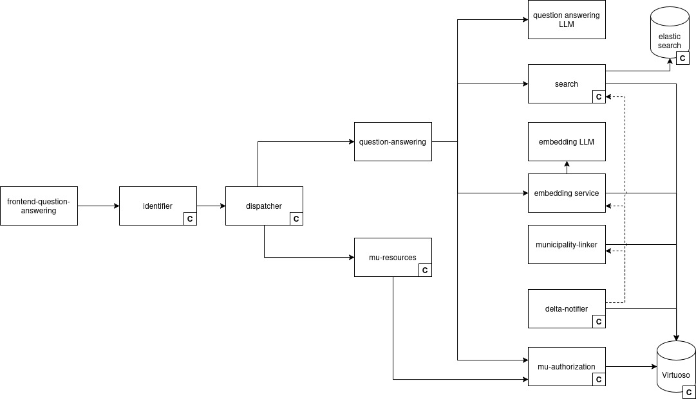

# Write-up UC2 Smart Search


This page is under construction


## Description UC/wanted deliverable

Local governments publish subsidy information as formal decisions and regulatory documents. For property owners considering climate-friendly renovations, e.g. insulation upgrades, green façades, or the installation of electric vehicle charging infrastructure, this information is publicly available but practically hard and time-consuming to find.

UC2 was set out to close this gap. By publishing subsidy-related LD\&L in the DECIDe data space and making it searchable through a purpose-built solution, citizens and businesses should be able to easily access all relevant information, understand their eligibility, and take action –contributing in the process to broader sustainability and Green Deal goals. The intended deliverable is a widget or application, embedded in the data space, through which property owners can query subsidy data across the pilot cities.


**Note:** During implementation, the team broadened the scope beyond the original subsidy focus. The challenge of making subsidy decisions accessible to citizens is in fact a specific instance of a much wider problem: LD\&L across all policy domains is structured in the same way, published through the same infrastructure, and equally difficult for non-expert users to navigate. Building a solution that works for any LD\&L topic –rather than subsidies alone– required the same effort as building one for subsidies only, while delivering substantially more value and reusability across the data space. The Business analysis section onwards describes the solution as it was built.


Within the project proposal, this maps to the following deliverables and tasks:

| Deliverable                                                                              | Activities                                                                                    |
| ---------------------------------------------------------------------------------------- | --------------------------------------------------------------------------------------------- |
| **D1.4** Data ready for decentralised ingestion into data space — scope of data plan UC2 | **T1.1-T1.7** Analyse available datasets and standards, develop and execute data plan for UC2 |
| **D2.1.4** In-depth technical analysis of current architecture UC2                       | **T2.1** In-depth analysis of current technical architecture at pilot sites & gap analysis    |
| **D3.5** Use case 2 implemented by Ghent as lead pilot site                              | **T3.9–T3.11** UC2 implementation at Ghent                                                    |
| **D3.6** Use case 2 implemented by Freiburg and/or Bamberg                               | **T3.12** UC2 implementation at Freiburg and/or Bamberg                                       |

### Link to other deliverables

#### UC0.0 Pipelines

UC2 depends on the data infrastructure established in UC0.0. The LD\&L documents that UC2 retrieves and serves are ingested, standardised, and stored as linked data through the UC0.0 pipelines. The Virtuoso SPARQL endpoint that UC2 queries for document metadata is part of the [semantic.works](https://semantic.works/) stack set up in UC0.0. Without the ingestion pipelines and the triplestore, UC2 has no corpus to search over.

[write-up-uc0.0-pipelines.md](write-up-uc0.0-data-space/write-up-uc0.0-pipelines.md "mention")

#### UC0.0 Human Validation

The Human Validation interfaces provides the human-in-the-loop validation layer for AI-generated annotations. The cross-use case HV architecture, shared validation logic, and data model are described within UC0.0.

[write-up-uc0.0-human-validation-hv.md](write-up-uc0.0-data-space/write-up-uc0.0-human-validation-hv.md "mention")

## Glossary


See the [UC0.0 Pipelines glossary](write-up-uc0.0-data-space/write-up-uc0.0-pipelines.md#glossary) for definitions of Embedding, LangChain, LLM, Ollama, RAG, and Token.

See the [UC0.1 Policy Impact Report glossary](write-up-uc0.1-policy-impact-report.md#glossary) for definitions of System prompt


<table><thead><tr><th width="172.3984375">Term/Acronym</th><th>Explanation</th></tr></thead><tbody><tr><td>ANN (Approximate Nearest-Neighbour) search</td><td>The technique a vector database uses to find similar vectors efficiently. <em>Approximate</em> means it sacrifices a small amount of precision in exchange for searching millions of vectors in milliseconds instead of seconds. Used by UC2's search service to find document vectors close to the embedded question.</td></tr><tr><td>Grounding</td><td>The constraint that an LLM's answer must be derived from specific provided source documents, rather than from its general training knowledge. In UC2, grounding is enforced through the system prompt, which instructs the LLM to answer only from the retrieved documents and to acknowledge when none are relevant.</td></tr><tr><td>Inference</td><td>Running a trained model on new data to produce an output –distinct from training. <em>Local inference</em> means running the model on a self-hosted server (e.g. via Ollama) rather than calling an external API; this avoids per-token costs and external data egress but may have higher latency. Hosted APIs (Mistral, OpenAI) typically offer lower latency but incur per-token costs.</td></tr><tr><td>Latency</td><td>The delay between sending a request to an AI model and receiving its response. In DECIDe, latency is a key factor when choosing between self-hosted models (e.g. via Ollama) and external hosted APIs: hosted APIs tend to respond faster but involve external data transfer and per-call or per-token costs, while self-hosted models keep data local but may increase latency.</td></tr><tr><td>Provider-agnostic / Vendor lock-in</td><td><p>A design in which the LLM provider can be swapped –Mistral, OpenAI, Ollama– without code changes. UC2 achieves this through LangChain's unified interface; switching providers is a configuration change, not a development effort.</p><p>The opposite is <em>vendor lock-in</em>, where the application is tied to one provider's specific API.</p></td></tr><tr><td>Relevance score / Relevance threshold</td><td>When a vector search returns documents, each result usually comes with a similarity score indicating how closely it matches the query. A <em>relevance threshold</em> is a minimum score below which results are discarded as too weak to be useful.</td></tr><tr><td>Semantic search</td><td>A search approach that finds documents based on meaning rather than exact keyword overlap. Implemented in UC2 via vector similarity between the embedded question and pre-embedded document content.</td></tr><tr><td>Stateless service</td><td>A service that keeps no memory of past requests between calls. Each request is handled independently, making the service easy to scale and easy to replace, but meaning every question is treated in isolation. UC2 is deliberately stateless, which is why follow-up questions within the same conversation are not supported in the current implementation.</td></tr><tr><td>Top-N</td><td>The number of documents to retrieve from the vector search and pass to the LLM as context. UC2 defaults to 3. Higher values give the LLM more context but also introduce weaker matches that may dilute or mislead the answer.</td></tr><tr><td>Embedding Vector</td><td>An embedding vector is like a <strong>mathematical fingerprint</strong> for a word, sentence, or image. It turns complex information into a format that computers can easily compare, analyze, and use to find patterns or similarities. Pieces of text that are similar in meaning also have similar embedding vectors, so it's easy to compare them mathematically.</td></tr></tbody></table>

## Business analysis + final feature passport (incl. functional analysis)

LD\&L produced by local authorities are publicly available but practically inaccessible to most users. Existing portals rely on keyword search, document lists, and administrative language that assumes familiarity with how decisions are structured and where to look. Both citizens and municipal staff struggle to quickly find decisions that apply to their situation, understand their content, and assess whether a newer decision has superseded an older one.

The DECIDe data space makes LD\&L available as linked data, but that infrastructure on its own does not address the discovery problem: SPARQL queries and RDF graphs are not viable interfaces for the majority of end users. UC2 closes this gap by placing a natural-language search layer over the data space corpus. A user poses a free-text question; the system retrieves the most semantically relevant decisions, passes them to an LLM to generate a grounded answer, and returns both the answer and the source documents it is based on. The result reduces dependence on administrative wording and makes decision data accessible without any technical knowledge of the underlying data model.

For local authorities, UC2 provides a high-visibility demonstration that LD\&L linked data assets can power AI-assisted citizen services. For the DECIDe project, UC2 complements the structured reporting and annotation use cases with an exploratory, question-and-answer interface –showing that the same data space can serve both analytical and accessibility purposes.

### Pilot partners

Ghent leads the UC2 implementation (D3.5), with Freiburg and/or Bamberg participating as a second pilot site (D3.6).

### Target audience / Personas

The primary audience for UC2 is citizens seeking to understand which decisions, subsidies, or regulations apply to their situation, and municipal staff –administrative officers, policy makers, and smart city teams– who need rapid access to decision content without navigating full document archives. A secondary audience is the technical team responsible for deploying and monitoring the microservice and its integration with the data space.

<table><thead><tr><th width="161.236328125">Persona</th><th>Journey</th></tr></thead><tbody><tr><td><strong>P5</strong> Non-technical application user</td><td>Uses the natural-language interface to ask questions about LD&#x26;L, reviews the AI-generated response and the source decisions it is grounded in, and provides validation through the HV thumbs-up/thumbs-down mechanism for both individual sources and the overall response.</td></tr><tr><td><strong>P6</strong> Data engineer</td><td>Deploys and monitors the UC2 microservice: manages the embedding service, semantic search index, and LLM backend integration; diagnoses failed requests; and manages the connection between the UC2 service and the Virtuoso SPARQL endpoint.</td></tr><tr><td><strong>P7</strong> Data space consumer</td><td>May embed the UC2 service into a local authority's website or platform as an accessible entry point to the data space, allowing end users to query LD&#x26;L through a natural-language interface without any knowledge of the underlying data infrastructure.</td></tr></tbody></table>

### Functionality (requirements)

UC2 is a question-answering microservice with a chat-style front-end. The back-end exposes a single endpoint that accepts a free-text question and an optional top-N parameter, and returns a generated answer together with a list of source documents. The front-end guides the user to select a local authority and pose a question, presents the response alongside the source decisions, and provides a Human Validation (HV) mechanism for signalling whether the answer and individual sources are correct. Each question, response, source set, and validation result is saved to a persistent store for data quality and model improvement use; this store is not exposed to end users.

The underlying mechanism is a Retrieval-Augmented Generation (RAG) pipeline: the question is embedded into a vector, semantically similar subsidy documents are retrieved, their metadata is enriched via SPARQL, and a Large-Language Model (LLM) generates an answer strictly grounded in the retrieved context. The service is stateless, language-aware, and provider-agnostic with respect to the LLM backend.

<table><thead><tr><th width="620.93359375">Requirement</th><th>Priority</th></tr></thead><tbody><tr><td>LD&#x26;L sourced from the data space</td><td>Must-have</td></tr><tr><td>Natural-language question input</td><td>Must-have</td></tr><tr><td>LLM-generated answer grounded in retrieved source decisions</td><td>Must-have</td></tr><tr><td>Trace the response back to the source decisions, with clickable links</td><td>Must-have</td></tr><tr><td>Questions and responses supported in Dutch and German</td><td>Must-have</td></tr><tr><td>Human validation of the generated response and its source decisions</td><td>Must-have</td></tr><tr><td>Each question, response, source set, and validation saved for data quality use; not exposed to users</td><td>Must-have</td></tr><tr><td>Filter to limit search to a specific local authority</td><td>Nice to have</td></tr><tr><td>Suggested example questions sourced from partner input</td><td>Nice to have</td></tr><tr><td>Follow-up question support within an existing conversation context</td><td>Nice to have</td></tr><tr><td>Widget embeddable in a local authority's website or platform</td><td>Nice to have</td></tr></tbody></table>

## Datasources, datasets and datastandards

### Data sources

| Data source | Type/category                     | Brief description                                               |
| ----------- | --------------------------------- | --------------------------------------------------------------- |
| LD\&L       | <p>Internal (triplestore)<br></p> | The ELI data from the pipeline, enriched with vector embeddings |

### Datasets available in the data space

| Dataset                                              | IdP/Authentication service                           | Country of origin | Domain                | Shared within the project | Reused within the project |
| ---------------------------------------------------- | ---------------------------------------------------- | ----------------- | --------------------- | ------------------------- | ------------------------- |
| Human validation votes on Answers (oa:Annotation)    | <mark style="color:$warning;">Sparql wrapper?</mark> | Belgium/Germany   | <p><br>Government</p> | Yes                       | No                        |
| Human validation votes on Quotations (oa:Annotation) |                                                      | Belgium/Germany   | Government            | Yes                       | No                        |

### Data standards

| Standard                                    | Link                                                                               |
| ------------------------------------------- | ---------------------------------------------------------------------------------- |
| Schema.org                                  | https://schema.org                                                                 |
| Web Annotation Vocabulary (`oa:Annotation`) | [https://www.w3.org/TR/annotation-vocab/](https://www.w3.org/TR/annotation-vocab/) |
| Simple Knowledge Organization System (SKOS) | [https://www.w3.org/TR/skos-reference/](https://www.w3.org/TR/skos-reference/)     |

The core of UC2 are questions of users about LD\&L and answers that are generated by LLMs based on decisions. We based the data model on schema.org with `schema:Question` and `schema:Answer` . Next to the text (`schema:text`) of the question and answer, we also capture the full prompt to the LLM using `dct:description`. Another specific property is `ext:owningBody` to capture the municipality that is relevant for the user. This is used to filter decisions per municipality.

<figure><figcaption><p>Fig. 1 Questions and Answers are modelled using Schema.org</p></figcaption></figure>

The answer is based on a set of decisions, ranked by confidence of being relevant. `schema:Quotation` is used to add confidence to the decision that was used. Currently, the quotation reflects the complete decision that is used as source (`oa:hasSource` ). However, this could later be extended with `oa:hasSelector` to reference a specific part of the decision that contributed to the answer. `schema:citation` is used to link the answer with the quotations.

<figure><figcaption><p>Fig. 2 Quotations are used as extension of decisions.</p></figcaption></figure>

While the HVT annotates on AI annotations, in UC2 users can add a thums up (approve) or down (reject) on the answer of the LLM. They can also review the related quotations separately: was this decision a good datasource for answering my question? A `skos:Concept` representing the feedback is linked through an annotation with the `schema:Answer` (Fig. 3) or `schema:Quotation` (Fig. 4). UC2 is thus an implementation of the annotation model described in [https://github.com/lblod/gitbook-decide-write-up/blob/master/decide-project/write-up-uc0.0-data-space#web-annotation-model](https://github.com/lblod/gitbook-decide-write-up/blob/master/decide-project/write-up-uc0.0-data-space#web-annotation-model "mention").

<figure><figcaption><p>Fig. 3: Answers can be annotated with feedback</p></figcaption></figure>

<figure><figcaption><p>Fig. 4: Quotations can be annotated with feedback</p></figcaption></figure>

## Final architecture

In general, the architectural picture of this use case is shown in the image below:

<figure><figcaption></figcaption></figure>

In this image, services are shown as rectangles, where core services are marked with a bold **C**. Communication between services happens through HTTP requests and are shown as arrows from the sender to the recipient. Delta messages are also such HTTP requests, but those are shown as dashed arrows. Databases are shown as cylinders.

Apart from the search and elastic search services, and a brief recap about the contents of the triplestore, all core services were described in the general architecture. All other services will be described in the following sections.

### Final semantic components

#### Triplestore contents

The data regarding the `eli:Expressions` is stored and served by the Virtuoso triplestore, which is the standard triplestore in the [semantic.works](http://semantic.works/) stack. The expression content is already present in this store in the form of linked data because it has been produced by the UC0.0 pipelines. The question answering service queries this endpoint in the enrichment step to retrieve the title and body text of each decision URI returned by the vector search service.

**GitHub**: [https://github.com/redpencilio/docker-virtuoso](https://github.com/redpencilio/docker-virtuoso)

#### Elastic Search

The Virtuoso triplestore is great for SPARQL queries, but it doesn't have great support for fuzzy searches and no support at all for performing vector searches. This is why the data we want to perform such searches on is duplicated into an [elastic search](https://www.elastic.co/) instance. The elastic search is always interfaced with through the search service, that forms the mapping between the master data in the triple store and the elastic search's derived content.

**GitHub:** [https://github.com/mu-semtech/mu-search-elastic-backend](https://github.com/mu-semtech/mu-search-elastic-backend)

#### Search

The search service ensures that data we want to perform fuzzy or vector searches on is replicated from the Virtuoso triplestore into the elastic search instance. It does this by watching for delta messages (see base architecture) and updating the elastic indexes as needed. The data to be indexed this way in configured in a configuration file. That way any `rdf:Type` and any property path starting from such a type can be indexed in elastic search.

**GitHub:** [https://github.com/mu-semtech/mu-search](https://github.com/mu-semtech/mu-search)

#### Embedding service

The core idea in this use case is to generate embedding vectors for decisions and questions, then compare these embedding vectors, and return the `top_n` decisions that are most similar to the question. The embedding service generates these embedding vectors for decisions, it is informed about new decisions arriving in the triplestore and if an embedding doesn't exist yet, it generates one and stores it in the triplestore. This again generates a delta, and the search interface knows to add the embedding to the elastic search interface so the decision can be found using a vector search on its embedding using the search service.

The embedding service also has an endpoint that can be used to generate the embedding for an arbitrary string. The question answering service uses this endpoint to generate the embedding for the user's question.

To generate the embedding vectors, the embedding service uses an LLM model. By default this is done locally using Ollama and the `embeddinggemma:300m` model.

**GitHub:** [https://github.com/semantic-ai/embedding-service](https://github.com/semantic-ai/embedding-service)

#### Municipality linker service

In this use case, the user may only be interested in questions regarding a specify local authority. E.g. the user will want to know which subsidies are available in Gent, subsidies in Freiburg are not helpful for the user. That means our `eli:Expressions` always need to be linked to the local authority that they belong to. This path can be different depending on where the data originates from. For structured data coming from OSLO or OPARL, this is easy, the link is provided to us in a structured manner. For expressions resulting from PDFs, this is not as straight forward, because the link may be provided by an unverified, AI-generated annotation or the AI service may even have failed to generate such a link at all as it couldn't find any. This is why for PDF processing, we ask the user to already provide us with the local authority owning the decision(s) in the PDF when starting the harvesting pipeline in UC0.

The municipality linker service, then provides a single, local predicate `ext:owningBody`, that can be indexed in elastic search to restrict the vector searches for expressions. Again, the municipality linker service is informed about changes to expressions, generates this link between the expression and the local authority that it belongs to. This again also generates a delta message, which is picked up by the search service to update its expression indexes.

**GitHub:** [https://github.com/lblod/decide-municipality-linker-service](https://github.com/lblod/decide-municipality-linker-service)

#### Question answering

The question answering service is a stateless FastAPI microservice that orchestrates four external services: the embedding service, the search service, the SPARQL endpoint and an LLM.

When a user submits a question, the service first calls the embedding service to convert the question text into a numerical vector. That vector is submitted to the search service, which returns the top-N most similar document URIs from its pre-built index. The question answering service then queries the mu-authorization SPARQL endpoint –established in UC0.0– to retrieve the title and body text for each returned URI to form the semantically enriched document. Finally, this enriched document together with the original question is submitted to an LLM via LangChain, which generates a grounded answer. The response returned contains the generated answer and a list of source documents with their titles and content.

```
User → POST /question-answering/answer
         ↓
    [1] Embedding API  →  vector for question
         ↓
    [2] Search API     →  top-N document URIs (vector similarity search)
         ↓
    [3] Virtuoso SPARQL → enriched metadata (title + content) per URI
         ↓
    [4] LLM (LangChain) → generated answer
         ↓
    UC2Response (answer + sources)
```

This architecture follows the [semantic.works](http://semantic.works/) paradigm, in which each concern –embedding, search, LLM generation– is a separate service. The question answering service itself is thin and stateless, which can easily be maintained, scaled, and replaced independently. SPARQL enrichment decouples document retrieval from metadata storage, meaning this service does not cache any document content but fetches exactly what it needs for each request from the triplestore.

The service exposes a single POST endpoint (`POST /question-answering/answer`). A minimal request supplies the question text and the owning local authority URI and, optionally, the number of source decisions to retrieve (`top_n`, defaulting to 3):

Request:


```json
{ 
    "question": "Welke subsidies bestaan er voor renovatie?", 
    "top_n": 3, 
    "localAuthority": "http://data.lblod.info/id/bestuurseenheden/353234a365664e581db5c2f7cc07add2534b47b8e1ab87c821fc6e6365e6bef5" 
}
```


The response returns the generated natural-language answer and the source decisions that were passed to the LLM, each carrying its URI, title, and truncated content:

Response:

```json
{
  "answer": "Op basis van de gevonden documenten...",
  "sources": [
    { "uri": "https://...", "title": "...", "content": "..." }
  ]
}
```

The `epvoc:expressionContent` predicate holds the text contents of each decision. This predicate is declared OPTIONAL in the enrichment query, so documents that carry a title but no body text are still returned and passed to the LLM, albeit with less context for the model to work with. Document content is truncated at `MAX_CONTENT_CHARS` (default 1000 characters) to remain within LLM context limits.

The query used to fetch metadata per document URI is not hardcoded in the service but loaded from a configuration file at `/config/enrichment-query.rq`, with a fallback to a default template embedded in the application. This makes UC2 domain-adaptable without code changes: an operator deploying the service against a different document corpus can supply a different enrichment query that maps to a different ontology, as long as it returns title and content bindings for a given set of URIs.

The question answering service allows the configuration of a minimum similarity score for expressions to be considered for an answer. The search service returns this similarity with its `top_n` most similar expressions. If no decisions are above this threshold, the user is informed that no decisions matched their question.

**GitHub:** [https://github.com/semantic-ai/decide-question-answering](https://github.com/semantic-ai/decide-question-answering)

#### Frontend question answering

This is the web application hosting the web interface that the user can interact with during use case 2. It is written in Ember and uses the endpoints provided by mu-resources and the question answering service to realize the use case.

**GitHub:** [https://github.com/lblod/frontend-decide-question-answering](https://github.com/lblod/frontend-decide-question-answering)

### Final AI components

Answer generation is handled by an LLM invoked through LangChain's init\_chat\_model abstraction. LangChain was chosen specifically to avoid vendor lock-in: the provider and model are controlled entirely by environment variables, and switching from a self-hosted Ollama instance to a cloud provider such as Mistral AI or OpenAI requires no code changes, only a dependency addition and environment reconfiguration. The default model in development is Mistral-Nemo running on a local Ollama server. Mistral-Nemo was selected because it offers strong multilingual performance at a parameter count that is practical for self-hosted inference. For production deployments where latency and throughput requirements exceed what self-hosted inference can provide, the provider can be switched to the Mistral API or an equivalent without architectural changes.

The LLM is given a custom system prompt that enforces three constraints: the answer must be grounded exclusively in the retrieved documents, the LLM must explicitly state when none of the retrieved documents are relevant to the question, and the answer must be produced in the same language as the question. This last constraint handles language switching transparently without any code-level branching between different language inputs.

The same approach is taken for the LLM that generates the embeddings for the embedding service, but the two LLMs are separate models as they fulfill different roles.

## Final UI design (and why) (if any)

The UC2 interface is designed around the familiar pattern of AI-powered chat interfaces. Inspiration was drawn from general-purpose chatbots (Gemini, Claude) as well as domain-specific tools such as Medwise AI, a chatbot that answers medical questions and closely mirrors the DECIDe use case of providing accurate answers within a defined, structured knowledge domain.



Common across all reference interfaces is an opening screen focused on a single action: asking a question. The UC2 interface follows this pattern and adds a local authority filter before the question field, which helps constrain retrieval to a relevant corpus. If the selected authority has provided example questions, a set of suggested prompts is also displayed, giving users a starting point without requiring them to formulate a query from scratch. This gives the users more Flexibility and Efficiency of Use (7th UX Heuristic).

Once the user types or selects a question, they are taken to the next screen, where their question will appear as a speech bubble on the right, and a loading indicator on the left until the AI answer shows up. This is a very common pattern in chat interfaces.

Four important decisions were made when designing this interface:

1. Validating responses (HV)
2. Not allowing continuous conversations
3. What to do when AI cannot find a relevant answer
4. Language of the interface

#### Validating responses (HV)

To comply with the Human Validation requirement shared across DECIDe use cases, the same thumbs up/down system used in UC0.0 is incorporated directly into the interface.

Every response to a question includes a sources section at the bottom, listing the decisions used to generate that answer. Each decision can be clicked on and read separately in an external tab. Each decision can also be validated with a thumbs up/down to indicate whether that decision is relevant and used correctly.

A second validation at the bottom of the response captures the user's judgement on the overall answer.

#### Not allowing continuous conversations

UC2 deliberately does not support multi-turn conversational interaction. Each request is processed statelessly, with no context carried from a previous exchange into the system prompt. Rather than build conversational state management within the project scope, the team directed that capacity toward higher-priority features. Two navigation buttons cover the most common follow-up needs without requiring multi-turn architecture:

* **Ask another question**: The user can use this to navigate back to the first screen, and type a new question; their local authority remains selected.
* **Update question**: This can be used if the user wished to update their previously typed question with more detail to get a more relevant answer, as a compromise for not allowing follow-up and clarification questions. It takes the user back to the previous page, but this time with their question visible inside the text field.

#### <mark style="background-color:$warning;">What to do when no relevant answer is found</mark>

An LLM will always generate a response, even when the retrieved documents are not relevant to the question. <mark style="background-color:$warning;">We can numerically gauge the relevance rate</mark> and decided on a threshold of relevance. If this threshold is not met, the user will get an error message (9th UX Heuristic: Help Users Recognise, Diagnose, and Recover from Errors):

> Sorry, we were unable to find any relevant information in any decision. Try rewording your question or giving more details to help us find the relevant information for you.

The user can then restart with a fresh question or refine their existing one via the "Update question" button.

#### Language of the interface

The interface is in English, avoiding the overhead of maintaining three separate localised versions within the project timescale. The LLM handles questions and generates responses in Dutch, German and English. Users are informed on the first screen that asking in the language of the source decisions –Dutch for Ghent, German for Freiburg and Bamberg– produces the most accurate results, though <mark style="background-color:$warning;">English questions</mark> are also accepted and will produce a response.

### Other explored UI design (and why not)

N/A

## Testing approach

### Risks & mitigations

#### Retrieval quality determines answer quality

If the semantic search step returns documents that are not relevant to the question, the LLM will either produce a misleading answer or correctly state that it cannot answer. This risk is partially mitigated by the system prompt instruction to acknowledge irrelevance, we are mitigating this by including a relevance score in the results returned by the search API when searching for documents similar in contents to the user's question. If this score is below an empirically determined threshold, the document is not included in the result.

#### Vendor lock-in for the LLM provider

Switching LLM providers is mitigated by the LangChain abstraction layer. Changing providers requires updating two environment variables and adding one dependency line to `requirements.txt`; no code changes are needed beyond this.

## Possible future work

### Possible future work DECIDe data space related

#### Integration of annotation metadata into retrieval

LD\&L in the corpus carry AI-generated annotations from the UC0.1 enrichment pipeline, including SDG codelist mappings. These annotations are not currently used by UC2. Future work could use annotation metadata as an additional signal in retrieval or filtering, e.g. surfacing only decisions classified under a given SDG theme in response to a thematically specific question.

#### Leveraging consolidated decision versions

A retrieved decision may be an amendment of an earlier one, making it contextually incomplete on its own. The construction of consolidated decisions –linking an original decision with its amendment history into a single authoritative text– is a UC0.0 pipeline concern. Once consolidated versions are available in the data space, UC2 could pass the consolidated text to the LLM rather than an isolated amendment, producing answers that reflect the current regulatory state in full rather than a fragment of it.

### Possible future work LBLOD related

## Relevant links

Link to github: [https://github.com/semantic-ai/decide-question-answering](https://github.com/semantic-ai/decide-question-answering)

Link to front-ends // Link to dev/test/prod (if any)
